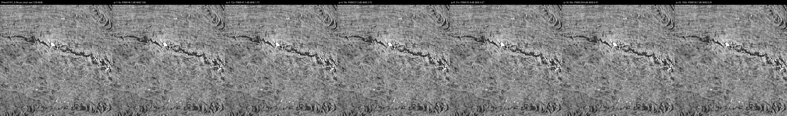
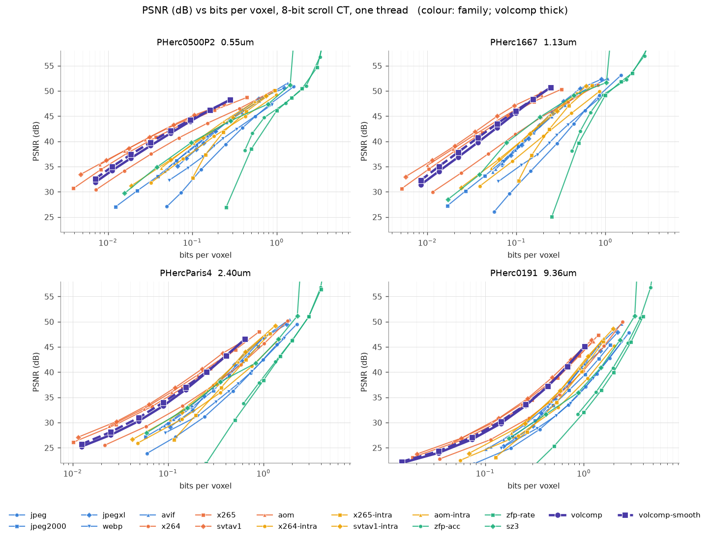
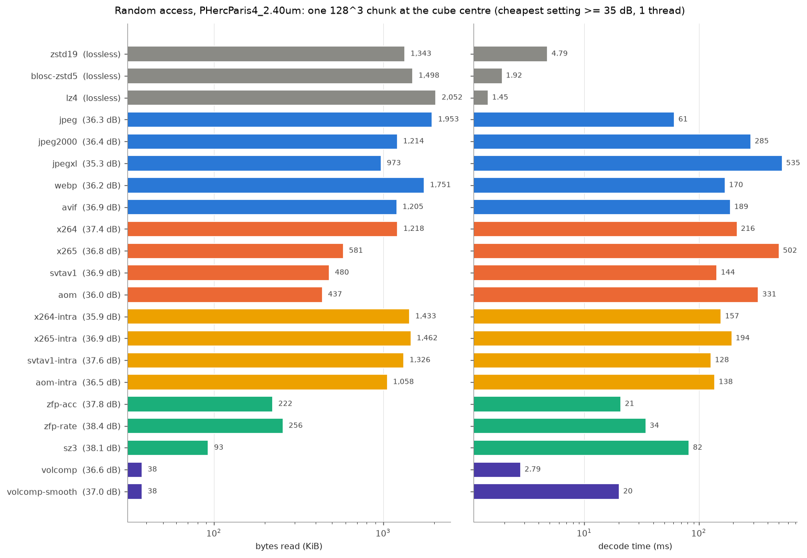

# volcomp: a random-access 3-D codec for scroll CT and surface predictions

Vesuvius Challenge monthly contest submission, September 2026.
Repository: <https://github.com/SuperOptimizer/volume-compressor>. Mirror:
<https://dl.ash2txt.org/community-uploads/forrest/volcomp/>. Every number comes from a document in this
repository (section 10). Competitor numbers measured on other data are labelled as such.

## 1. Summary

| what | number | source |
|---|---|---|
| PHercParis4 2.4 µm CT, 54 held-out 128³ chunks, q 8 | **52.9x**, 35.0 dB PSNR, MAE 3.2 | docs/BENCHMARKS.md |
| decode / encode at q 8, one core | **1,375 / 784 MB/s** | docs/BENCHMARKS.md |
| 512³ cubes at q 8: 0.55 / 1.13 / 2.40 / 9.36 µm | 145.7x / 131.7x / 52.3x / 31.0x | docs/comparison/README.md |
| whole mirror vs the bucket: 5.86 TB | **52.6x** vs bucket stored bytes, **233x** vs logical level 0 | docs/_mirror_size_2026-09-30.md |
| PHerc0343P 8.64 µm CT, whole level 0 (138 Gvox) | 239.3 MiB | fact sheet 3g |
| our m7 stores (8-bit probability) vs published binary m7 masks | **1.63-2.34x smaller** | docs/comparison/surfaces/README.md |
| q 8 cost on an m7 prediction vs the same run's float output | dice 0.978, MAE 4.10 / 255 | surfaces/PHerc0343P/README.md |
| surface mode q 64 (exact threshold) vs q 8 | 0.78x (recto) / 0.71x (m7) the size | docs/surface_mode.md |

| released | where |
|---|---|
| C library `volcomp.h` 1.3.0 (format rev. 4), CLI, spec, tests, fuzzers | this repository |
| Python zarr v3 codec `volcomp-zarr` | `python/` |
| single-file browser viewer (~300 KB, WebAssembly decoder) | `web/dist/volcomp_viewer.html` |
| CT of 64 of the bucket's 67 volumes (all 39 samples); the 41 published m7 th0.2 masks as volcomp stores; **whole-volume m7 probability stores** (59 up, 61 when the last uploads finish) | the mirror (5.86 TB) |
| VC3D integration | [ScrollPrize/villa#1704](https://github.com/ScrollPrize/villa/pull/1704) (open) |

volcomp is a single-header C codec for `uint8` volumes: a 16³ 3-D DCT, a dead-zone quantiser and tANS,
in independently decodable 128³ chunks inside standard zarr v3 shards. One knob, `q`.

## 2. Motivation

| open-data bucket (docs/_bucket_size_2026-09-30.md) | TB |
|---|--:|
| logical size, level 0 (67 volumes, 39 samples) | 761.1 |
| logical size with pyramids | 869.9 |
| stored, level 0 | 239.7 |
| stored, all levels | 275.1 |
| surface prediction stores (84) | 2.30 |

| volcomp mirror vs bucket (docs/_mirror_size_2026-09-30.md) | bucket | mirror | ratio |
|---|--:|--:|--:|
| logical level 0 / our CT level 0 | 761.1 TB | 3.27 TB | **233x** |
| stored level 0 / our CT level 0 | 239.7 TB | 3.27 TB | **73x** |
| stored all levels / our CT all levels | 275.1 TB | 5.24 TB | **52.6x** |

The whole mirror is 5.86 TB: CT 5.24 TB, surface stores 0.51 TB, teacher regions 0.11 TB. It holds 64 of
the 67 volumes; on the 64 matched volumes the ratios are 232x / 73x / 52x.

| pitch group | volumes | logical L0 TB | stored TB |
|---|--:|--:|--:|
| <= 1.2 µm | 7 | 148.9 | 95.3 |
| 2.2-2.4 µm | 23 | 573.5 | 168.0 |
| 8.6-9.4 µm | 34 | 37.3 | 11.8 |

| PHerc0343P 8.64 µm (138.04 Gvox) | size | volcomp ratio |
|---|--:|--:|
| logical, level 0 | 0.138 TB | 550x |
| bucket, level 0 / all levels (exact) | 0.033 / 0.037 TB | 130x / 95x |
| volcomp, level 0 / all levels | 239.3 / 372.6 MiB | |

The bucket is uncompressed zarr v2 with empty chunks unwritten, so the stored size is a third of the
logical size. The fine scans account for almost all of it. The 0343P ratios are dominated by masked air;
section 4 has the codec's behaviour on dense papyrus. Tracers, viewers and inference read scattered
regions over the network, so volcomp is built for per-chunk random access, HTTP Range streaming from
static hosting, fast CPU decode, and a browser decoder.

## 3. The format

| unit | size | role |
|---|---|---|
| block | 16³ | DCT unit; decoding one block touches one substream of <= 16 blocks |
| chunk | 128³ | independently decodable; one zarr chunk |
| shard | 1024³ | zarr v3 `sharding_indexed`, trailing index, crc32c |

| mode | stores | measured |
|---|---|---|
| 0, lossy (q 1-255) | DCT, DC step q/8, AC step q·(1+x+y+z)^0.65, tANS | section 4 |
| 1-3, lossless (q 0) | prediction along z, never more than raw + 8 bytes | 1.8x synthetic CT; class maps and masks 60-250x |
| 4, mask | 2x majority pool, context-coded, decoded as a trilinear ramp | 0.0057 bits/voxel, 11x smaller than packbits + zstd-19 |
| 5, exact mask | full 128³ mask, exact 0/255 | 0.0255 bits/voxel, 2.4x smaller than packbits + zstd-19 |
| 6, surface | flat-law DCT base + refinement bits near the threshold | `(src >= thr) == (dec >= thr)` for every voxel |

| decode-side deblocking (opt-in, not in the format) | setting | effect | cost |
|---|---|---|---|
| masked CT, q >= 4 | gated face filter, strength 2, zero guard | +0.11 to +0.61 dB, no chunk worse | 5-6 ms/chunk |
| probability maps | Gaussian σ 0.6, zero guard | m7 q 16 dice 0.9913 to 0.9931 | 13-17 ms/chunk |

The shard layout is byte-compatible with zarr v3 `sharding_indexed` (`index_location: "end"`, crc32c
index), with `{"name": "volcomp", "configuration": {"q": 8}}` as the only codec. Production CT uses q 8 at
level 0 and q 4 / 2 / 1 on coarser levels. Deblocking smooths block faces, then projects each block back into
its quantisation cells. Exact zeros stay zero and surface chunks keep their threshold.

```python
import numpy as np, volcomp_zarr as vc              # tested against the repo's libvolcomp.so
z, y, x = np.mgrid[0:128, 0:128, 0:128]
chunk = np.clip(128 + 60*np.sin(x/9 + z/13) + np.random.default_rng(0).normal(0, 6, x.shape), 0, 255).astype(np.uint8)
enc = vc.encode(chunk.tobytes(), 8)                  # lossy q 8; vc.Q_LOSSLESS for exact
dec = np.frombuffer(vc.decode(enc), np.uint8).reshape(chunk.shape)
blk = np.frombuffer(vc.decode_block(enc, 2, 3, 4), np.uint8).reshape(16, 16, 16)
assert np.array_equal(blk, dec[32:48, 48:64, 64:80]) # one block == that region of the full decode
sm = vc.decode_smooth(enc, 2.0, zero_guard=True, gated=True)   # opt-in deblocking
```

## 4. Results on scroll CT

| q | ratio | PSNR dB | SSIM | MAE | P99 | max | enc MB/s | dec MB/s |
|--:|--:|--:|--:|--:|--:|--:|--:|--:|
| 2 | 17.56 | 41.33 | .9840 | 1.573 | 7 | 49 | 471 | 702 |
| 4 | 30.05 | 38.04 | .9700 | 2.282 | 11 | 77 | 574 | 906 |
| 8 | 52.92 | 35.00 | .9463 | 3.217 | 15 | 121 | 784 | 1375 |
| 16 | 95.58 | 32.22 | .9088 | 4.416 | 21 | 143 | 1033 | 2135 |
| 32 | 176.5 | 29.67 | .8532 | 5.911 | 28 | 155 | 1113 | 2484 |

PHercParis4 2.4 µm, 54 held-out chunks, one core, AVX2. Voxels with |error| > 3q: 1.24 % at q 2, 0.10 % at
q 8. The plain C kernels decode at 610 MB/s at q 8.

| q | 0.55 µm PHerc0500P2 | 1.13 µm PHerc1667 | 2.40 µm PHercParis4 | 9.36 µm PHerc0191 |
|--:|--:|--:|--:|--:|
| 1 | 28.4x, 48.3 dB | 33.1x, 50.7 dB | 12.5x, 46.5 dB | 7.9x, 45.1 dB |
| 2 | 49.6x, 46.2 dB | 52.0x, 48.3 dB | 19.7x, 43.3 dB | 11.8x, 41.1 dB |
| 4 | 85.2x, 44.0 dB | 81.7x, 45.6 dB | 31.7x, 39.9 dB | 18.6x, 37.2 dB |
| 8 | 145.7x, 41.6 dB | 131.7x, 42.7 dB | 52.3x, 36.6 dB | 31.0x, 33.4 dB |
| 16 | 250.3x, 39.2 dB | 217.6x, 39.8 dB | 90.1x, 33.3 dB | 55.7x, 29.8 dB |
| 32 | 428.0x, 36.7 dB | 361.5x, 36.9 dB | 163.4x, 30.3 dB | 109.3x, 26.7 dB |

| deblocked PSNR (plain) | 0.55 µm | 1.13 µm | 2.40 µm | 9.36 µm |
|--:|--:|--:|--:|--:|
| q 8 | 42.1 (41.6) | 43.4 (42.7) | 36.9 (36.6) | 33.5 (33.4) |
| q 16 | 39.8 (39.2) | 40.7 (39.8) | 33.9 (33.3) | 30.1 (29.8) |
| q 32 | 37.5 (36.7) | 37.9 (36.9) | 31.0 (30.3) | 27.1 (26.7) |

512³ cubes of original CT. The same q gives 3-5x more ratio at fine pitch than at 9.36 µm, so
"about 50x at 35 dB" describes 2.4 µm only. The deblocking gain grows with q and shrinks with voxel size.

Each strip below shows raw, then q 1, 2, 4, 8, 16 and 32, on the centre z plane of a 512³ cube.


*PHercParis4 2.4 µm, plain decode.*


*The same strip with the deblocking post-filter.*


*PHerc0500P2 0.55 µm: q 32 is 428x at 36.7 dB.*


*PHerc0191 9.36 µm: the hardest scan (q 8 is 31x at 33.4 dB).*

| PHercParis4 2.4 µm, q 8 error | PHerc0191 9.36 µm, q 8 error |
|---|---|
|  |  |

*Raw in grey; red opacity = min(1, 4·|error|/255); 2x magnified.*

| pitch µm | scroll | q 8 | q strip (raw, q 1-32) | q 8 error |
|--:|---|--:|---|---|
| 0.55 | PHerc0500P2 | 145.7x, 41.6 dB | [](comparison/PHerc0500P2_0.55um/zmid_all.png) | [](comparison/PHerc0500P2_0.55um/diff_zmid_q8.png) |
| 1.13 | PHerc0139 | 177.3x, 44.1 dB | [](comparison/PHerc0139_1.13um/zmid_all.png) | [](comparison/PHerc0139_1.13um/diff_zmid_q8.png) |
| 1.13 | PHerc1667 | 131.7x, 42.7 dB | [](comparison/PHerc1667_1.13um/zmid_all.png) | [](comparison/PHerc1667_1.13um/diff_zmid_q8.png) |
| 2.21 | PHerc0343P | 76.1x, 37.8 dB | [](comparison/PHerc0343P_2.21um/zmid_all.png) | [](comparison/PHerc0343P_2.21um/diff_zmid_q8.png) |
| 2.40 | PHercParis4 | 52.3x, 36.6 dB | [](comparison/PHercParis4_2.40um/zmid_all.png) | [](comparison/PHercParis4_2.40um/diff_zmid_q8.png) |
| 4.32 | PHerc0500P2 | 78.9x, 38.6 dB | [](comparison/PHerc0500P2_4.32um/zmid_all.png) | [](comparison/PHerc0500P2_4.32um/diff_zmid_q8.png) |
| 8.64 | PHerc0800 | 40.3x, 34.1 dB | [](comparison/PHerc0800_8.64um/zmid_all.png) | [](comparison/PHerc0800_8.64um/diff_zmid_q8.png) |
| 9.36 | PHerc0191 | 31.0x, 33.4 dB | [](comparison/PHerc0191_9.36um/zmid_all.png) | [](comparison/PHerc0191_9.36um/diff_zmid_q8.png) |

*All eight 512³ cubes, centre z plane; thumbnails link to the full lossless PNGs.*

Every image, with thumbnails: [docs/comparison/GALLERY.md](comparison/GALLERY.md). Tables per cube: [docs/comparison/README.md](comparison/README.md).

## 5. Comparison with other codecs

> **Interim: contended timings.** From [docs/bench/interim/](bench/interim/operating_points.md)
> (`tools/bench_codecs.py`, 543 rows, all four cubes). Speeds come from a 12-worker pass on a shared machine;
> a quiet single-thread timing pass is pending. Final numbers replace this section when docs/bench/README.md lands.


*PSNR against bits per voxel on the four 512³ cubes of section 4; volcomp thick. SSIM:
[rd_ssim.png](bench/interim/rd_ssim.png).*

| best of family: bits at 35 dB, x volcomp | 0.55 µm | 1.13 µm | 2.40 µm | 9.36 µm | range |
|---|--:|--:|--:|--:|--:|
| svtav1 (GOP 128) | **0.53** | **0.55** | **0.69** | **0.86** | 0.53-0.86 |
| x265 (GOP 128) | 0.71 | 0.72 | 0.83 | 0.99 | 0.71-0.99 |
| aom (GOP 128) | outside sweep | outside sweep | 0.75 | 0.90 | 0.75-0.90 |
| volcomp + deblock | 0.86 | 0.85 | 0.90 | 0.98 | 0.85-0.98 |
| x264 (GOP 128) | 1.43 | 1.91 | 1.64 | 1.62 | 1.43-1.91 |
| best all-intra | 3.16 (svtav1) | 3.11 (svtav1) | 1.76 (aom) | 1.51 (svtav1) | 1.51-3.16 |
| jpegxl / avif (best) | 4.09 (avif) | 3.95 (avif) | 1.88 (avif) | 1.62 (avif) | 1.62-4.09 |
| jpeg2000 | 4.05 | 3.72 | 2.05 | 1.85 | 1.85-4.05 |
| jpeg / webp (best) | 7.02 (webp) | 6.76 (webp) | 3.05 (webp) | 2.55 (jpeg) | 2.55-7.02 |
| sz3 | 2.94 | 2.90 | 1.86 | 2.31 | 1.86-2.94 |
| zfp (best mode) | 30.85 (rate) | 25.28 (rate) | 5.84 (acc) | 3.74 (acc) | 3.74-30.85 |

*Each codec's bits per voxel at 35 dB over volcomp's (log-linear interpolation along its sweep,
operating_points.md); below 1 = fewer bits than volcomp. "outside sweep" = aom's sweep and JPEG XL's
did not reach down to 35 dB on the fine scans. volcomp itself: 0.013 / 0.016 / 0.118 / 0.321 bits per voxel.*

| PHercParis4 2.40 µm, codec | family | bpv @ 30 dB | bpv @ 35 dB | bpv @ 40 dB | x volcomp @ 35 dB |
|---|---|--:|--:|--:|--:|
| jpeg | 2-D per slice | 0.197 | 0.405 | 0.746 | 3.43 |
| jpeg2000 | 2-D per slice | 0.104 | 0.241 | 0.469 | 2.05 |
| jpegxl | 2-D per slice | 0.121 | 0.232 | 0.418 | 1.97 |
| webp | 2-D per slice | 0.150 | 0.360 | 0.741 | 3.05 |
| avif | 2-D per slice | 0.100 | 0.222 | 0.442 | 1.88 |
| x264 | video, GOP 128 | 0.069 | 0.193 | 0.455 | 1.64 |
| x265 | video, GOP 128 | 0.031 | 0.097 | 0.246 | 0.83 |
| svtav1 | video, GOP 128 | **0.027** | **0.082** | **0.203** | 0.69 |
| aom | video, GOP 128 | 0.029 | 0.088 | 0.225 | 0.75 |
| x264-intra | video, all-intra | 0.120 | 0.298 | 0.636 | 2.53 |
| x265-intra | video, all-intra | 0.166 | 0.289 | 0.499 | 2.45 |
| svtav1-intra | video, all-intra | 0.088 | 0.219 | 0.420 | 1.85 |
| aom-intra | video, all-intra | - | 0.207 | 0.411 | 1.76 |
| zfp-acc | 3-D | - | 0.689 | 1.095 | 5.84 |
| zfp-rate | 3-D | 0.480 | 0.742 | 1.149 | 6.30 |
| sz3 | 3-D | 0.089 | 0.219 | 0.549 | 1.86 |
| **volcomp** |  | 0.046 | 0.118 | 0.256 | 1.00 |
| volcomp + deblock |  | 0.039 | 0.107 | 0.251 | 0.90 |
| lossless: zstd-19 / blosc-zstd5 / lz4 | | | 5.336 / 5.987 / 8.025 | | |


*One 128³ chunk at the cube centre, PHercParis4 2.4 µm. Per-slice codecs read the chunk's 128 slices, video
codecs its closed 128-frame GOP, 3-D codecs and volcomp one blob.*

| one 128³ chunk: KB read / ms | 0.55 µm | 1.13 µm | 2.40 µm | 9.36 µm |
|---|--:|--:|--:|--:|
| volcomp | **5.2 / 2.3** (36.7 dB) | **5.9 / 3.7** (36.9 dB) | **38.5 / 2.8** (36.5 dB) | **107.2 / 3.7** (37.2 dB) |
| svtav1 | 38 / 74.9 | 50 / 154.3 | 492 / 144.3 | 1,995 / 239.9 |
| x265 | 67 / 133.6 | 90 / 87 | 595 / 502.4 | 2,253 / 395 |
| aom | 32 / 128.7 | 44 / 52.5 | 448 / 331.4 | 1,876 / 292.6 |
| x264 | 121 / 66.3 | 212 / 496.7 | 1,247 / 215.8 | 2,367 / 221.1 |
| svtav1-intra | 220 / 86.1 | 277 / 109.9 | 1,358 / 127.9 | 2,354 / 218.5 |
| jpeg2000 | 251 / 112.3 | 316 / 204.8 | 1,244 / 284.8 | 2,822 / 548 |
| jpegxl | 275 / 360.7 | 299 / 411.4 | 997 / 535.4 | 2,921 / 477.3 |
| avif | 248 / 117.5 | 296 / 130.7 | 1,234 / 188.5 | 2,821 / 247 |
| sz3 | 26 / 69.5 | 25 / 90.2 | 95 / 82.3 | 198 / 72.5 |
| zfp-acc | 112 / 33.2 | 115 / 33.9 | 228 / 20.9 | 336 / 12.4 |
| zstd19 | 1,106 / 2.4 | 1,053 / 2.3 | 1,375 / 4.8 | 1,559 / 3.9 |
| lz4 | 2,001 / 1.5 | 2,011 / 6.1 | 2,102 / 1.5 | 2,105 / 6.7 |

*Each codec at its cheapest setting reaching 35 dB (so PSNR differs by codec; lossless rows are exact).
From speed_random_access.md; contended timings.*

Inter-frame video codecs beat volcomp on bits at 35 dB: SVT-AV1 needs 0.53-0.86x, x265 0.71-0.99x and aom
0.75-0.90x, and their lead shrinks from fine to coarse pitch. Every other lossy codec needs more bits than
volcomp: x264 1.4-1.9x, per-slice and all-intra codecs 1.5-7.0x at their best, SZ3 1.9-2.9x, ZFP 3.7-31x.
For one chunk at 35 dB, volcomp reads 6-21x fewer bytes than the inter-frame codecs and decodes 14-179x
faster. Against all lossy codecs the ranges are 1.8-206x fewer bytes (SZ3 comes closest) and 3.4-191x faster.
The lossless codecs read 14-388x more bytes; lz4 and blosc-zstd sometimes decode a chunk slightly faster.

| measured in this repository | result | source |
|---|---|---|
| vs predecessor c5d, same q | 0.6-6.9 % fewer bytes; decode 2.0-4.0x, encode 1.4-2.2x faster | docs/BENCHMARKS.md |
| lossless vs zstd-19, real label channels | 22 % smaller on a sparse mask; 23-34 % larger on busy channels | docs/BENCHMARKS.md |
| probability maps, q 8 vs u8 + zstd-19 (bits/voxel) | 0.065 vs 3.94 (recto); 0.052 vs 1.70 (m7) | docs/surface_mode.md |
| masks, mode 5 vs packbits + zstd-19 | 2.4x smaller, exact | docs/api.md |

| landscape (docs/_landscape_2026-09-30.md; all numbers on other data) | random access | reported on other data |
|---|---|---|
| zstd / blosc (lossless) | zarr chunk | bounded by sensor noise |
| per-slice JPEG 2000 / JPEG XL / AVIF | slice tile | 3-D J2K beat 2-D by 1-3 dB (clinical CT) |
| HEVC / AV1 (z as time) | GOP of full frames | ~34x vs J2K ~12x on 34 µm micro-CT; likely strongest on ratio |
| ZFP | 4³ block | up to ~2 GB/s; error bounds |
| SZ3 / MGARD | chunk | hard error bounds; float HPC data |
| TTHRESH | none (global) | very high ratios on smooth floats; ~20 MB/s decode |
| neural / INR | none practical | encode is training; GPU decode |

No surveyed source benchmarks scroll CT. volcomp's measured position is per-chunk random access at about
1.4 GB/s per core, zarr v3 and browser support, and one format for CT, labels, masks and thresholded
predictions.

## 6. Downstream validation

| q | recto teacher dice vs raw-CT prediction | mean abs diff (u8) | correlation |
|--:|--:|--:|--:|
| 4 | 0.9777 | 2.40 | 0.99775 |
| 8 | 0.9511 | 5.85 | 0.98812 |
| 16 | 0.9273 | 8.59 | 0.97752 |

PHercParis4 interior, central 256³ scored (docs/deblocking.md). The teacher was not trained on compressed
data. Deblocking does not help at q 8 (0.948-0.949) and helps at q 16 (0.931-0.933).

| store (12 × 256³ per teacher) | bits/voxel recto / m7 | threshold dice | skeleton F1 | band MAE |
|---|---|---|---|---|
| mode 0, q 8 | 0.0647 / 0.0523 | 0.9807 / 0.9917 | 0.52 / 0.64 | 2.61 / 2.21 |
| surface, q 32 | 0.0759 / 0.0530 | 1 / 1 | 1 / 1 | 2.59 / 2.23 |
| surface, q 64 | 0.0503 / 0.0370 | 1 / 1 | 1 / 1 | 3.51 / 3.64 |

Surface mode makes the thresholded mask exact at 0.71-0.78x the size of q 8. Surface decode runs at
0.96-1.5 GB/s, against 3.5-4.2 GB/s for q 8.

| m7 whole-volume release | |
|---|---|
| stores | 61: all 31 volumes at 8-9 µm (level 0) + 30 fine-pitch scans at the level nearest 9 µm; 59 on the mirror at the 2026-09-30 crawl |
| model / engine | `surface_m7_nnunet`, 192³ windows, Gaussian blend, TensorRT fp16 (corr. 0.99996 vs PyTorch), no TTA |
| stride / CT input | 128 on q 8 CT with smoothing 2 (59 stores); 96 on plain q 8 CT (0343P, 0009B level 0) |
| format | `uint8` = round(255·p), volcomp q 8, 8 levels named by pitch |
| name | `<Sample>/representations/predictions/surfaces/<scan>-surface-20260925170000-surface-m7-L<k>-prob.zarr` |

| ours vs published m7 (same scan, same level) | PHerc0343P (2.215 µm, L2) | PHerc0009B (2.401 µm, L2) |
|---|---|---|
| voxels | 56.0 Gvox | 363.3 Gvox |
| published level 0 (binary th 0.2, blosc) | 370 MiB | 999 MiB |
| ours level 0 (8-bit probability, q 8) | 158 MiB | 613 MiB |
| published / ours | **2.34x** | **1.63x** |
| all levels (published 6 / ours 8) | 468 / 202 MiB | 1.23 GiB / 764 MiB |
| box dice p >= 0.5 / p >= 0.2 | 0.637 / 0.736 | 0.655 / 0.744 |
| box precision / recall p >= 0.5 | 0.877 / 0.501 | 0.859 / 0.530 |
| whole-volume dice p >= 0.5 / p >= 0.2 | 0.459 / 0.603 | 0.686 / 0.758 |
| published surface voxels in masked air | 81 % | 71 % |

| scroll | level (pitch) | published L0 | ours L0 | ratio | stride | dice p>=0.2 box / whole | dice p>=0.5 box / whole | published in masked air |
|---|---|--:|--:|--:|--:|---|---|--:|
| [PHerc0343P](comparison/surfaces/PHerc0343P/README.md) | 2 (8.86 µm) | 370 MiB | 158 MiB | 2.34x | 128 | 0.735 / 0.603 | 0.637 / 0.459 | 81 % |
| [PHerc0009B](comparison/surfaces/PHerc0009B/README.md) | 2 (9.604 µm) | 999 MiB | 613 MiB | 1.63x | 128 | 0.744 / 0.757 | 0.655 / 0.686 | 71 % |
| PHerc0800 | 0 | [pending] | | | | | | |
| PHerc1218 | 0 | [pending] | | | | | | |
| PHerc0175A | 0 | [pending] | | | | | | |
| PHerc0268 | 0 | [pending] | | | | | | |
| PHerc1447 | 0 | [pending] | | | | | | |
| PHerc0125 | 0 | [pending] | | | | | | |
| **2 with numbers** | | **1.34 GiB** | **771 MiB** | **1.78x** | | | | |

*Eight scrolls with a published m7 mask at the same level (docs/comparison/surfaces/README.md). The six level-0 rows were still being scored when this was written; their images are final.*

| compression only: our q 8 vs the same run's fp32 output (0343P 8.64 µm box) | MAE /255 | dice p >= 0.5 | dice p >= 0.2 |
|---|--:|--:|--:|
| plain decode | 4.10 | 0.978 | 0.968 |
| gated2 smoothing | 3.70 | 0.978 | 0.969 |
| Gaussian 0.6 | 4.67 | 0.977 | 0.955 |

Our stores hold 255 probability levels in less space than the published stores use for one bit. The box dice
gap to published (about 0.33) is mostly not compression. The two are separate inference runs, and m7's
mask moves with window placement (stride 128 vs 96 on the same input: dice 0.946). The thresholds differ,
and the published masks mark blocks of masked air (excluded above). Compression alone costs about 0.02 dice.

| scroll | diff (red published only, blue ours only, grey both) | zoom (CT, published, ours, ours smoothed, diff) |
|---|---|---|
| PHerc0343P z1493 | [](comparison/surfaces/PHerc0343P/z1493_diff.png) | [](comparison/surfaces/PHerc0343P/z1493_zoom.png) |
| PHerc0009B z2709 | [](comparison/surfaces/PHerc0009B/z2709_diff.png) | [](comparison/surfaces/PHerc0009B/z2709_zoom.png) |
| PHerc0800 z6613 | [](comparison/surfaces/PHerc0800/z6613_diff.png) | [](comparison/surfaces/PHerc0800/z6613_zoom.png) |
| PHerc1218 z6421 | [](comparison/surfaces/PHerc1218/z6421_diff.png) | [](comparison/surfaces/PHerc1218/z6421_zoom.png) |
| PHerc0175A z9877 | [](comparison/surfaces/PHerc0175A/z9877_diff.png) | [](comparison/surfaces/PHerc0175A/z9877_zoom.png) |
| PHerc0268 z9109 | [](comparison/surfaces/PHerc0268/z9109_diff.png) | [](comparison/surfaces/PHerc0268/z9109_zoom.png) |
| PHerc1447 z17813 | [](comparison/surfaces/PHerc1447/z17813_diff.png) | [](comparison/surfaces/PHerc1447/z17813_zoom.png) |
| PHerc0125 z3285 | [](comparison/surfaces/PHerc0125/z3285_diff.png) | [](comparison/surfaces/PHerc0125/z3285_zoom.png) |

*One fixed slice per scroll; thumbnails link to full resolution.*

| published mask as volcomp mask chunks | panel (published, mode 4 ramp, mode 5 exact, mode 4 vs published) | zoom | bits/voxel |
|---|---|---|---|
| PHerc0800 z6613 | [](comparison/masks/PHerc0800/mask_z6613_all.png) | [](comparison/masks/PHerc0800/mask_z6613_zoom.png) | [pending] |
| PHerc1218 z6421 | [](comparison/masks/PHerc1218/mask_z6421_all.png) | [](comparison/masks/PHerc1218/mask_z6421_zoom.png) | [pending] |
| PHerc0125 z3285 | [](comparison/masks/PHerc0125/mask_z3285_all.png) | [](comparison/masks/PHerc0125/mask_z3285_zoom.png) | [pending] |

*Mode 4 stores the 2x majority pool (0.0057 bits/voxel on the Paris 4 recto), mode 5 the exact mask (0.0255); per-scroll numbers pending in docs/comparison/masks/README.md.*

Panels: CT, published (solid amber), ours plain (amber at 0.6·p), ours smoothed, diff (red = published only,
blue = ours only, grey = both). Slices sit at fixed box positions and were not picked.


*PHerc0343P z 1493, full 1024² slice at half resolution.*


*PHerc0343P z 1493, 256² crop at 2x.*


*PHerc0009B z 2709, full slice.*


*PHerc0009B z 2709, 2x crop.*

## 7. Tools and integration


*PHerc0343P 2.215 µm CT at level 0 with our m7 `-L2` probabilities (red) drawn from their 8.86 µm level 0.*


*PHercParis4: CT, m7 probabilities and the published th0.2 mask as three layers; 105 MB fetched in 645 requests.*


*The add-layer panel: every volume and representation store of a sample, with type, source level, size and pitch.*

| viewer feature | detail |
|---|---|
| delivery | one ~300 KB HTML file, works from `file://` |
| layers | any number; per-layer colour map, blend, opacity, window, threshold, level |
| geometry | micrometre world frame; per-layer pitch and origin; level chosen per view (<= 1 screen pixel) |
| resampling | nearest for masks/labels, integer trilinear for CT/probabilities, bit-exact vs a Python reference |
| streaming | trailing shard index by Range (crc-checked); ranges merged at <= 64 KB gaps; worker pool |
| verification | 42 PASS / 0 FAIL in headless Chromium; WASM decode bit-identical to native C on 7 chunks |

| integration | status |
|---|---|
| export pipeline `tools/export/` | coordinator + workers, S3 to SFTP, leased units, occupancy masks skip empty units (65.8 % of the Paris 4 recto prediction export) |
| Python / zarr | `volcomp-zarr` codec registered as `"volcomp"`; `set_read_smoothing(2)` for deblocked reads |
| VC3D (villa#1704, open, +5,692 / -192) | vendored volcomp 1.3.0, C++ codec shim, `VcDataset`/`Volume` support, zarr shard index at the end + crc32c, tests |

## 8. Limitations

- No error bound. P99 is empirical: 15 at q 8, 28 at q 32.
- Block artefacts are visible at q 8 above 2x zoom. Blocking amplification is 1.19 (q 2) to 1.93 (q 32). Deblocking is opt-in, and the viewer applies it per chunk only.
- Models not trained on compressed data are sensitive: teacher dice is 0.951 at q 8. Fine-tuning on compressed data is unfinished. No tracing or segmentation impact has been measured.
- The released m7 stores are q 8 and flip 0.18-0.66 % of voxels at the 0.5 threshold. Surface mode fixes this but is not used in them. Readers older than revision 4 reject surface chunks.
- The m7 stores mix stride 96 (2 stores) and 128 (59 stores). The published-mask comparison covers two scans.
- Inter-frame video codecs beat volcomp on bits at 35 dB (SVT-AV1 0.53-0.86x, x265 0.71-0.99x), at the cost of GOP-sized random access (6-21x more bytes, 14-179x slower per chunk). Benchmark timings are interim (contended machine).
- Design tables use PHercParis4 2.4 µm. Four cubes show the spread across pitch (26.7-50.7 dB).
- Measured on Linux x86-64 (WSL2, ±10 % timing) only. The viewer is tested in headless Chromium only, and draws axis-aligned slices only.
- The villa PR is not merged, and the codec is not in the zarr codecs registry.
- Mask mode 4 is not exact (1.7 % of voxels differ). Lossless loses to zstd-19 by 23-34 % on busy channels.

## 9. How to use it

```text
# Viewer: open in Chrome/Edge, pick a sample, I = add layer, D = deblock, ? = keys
web/dist/volcomp_viewer.html
```

```sh
# C library, CLI and tests (clang or GCC, C23)
cmake --preset release && cmake --build --preset release && ctest --preset release
./build/release/volcomp encode chunk.u8 chunk.volc --q=8 && ./build/release/volcomp decode chunk.volc out.u8 --smooth
```

```sh
# Python / zarr codec
cmake --build --preset release --target volcomp_shim && cp build/release/libvolcomp.so python/volcomp_zarr/ && pip install ./python[zarr]
```

```python
# Read a mirror copy of a store (importing registers the codec; smoothing is optional)
import zarr, volcomp_zarr; volcomp_zarr.set_read_smoothing(2)
a = zarr.open("<mirror copy>/PHerc0343P/volumes/20250521134555-8.640um-1.2m-116keV-masked.zarr/0", mode="r")
```

```text
# Mirror layout
https://dl.ash2txt.org/community-uploads/forrest/volcomp/<Sample>/volumes/<volume>.zarr/<0..5>/
https://dl.ash2txt.org/community-uploads/forrest/volcomp/<Sample>/representations/predictions/surfaces/<name>.zarr/<pitch>/
```

## 10. Reproducibility

| numbers | document | tool / commit |
|---|---|---|
| held-out table, throughput, error tails, kernels | docs/BENCHMARKS.md | `volcomp-bench`, `tools/fetch_corpus.sh` |
| per-pitch cubes, CT images | docs/comparison/README.md, report.json | `tools/compare_images.py`, `tools/diff_images.py` (018bef0, 61ff40f, 36daf54, e565113) |
| deblocking, teacher dice | docs/deblocking.md | `tools/surface_study/dbk*.py`, `downstream.py` (069a4bd, 1f618bd, f31b0e2) |
| surface mode, probability-map costs | docs/surface_mode.md | `tools/surface_study/` (18a711e, 7c14567) |
| m7 vs published masks | docs/comparison/surfaces/ READMEs + report.json | `tools/surface_compare.py` (49c29e6) |
| all comparison images, thumbnails | docs/comparison/GALLERY.md, masks/README.md | `tools/gallery.py` (c7be1e3) |
| m7 release scope and pipeline | surfaces READMEs; fact sheet section 5 | rvsm `tools/m7_wholevol.py` (090eaa0) |
| viewer | web/README.md | `web/test/` (3e549a3, b4bbc3e) |
| export pipeline, modes, API | tools/export/README.md, docs/api.md, spec/format.md | `tools/export/`, `tests/`, `fuzz/` |
| bucket size | docs/_bucket_size_2026-09-30.md | anonymous `aws s3 ls` |
| mirror size, mirror/bucket ratios | docs/_mirror_size_2026-09-30.md | crawl of the mirror's autoindex (167,585 listings) |
| mirror sizes, PR, conflicts | docs/_factsheet_2026-09-30.md | live listings, `gh pr view 1704` |
| other codecs | docs/_landscape_2026-09-30.md | web survey |
| codec benchmark (interim) | docs/bench/interim/ (operating_points.md, results.csv, random_access.csv, plots) | `tools/bench_codecs.py` |
