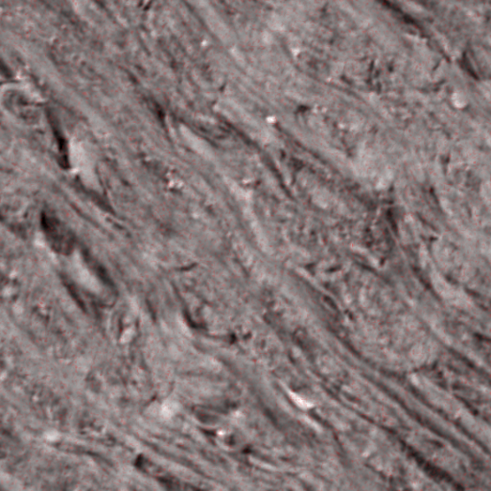
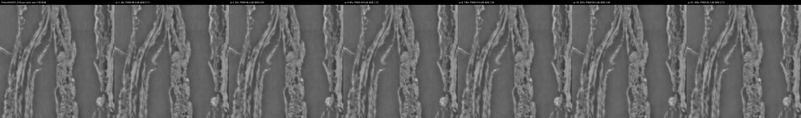
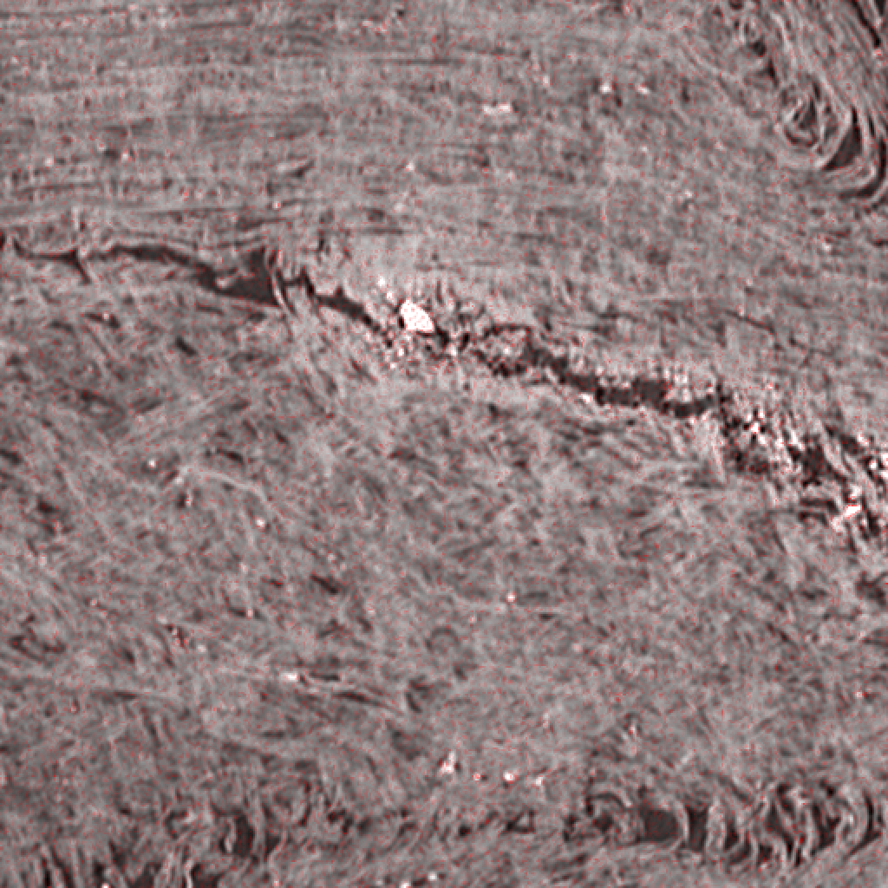
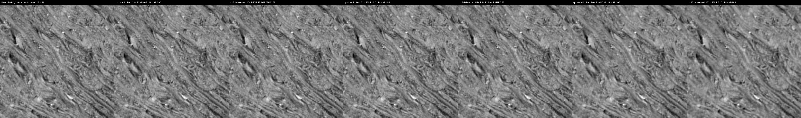
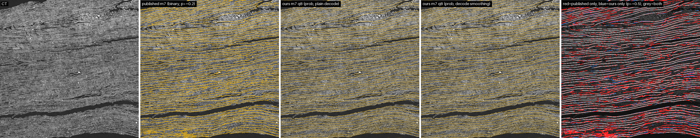
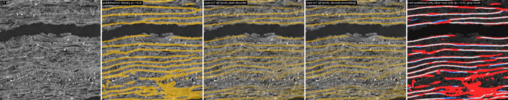
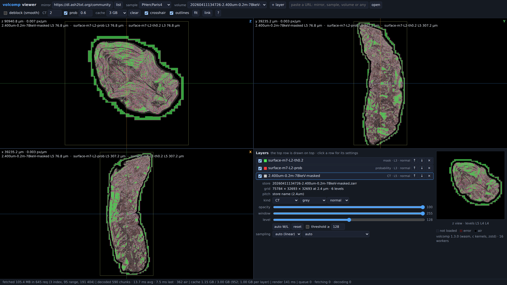
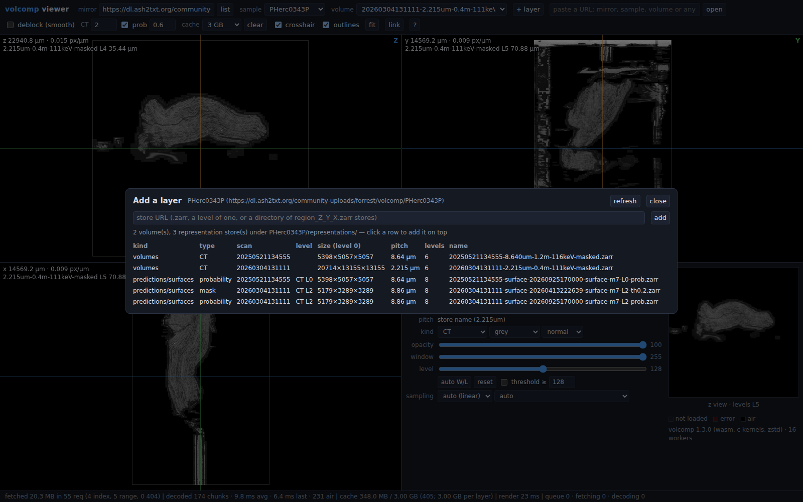

# volcomp: a random-access 3-D codec for scroll CT and surface predictions

Vesuvius Challenge monthly contest submission, September 2026.
Repository: <https://github.com/SuperOptimizer/volume-compressor> (this file: `docs/SUBMISSION_2026-09.md`).
Mirror: <https://dl.ash2txt.org/community-uploads/forrest/volcomp/>.

Every number below is taken from a document in this repository; section 10 lists which one. Where the
repository's own documents disagree, the disagreement is stated rather than resolved by picking the nicer
number. Numbers measured on other data (other codecs' papers) are labelled as such and are not comparable.

## 1. Summary

volcomp is a single-header C compressor for `uint8` volumes, built for the scroll micro-CT and for the model
predictions made from it. It is a 16³ 3-D DCT with a dead-zone quantiser and a tANS entropy coder, cut into
independently decodable 128³ chunks that sit inside ordinary zarr v3 `sharding_indexed` shards of 1024³. There
is one quality knob, `q`, plus exact modes for labels, binary masks and thresholded surface predictions. No
threads, no dependencies beyond libc/libm.

Headline measurements (single thread, Core Ultra 9 275HX, details in section 4):

| what | number | source |
|---|---|---|
| PHercParis4 2.4 µm CT, 54 held-out 128³ chunks, q 8 | **52.9x**, PSNR 35.0 dB, MAE 3.2 | docs/BENCHMARKS.md |
| same, decode / encode throughput at q 8 | **1,375 / 784 MB/s** per core | docs/BENCHMARKS.md |
| 512³ cubes at q 8, four scans (0.55 / 1.13 / 2.40 / 9.36 µm) | 145.7x / 131.7x / 52.3x / 31.0x at 41.6 / 42.7 / 36.6 / 33.4 dB | docs/comparison/README.md |
| PHerc0343P 8.64 µm CT, whole level 0 (138.04 Gvox, masked) | 239.3 MiB on the mirror | fact sheet 3g |
| our m7 surface stores (8-bit probability, q 8) vs the published binary m7 masks (blosc) | **1.63x to 2.34x smaller** at level 0 | docs/comparison/surfaces/README.md |
| compression-only cost on an m7 prediction (q 8 vs the same run's float output) | dice 0.978, MAE 4.10 / 255 | docs/comparison/surfaces/PHerc0343P/README.md |
| surface mode (exact threshold), q 64 | 0.78x (recto) / 0.71x (m7) the size of q 8, threshold exact for every voxel | docs/surface_mode.md |

What is released:

- **The C library** `volcomp.h` (version 1.3.0, format revision 4), a CLI, tests, fuzz targets and the
  format specification (`spec/format.md`).
- **A Python zarr v3 codec**, `volcomp-zarr` (`python/`), registered as `"volcomp"`, with the ctypes
  bytes-level API and reader-side deblocking.
- **A single-file browser viewer** (`web/dist/volcomp_viewer.html`, about 300 KB) that streams any store
  on the mirror by HTTP Range and decodes in WebAssembly, with a layer stack for CT and predictions.
- **The mirror**: the open-data CT volumes of all 39 samples re-encoded as volcomp zarr v3 stores, the
  published surface masks re-exported as volcomp mask stores (exact mode 5; the PHercParis4 recto as mode 4), and **61 new whole-volume m7
  surface-probability stores** (section 6.3).
- **The villa integration**, ScrollPrize/villa PR [#1704](https://github.com/ScrollPrize/villa/pull/1704),
  "3D DCT based compression backend for VC3D" (open, not merged).

## 2. Motivation

### 2.1 The size of the data

> **[pending: docs/_bucket_size_2026-09-30.md]** A measurement of the open-data bucket's logical and stored
> size is in progress and will replace this block. Until then the repository holds two totals that disagree,
> and neither is a measurement of the bucket:
>
> | claim | source |
> |---|---|
> | ~300 TB uncompressed, about 44x smaller (~6 TB) with per-level q 8 / 4 / 2 / 1 | villa PR #1704 body |
> | 64 volumes, ~760 TB logical at level 0, plus the pyramids | tools/export/README.md |
>
> For scale from a public source: the first 3.24 µm volume of PHerc 332 at 53 keV is 4.1 TB
> (scrollprize.substack.com, cited in docs/_landscape_2026-09-30.md).

What is measured is one whole scan. PHerc0343P at 8.64 µm is 138.04 Gvox (138 GB as `uint8`). Its volcomp
level 0 on the mirror is 239.3 MiB, and the whole six-level pyramid is 372.6 MiB. That is 550x, but most of
the volume is masked air, which costs almost nothing in any codec; section 4 gives the codec's behaviour on
dense papyrus, which is the number to use.

### 2.2 What a tracer or a viewer needs

A tool such as VC3D, a surface tracer, or a model running inference never reads a whole volume at once. It
reads scattered 128³-ish regions, at several resolutions, often over the network. That gives four
requirements, which set the design more than the compression ratio does:

1. **Random access at chunk granularity.** Each 128³ chunk decodes on its own; within a chunk, one 16³
   block can be decoded by touching a single substream of at most 16 blocks.
2. **Streaming from static hosting.** A chunk is a byte range inside a shard file, found through the
   shard's trailing index. A reader fetches the index, then only the ranges it needs. No server logic.
3. **Fast decode on a CPU.** About 1.4 GB/s per core at q 8 means a 1024³ shard of CT decodes in under a
   second on one core, and inference can decode on the fly instead of staging decoded copies.
4. **A browser path.** The decoder compiles to a small WebAssembly module, so a zero-install page can
   browse the mirror.

## 3. The format

### 3.1 Geometry

| unit | size | role |
|---|---|---|
| block | 16³ | transform unit; random-access unit inside a chunk |
| substream | 16 blocks | 32 per chunk; decoding one block touches one substream |
| chunk | 128³ = 8x8x8 blocks | independently decodable; one zarr chunk |
| shard | 1024³ = 8x8x8 chunks | zarr v3 `sharding_indexed`, index at the end, crc32c-checked |

### 3.2 Lossy mode (q = 1 to 255)

Per 16³ block: an orthonormal 3-D DCT-II (separable 16-point), a dead-zone quantiser, a zigzag scan, and a
two-lane tANS coder with per-chunk frequency tables and 10 context models, plus a raw bypass bit stream.

- **Step law.** The DC step is q/8. The AC step for frequency (x, y, z) is q·(1+r)^0.65 with r = x+y+z, so
  high frequencies are quantised more coarsely. The encoder's AC dead zone is floor(|X|/step + 0.2); the
  decoder reconstructs |level| = 1 at an offset of 0.15 and larger levels at 0.30.
- **What q means.** q is the quantiser step in voxel units. Typical values are 2 to 32. The production CT
  export uses q 8 at level 0 and 4 / 2 / 1 at levels 1 / 2 / 3 and above, because downsampling averages the
  noise away and the coarser levels are small anyway.
- **No in-format filter.** Blocks and chunks reconstruct independently, so there are no seams between
  chunks by construction. Deblocking is an optional reader step (3.5).
- **Kernels.** AVX2+FMA kernels are chosen at runtime on x86-64, plain C elsewhere. The two agree to ±1 in a
  voxel on decode (with clang and GCC on x86-64 they produce identical bytes).

### 3.3 Exact modes

The mode is stored in header byte 5. An older reader rejects a mode it does not know instead of misreading it.

| mode | name | what it stores | measured size |
|---|---|---|---|
| 0 | lossy DCT | as above | section 4 |
| 1-3 | lossless (q = 0) | per-block prediction along z, zigzag residuals, CONST / SPARSE / DENSE / RAW per block; never more than raw + 8 bytes | 1.8x on synthetic CT; label planes and masks 60-250x |
| 4 | mask | 2x2x2 majority pool of a binary mask (64³), context-coded, decoded trilinearly to a 0..255 ramp | 0.0057 bits/voxel on the PHercParis4 recto, 11x smaller than packbits + zstd-19 |
| 5 | mask, spatially lossless | the full 128³ binary mask, same coder, decodes to exact 0/255 | 0.0255 bits/voxel, 2.4x smaller than packbits + zstd-19 |
| 6 | surface | a DCT base with a flat step law plus a refinement that keeps a threshold exact | 0.71-0.78x the size of q 8 at q 64 |

**Surface mode (mode 6)** exists because thresholding is what consumers do with a probability map, and plain
q 8 does not preserve the threshold: it puts 0.66 % (recto) and 0.18 % (m7) of voxels on the wrong side of
0.5, and the skeleton of the thresholded mask then agrees with the source's only at F1 0.52 / 0.64. A surface
chunk is a DCT base whose reconstruction is bit-exact on every build (strict IEEE kernels, no FMA, fixed
butterfly order), plus one context-coded bit for every voxel whose base value lies within a margin of the
threshold, saying whether the base put it on the wrong side. The guarantee is `(source >= thr) == (decoded
>= thr)` for every voxel, so the mask, its skeleton and its distance field are exactly the source's.

### 3.4 zarr v3 integration

A shard is up to 512 chunk streams back to back followed by an index of 512 (u64 offset, u64 nbytes) pairs
and a CRC-32C of the index. A missing or all-zero chunk has offset = nbytes = all ones and reads as the fill
value 0. This is byte-compatible with zarr v3 `sharding_indexed` with `index_location: "end"` and
`index_codecs = [bytes(little), crc32c]`, with the inner codec `{"name": "volcomp", "configuration": {"q": 8}}`
and no second compressor. Any zarr v3 reader with the codec registered can open the mirror's stores.

### 3.5 Decode-side deblocking

At higher q the 16³ block faces show. Instead of changing the format, a reader can opt in to
`volcomp_decode_smooth`, which (1) smooths the chunk's interior block faces and then (2) projects every block's
DCT coefficients back into the quantisation cells they were decoded from. The result is still a reconstruction
the stream allows. With the zero guard, exact zeros (masked air) stay zero, and a surface chunk keeps its exact
threshold. Settings from docs/deblocking.md:

| data | setting | effect | cost |
|---|---|---|---|
| masked CT, q >= 4 | gated face filter, strength 2, zero guard | +0.11 to +0.61 dB PSNR, no chunk worse than no filter on 4 volumes at q 4, 8, 16 | 5-6 ms per chunk (380-420 MB/s) |
| masked CT, q < 4 | none (decode_smooth turns itself off) | gated filters are within ±0.03 dB of no filter at q 2 | none |
| probability maps | Gaussian seam blur σ 0.6, zero guard | m7 q 16: dice 0.9913 to 0.9931, iso-surface shift 0.095 to 0.075 voxel | 13-17 ms per chunk |

Two encoder-side alternatives were measured and rejected: encode-only error feedback (+10-23 % bytes for
-0.1 to -0.8 dB) and a per-chunk signalled filter strength (equal to the best fixed strength within 0.01 dB).

### 3.6 Worked example (Python)

The bytes-level API works on one 128³ `uint8` chunk in z-major order. This snippet was run against the
repository's `libvolcomp.so`:

```python
import numpy as np
import volcomp_zarr as vc

# a synthetic 128^3 uint8 chunk (z-major); in practice one zarr chunk of CT
z, y, x = np.mgrid[0:128, 0:128, 0:128]
chunk = 128 + 60 * np.sin(x / 9.0 + z / 13.0) + np.random.default_rng(0).normal(0, 6, x.shape)
chunk = np.clip(chunk, 0, 255).astype(np.uint8)

enc = vc.encode(chunk.tobytes(), 8)                  # lossy, q = 8
dec = np.frombuffer(vc.decode(enc), np.uint8).reshape(chunk.shape)
print(len(enc), vc.stream_q(enc))                    # stream size in bytes, 8.0

exact = vc.encode(chunk.tobytes(), vc.Q_LOSSLESS)    # q = 0, byte-exact
assert bytes(vc.decode(exact)) == chunk.tobytes()

blk = np.frombuffer(vc.decode_block(enc, 2, 3, 4), np.uint8).reshape(16, 16, 16)
assert np.array_equal(blk, dec[32:48, 48:64, 64:80])  # one block == that region of the full decode

sm = vc.decode_smooth(enc, 2.0, zero_guard=True, gated=True)   # opt-in deblocking for CT at q >= 4
```

As a zarr v3 codec, the same thing is one serializer (`compressors=None`, because the chain must be volcomp
only):

```python
import zarr
from volcomp_zarr import VolcompCodec
z = zarr.create_array(store, shape=shape, chunks=(128,) * 3, shards=(1024,) * 3, dtype="uint8",
                      serializer=VolcompCodec(q=8), compressors=None, fill_value=0)
# VolcompCodec(q=0) lossless; mode="mask" | "mask-lossless"; mode="surface", q=64, threshold=128
```

## 4. Results on scroll CT

### 4.1 Rate-distortion on the held-out set

54 held-out 128³ chunks of PHercParis4 2.4 µm (masked), never used for design; single thread, AVX2 build,
medians of 3, about ±10 % timing noise under WSL2:

| q | ratio | PSNR dB | SSIM | MAE | P99 | max | enc MB/s | dec MB/s |
|--:|--:|--:|--:|--:|--:|--:|--:|--:|
| 2 | 17.56 | 41.33 | .9840 | 1.573 | 7 | 49 | 471 | 702 |
| 4 | 30.05 | 38.04 | .9700 | 2.282 | 11 | 77 | 574 | 906 |
| 8 | 52.92 | 35.00 | .9463 | 3.217 | 15 | 121 | 784 | 1375 |
| 16 | 95.58 | 32.22 | .9088 | 4.416 | 21 | 143 | 1033 | 2135 |
| 32 | 176.5 | 29.67 | .8532 | 5.911 | 28 | 155 | 1113 | 2484 |

The error has tails: voxels with |error| > 3q are 1.24 % at q 2, 0.10 % at q 8 and 0.0004 % at q 32, almost
all in high-contrast interior blocks, not at the air mask. The plain C kernels (arm64, or x86-64 without AVX2)
decode at 610 MB/s at q 8, against 1,406 MB/s for AVX2 in the same run.

### 4.2 Rate-distortion per voxel size

512³ cubes (128 MiB each) of the original uncompressed CT from four ESRF scans, from docs/comparison/README.md.
Plain decode:

| q | 0.55 µm PHerc0500P2 | 1.13 µm PHerc1667 | 2.40 µm PHercParis4 | 9.36 µm PHerc0191 |
|--:|--:|--:|--:|--:|
| 1 | 28.4x, 48.3 dB | 33.1x, 50.7 dB | 12.5x, 46.5 dB | 7.9x, 45.1 dB |
| 2 | 49.6x, 46.2 dB | 52.0x, 48.3 dB | 19.7x, 43.3 dB | 11.8x, 41.1 dB |
| 4 | 85.2x, 44.0 dB | 81.7x, 45.6 dB | 31.7x, 39.9 dB | 18.6x, 37.2 dB |
| 8 | 145.7x, 41.6 dB | 131.7x, 42.7 dB | 52.3x, 36.6 dB | 31.0x, 33.4 dB |
| 16 | 250.3x, 39.2 dB | 217.6x, 39.8 dB | 90.1x, 33.3 dB | 55.7x, 29.8 dB |
| 32 | 428.0x, 36.7 dB | 361.5x, 36.9 dB | 163.4x, 30.3 dB | 109.3x, 26.7 dB |

The same q behaves very differently across pitches. The fine-pitch scans (0.55 and 1.13 µm) are smooth at
the voxel scale, so q 8 gives 130-150x at over 41 dB. The 9.36 µm scan packs more papyrus structure into each
block, so q 8 gives 31x at 33.4 dB, and its MAE at q 8 (4.27) is close to Paris 4's at q 16. "About 50x at 35
dB" is a statement about 2.4 µm, not about every scan.

### 4.3 What it looks like

All images are lossless 512² PNGs of one 512³ cube (1 pixel = 1 voxel unless noted).

**PHercParis4 2.4 µm, centre z plane: raw, then q 1, 2, 4, 8, 16, 32** (plain decode). Up to q 8 the fibre
structure is intact at 1:1; from q 16 the texture flattens and block structure appears in smooth regions.


**The error at q 8 on the same plane**, raw in grey with a red overlay of opacity min(1, 4·|error|/255),
magnified 2x (an error of 32 would be 50 % red). The q 8 error is a faint, spatially uniform speckle with no
structure along the papyrus.



**PHerc0500P2 0.55 µm, raw and q 1 to 32.** At fine pitch the panels are hard to tell apart even at q 32
(428x, 36.7 dB).



**PHerc0191 9.36 µm, q 8 error overlay.** The hardest of the four: the speckle is denser than at 2.4 µm and
is strongest on the bright, high-contrast inclusions along the crack.



**Deblocking, PHercParis4 centre z plane, raw and q 1 to 32 decoded with the post-filter.** Compare the q 16
and q 32 panels with the plain row above.



The full set (nine views per cube, every q, plain and deblocked, and 72 error overlays) is in
[docs/comparison/](comparison/README.md).

### 4.4 The deblocking effect in numbers

Deblocked PSNR on the four cubes (plain in brackets): at q 8, 42.1 (41.6), 43.4 (42.7), 36.9 (36.6),
33.5 (33.4) dB; at q 16, 39.8 (39.2), 40.7 (39.8), 33.9 (33.3), 30.1 (29.8) dB. The gain grows with q and
shrinks with voxel size. On the held-out chunks the per-chunk post-filter moves q 8 from 35.00 to 35.17 dB and
q 16 from 32.22 to 32.54 dB, at a cost of 2-8 % of decode time in that (older, per-chunk) filter. For teacher
inference it does not help at q 8 (section 6.1), so it is a viewing and high-q tool.

## 5. Comparison with other codecs

### 5.1 Measured head-to-head

> **[pending: docs/bench/README.md and docs/bench/*.png]** A benchmark on the same 512³ cubes is in progress:
> zstd and blosc (lossless), per-slice JPEG, JPEG 2000, JPEG XL, WebP and AVIF, the video codecs x264, x265
> and AV1 with z as time, ZFP, and JP3D, with rate-distortion plots and the ratio each reaches at 30, 35 and
> 40 dB. Until it lands, **this writeup makes no claim that volcomp beats any of these on scroll CT.**

What the repository measures today:

| comparison | result | source |
|---|---|---|
| volcomp vs its predecessor c5d, same q, held-out set | 0.6 % (q 2) to 6.9 % (q 32) fewer bytes; decode 2.0-4.0x, encode 1.4-2.2x faster | docs/BENCHMARKS.md |
| lossless q = 0 vs zstd-19, real label channels | 22 % smaller on a sparse mask; 23-34 % **larger** on the two busier channels | docs/BENCHMARKS.md |
| label planes at q 8 vs the blosc-zstd chunks they ship in | 35x smaller (MAE 0.5, 43.7 dB) | README.md |
| probability maps: q 8 vs u8 + zstd-19 | 0.065 vs 3.94 bits/voxel (recto), 0.052 vs 1.70 (m7) | docs/surface_mode.md |
| masks: mode 5 vs packbits + zstd-19 | 2.4x smaller, exact | README.md |

### 5.2 The landscape, with its caveats

docs/_landscape_2026-09-30.md surveys the alternatives. **No source in it benchmarks any codec on scroll CT,**
and every competitor number there is on other data (simulation floats, clinical CT, a 34 µm mouse micro-CT,
ultrasound video). Its conclusions, in short:

- **Lossless (zstd, blosc).** Universal and supported by every zarr reader, but bounded by sensor noise. The
  commonly quoted 1.3-2x on noisy 8-bit CT has no retrieved source; volcomp's own lossless mode gets 1.8x on
  synthetic CT. Reaching 20-500x needs a lossy codec.
- **Per-slice image codecs (JPEG, JPEG 2000, JPEG XL, WebP, AVIF).** Available as zarr codecs through
  imagecodecs, but they ignore z. On thoracic CT, 3-D JPEG 2000 beat 2-D by 1-3 dB at 8:1 to 16:1 (RSNA 2004,
  clinical CT). Access is by slice tile, which suits an x-y viewer and not xz/yz slicing or 3-D tracers.
- **Video codecs (HEVC, AV1, VVC) with z as time.** Probably the strongest competitor on ratio: they have
  rate-distortion optimisation, adaptive block sizes and in-loop filters. On a 34 µm micro-CT study HEVC kept
  morphology to ~34x where JPEG 2000 managed ~12x (different data, not PSNR-matched). Their cost here is
  random access: a sub-volume needs whole GOPs of full frames, and there is no zarr codec for them.
- **3-D native codecs.** ZFP (4³ blocks, fixed-rate or accuracy modes, up to ~2 GB/s) is the closest
  architectural cousin and offers error bounds; SZ3 and MGARD offer hard error bounds; TTHRESH reaches very
  high ratios on smooth float fields but decodes at roughly 20 MB/s from its own figures and has no useful
  random access; JP3D exists as a standard with few implementations.
- **Neural / INR codecs.** Report high ratios on smooth scientific fields, but encoding is training (minutes
  to hours per MB-scale volume) and decoding needs a GPU. Not a candidate for a multi-hundred-TB archive.

volcomp's measured position: about 1.4 GB/s decode per core at q 8 with chunk-level random access, zarr v3
sharding and a browser decoder, and a single format that also covers exact labels, masks and thresholded
predictions. Its gaps are the head-to-head measurement (pending above) and the lack of an error bound.

## 6. Downstream validation

### 6.1 A teacher model on decoded CT

The recto surface teacher was run on an uncompressed interior 512³ of PHercParis4 and on the same region
decoded from volcomp, and the predictions were compared on the central 256³ (docs/deblocking.md):

| q | dice at 0.5 vs the raw-CT prediction | mean abs diff (u8) | correlation |
|--:|--:|--:|--:|
| 4 | 0.9777 | 2.40 | 0.99775 |
| 8 | 0.9511 | 5.85 | 0.98812 |
| 16 | 0.9273 | 8.59 | 0.97752 |

At q 8, plain decode agrees best (0.951, against 0.948-0.949 with any deblocking filter); at q 16 every filter
helps (0.927 to 0.931-0.933). This teacher was not trained on compressed data. A dice of 0.95 at q 8 is a real
cost, and the villa PR says the same thing in plain words: models not fine-tuned on compressed data are
sensitive to it. Fine-tuning on compressed data is not done (section 8).

### 6.2 Probability stores and the threshold

On 12 cubes of 256³ per teacher (201 M voxels each, fresh float predictions on PHercParis4, docs/surface_mode.md):

| store | bits/voxel recto / m7 | threshold dice recto / m7 | skeleton F1 recto / m7 | band MAE recto / m7 |
|---|---|---|---|---|
| mode 0, q 8 | 0.0647 / 0.0523 | 0.9807 / 0.9917 | 0.52 / 0.64 | 2.61 / 2.21 |
| surface, q 32 | 0.0759 / 0.0530 | 1 / 1 | 1 / 1 | 2.59 / 2.23 |
| surface, q 64 | 0.0503 / 0.0370 | 1 / 1 | 1 / 1 | 3.51 / 3.64 |

Surface q 64 is 0.78x (recto) and 0.71x (m7) the size of q 8 with an exact mask; the price is a larger soft
error near the surface (3.5/255 against 2.2-2.6). The cost is speed: surface decode runs at 0.96-1.5 GB/s
against 3.5-4.2 GB/s for q 8 on these maps.

### 6.3 The m7 whole-volume release

Over the last week we ran the m7 surface model (the published `surface_m7_nnunet` checkpoint) over whole
volumes and wrote the result straight into volcomp stores:

- **61 stores**: all 31 volumes at 8-9 µm, at level 0, plus 30 fine-pitch scans at the CT level nearest 9 µm
  (level 2 for 2.4 µm, 3 for 1.1 µm, 4 for 0.5 µm, 1 for 4.3 µm).
- **Pipeline**: 192³ windows, separable Gaussian blend, TensorRT fp16 (correlation 0.99996 with the PyTorch
  model), no TTA, reading volcomp q 8 CT. The first two volumes (PHerc0343P and PHerc0009B at level 0) used
  stride 96 on plain-decoded CT; the other 59 used **stride 128** on CT decoded with smoothing 2, which was
  needed to fit the schedule.
- **Format**: `uint8` = round(255·p), volcomp q 8, eight levels named by pitch, shards 1024³ at level 0
  shrinking to 128³. Store names follow
  `<Sample>/representations/predictions/surfaces/<scan>-surface-20260925170000-surface-m7-L<k>-prob.zarr`.

Sizes, from the live listing: PHerc0343P 8.64 µm, 252.3 MiB; PHerc0009B, 1.33 GiB.

### 6.4 Our m7 stores against the published m7 masks

Upstream publishes m7 predictions for some fine-pitch scans as binary masks thresholded at 0.2, in blosc-zstd
zarr v2. Two of our stores cover the same scan at the same level, so they can be compared directly
(docs/comparison/surfaces/):

| | PHerc0343P (2.215 µm scan, level 2) | PHerc0009B (2.401 µm scan, level 2) |
|---|---|---|
| voxels at level 0 | 56.0 Gvox | 363.3 Gvox |
| published, level 0 (binary, blosc) | 370 MiB | 999 MiB |
| ours, level 0 (8-bit probability, volcomp q 8) | 158 MiB | 613 MiB |
| published / ours, level 0 | **2.34x** | **1.63x** |
| all levels (published 6 / ours 8) | 468 / 202 MiB | 1.23 GiB / 764 MiB |
| dice, ours p >= 0.5 vs published, dense 1024³ box | 0.637 | 0.655 |
| precision / recall, same | 0.877 / 0.501 | 0.859 / 0.530 |
| dice, ours p >= 0.2 (the published threshold), box | 0.736 | 0.744 |
| dice p >= 0.5 / p >= 0.2, whole volume | 0.459 / 0.603 | 0.686 / 0.758 |

So our stores hold 255 levels of probability in less space than the published stores spend on one bit.

**The agreement is low, and compression is a small part of why.** The box dice is 0.64-0.66, a gap of about
0.32-0.34 below the compression-only figure. Three things produce that gap:

1. **Separate inference runs.** Same checkpoint, different run: our stride 128, Gaussian blend, TensorRT fp16
   and q 8 CT input against the upstream nnU-Net predictor on the original CT. m7's mask moves with window
   placement: on the same input, stride 128 against stride 96 gives dice 0.946, stride 96 against 144 gave
   0.82 on the PHerc0343P 8.64 µm volume, and no stride pair we tried reaches 0.99.
2. **Thresholds.** The published masks are cut at 0.2, ours is scored at 0.5, so the published sheets are
   thicker (recall 0.50-0.53 at high precision 0.86-0.88). At the published threshold the box dice rises to
   0.74.
3. **The published masks' air blocks.** 80 % (0343P) and 71 % (0009B) of the published surface voxels lie
   outside the published CT mask, in solid blocks of masked air. The scores above exclude them; counted in,
   the whole-volume dice drops to 0.12-0.28.

**What compression itself costs** was measured where the uncompressed float output of the same run was kept
(a 384×768² box of the PHerc0343P 8.64 µm scan; no float output exists for the level-2 scans above):

| our q 8 store decoded | MAE (/255) | dice p >= 0.5 | dice p >= 0.2 |
|---|---|---|---|
| plain | 4.10 | 0.978 | 0.968 |
| gated2 smoothing | 3.70 | 0.978 | 0.969 |
| Gaussian 0.6 | 4.67 | 0.977 | 0.955 |

That is about 0.02 dice and 4 of 255 in MAE. Surface mode (6.2) would remove the dice part for anyone who
thresholds; the released stores are mode 0, q 8.

**Images.** Five panels per slice: CT, the published mask (amber, solid), ours plain (amber at opacity 0.6·p),
ours with decode smoothing, and a diff (red = published only, blue = ours only at p >= 0.5, grey = both). The
slices sit at fixed positions (1/3 and 2/3 of the box along each axis), not picked. Because the published
threshold is lower, a thin red rim is expected along every sheet even from identical predictions.

PHerc0343P, z 1493, 256² crop at 2x. The published mask has thicker sheets and filled patches between them
(the red blobs in the diff); ours follows the sheets more thinly and shows the lower-probability regions as
faint amber:


PHerc0009B, z 2709, the whole 1024² slice at half resolution, and its 2x crop:





## 7. Tools

### 7.1 The single-file viewer

`web/dist/volcomp_viewer.html` is one self-contained page (about 300 KB: HTML, JS, a decode worker and the
volcomp and zstd decoders compiled to WebAssembly and inlined). Double-click it; it works from `file://` and
needs nothing installed. It streams from the mirror or any server that allows CORS and Range requests.

- **Layer stack.** Three orthogonal slice views over a stack of any number of layers: the CT and any store
  under `representations/` (m7 probabilities, masks, teacher region sets). Each layer has its own colour map,
  blend mode (normal, additive, max), opacity, window/level, optional threshold, sampling and pyramid level.
  Any layer can be at the bottom, so a prediction can be viewed alone.
- **Geometry and resampling.** All views work in micrometres. Each level of each layer has its own pitch and
  origin; an m7 `-L<k>` store's level 0 is exactly CT level k. Each layer picks, per view, the coarsest level
  whose pitch is at most one screen pixel. Masks and labels are sampled nearest, CT and probabilities
  trilinearly with 8-bit weights, in integer arithmetic, so a Python reference compositor reproduces the
  browser's tiles bit for bit.
- **Streaming.** For each shard it reads the trailing index by one Range request and checks its CRC, then
  fetches only the chunks in view, merging ranges with gaps of at most 64 KB. Decoding runs in a pool of Web
  Workers. Chunks on screen are never evicted, so the views do not thrash when the cache is small; a layer
  that does not fit its share drops to a coarser level and the status bar says so.
- **Deblock toggle**, with the settings of section 3.5; the URL hash records the whole view for sharing.


PHerc0343P 2.215 µm CT at level 0 with our m7 `-L2` probabilities (red), which are drawn from their own 8.86 µm
level 0 over the finer CT.



PHercParis4: CT, m7 probabilities and the published th0.2 mask as three layers at coarse levels. The
status bar reports 105 MB fetched in 645 requests for this view.



The add-layer panel lists a sample's volumes and every store under `representations/`, with its type, the
CT level it was made from, size, pitch and number of levels.

Verification (web/README.md, 2026-09-30): 42 PASS, 0 FAIL in headless Chromium, including bit-exact tiles
against the reference compositor and chunk checksums against the native decoder. The WebAssembly decoder
matches the native C kernels bit for bit on seven test chunks covering CT, probabilities, masks and surface
chunks.

### 7.2 The export pipeline

`tools/export/` re-encodes the bucket: a coordinator holds a sqlite queue of (volume, level, shard) units;
workers download up to 512 source chunks, run `volcomp shard-pack` and `shard-verify`, and upload by SFTP
with an atomic rename. Units are leased, so workers can die and the run can be stopped and resumed. Occupancy
masks computed from each volume's coarsest level mark empty units done without touching them (65.8 % of the
units of the PHercParis4 recto prediction export). The published surface predictions go through the same pipeline as mask (mode 4)
or exact mask (mode 5) stores.

### 7.3 villa / VC3D integration

ScrollPrize/villa PR #1704 (open, +5,692 / -192, 21 files) vendors volcomp 1.3.0 into
`volume-cartographer/libs/volcomp`, adds a C++ codec shim, teaches `VcDataset`, `Volume` and the chunk
fetcher to read volcomp stores, and fixes the C++ zarr reader and writer to handle shards with the index at
the end and a crc32c index codec, with tests for both. Decode smoothing is exposed there but not yet called
by any VC3D reader.

## 8. Limitations and caveats

- **No error bound.** Quality is empirical. The README's "P99 ≈ 2.5q" is a loose summary: measured P99 is
  15 at q 8 (1.9q) and 28 at q 32 (0.9q), and hostile content can ring arbitrarily. Codecs such as SZ3,
  MGARD and ZFP in accuracy mode offer hard bounds; volcomp does not.
- **Blocking.** 16³ blocks show at high zoom. The PR notes visible artefacts at q 8 above 2x zoom at native
  resolution; blocking amplification is 1.19 at q 2 rising to 1.93 at q 32. Deblocking is opt-in and per
  chunk in the viewer, so chunk faces are only treated by the region-level filter, which the viewer does not
  apply.
- **Models not trained on compressed data are sensitive to it.** Teacher dice against raw-CT inference is
  0.951 at q 8 (section 6.1). Fine-tuning on compressed data is in progress and has no result yet. No effect
  of compression on tracing or segmentation quality has been measured.
- **q 8 probability stores lose the threshold** on 0.18-0.66 % of voxels. The released m7 stores are q 8;
  surface mode fixes this but is not what they use, and a reader older than format revision 4 rejects
  surface chunks.
- **Comparison with other codecs is pending** (section 5.1). The landscape suggests video codecs may win
  on ratio at equal PSNR; until the benchmark lands, that is open.
- **Corpus.** The design and the main tables use PHercParis4 2.4 µm; four 512³ cubes show how the numbers
  move across pitch (26.7 to 50.7 dB over q 1-32). Other scans may differ.
- **Platforms.** Measured on Linux x86-64 under WSL2 only (±10 % timing noise); arm64 compiles and uses the
  C kernels, unmeasured. The viewer is tested in headless Chromium only; Firefox and Safari are untested. It
  shows axis-aligned slices only and ignores rotations and affines.
- **Integration is not merged.** The villa PR is open; the codec is not in the zarr codecs registry.
- **Mask mode 4 is not exact** (1.7 % of thresholded voxels differ, up to 2 voxels); mode 5 is.
- **Lossless mode loses to zstd-19** by 23-34 % on busy, non-sparse channels.
- **The m7 comparison** covers two scans, and the compression-only check is on one box of a third scan;
  the stride difference in the release (96 for two volumes, 128 for 59) means the stores are not all from
  identical inference settings.

## 9. How to use it

**Look at the data (no install).** Download `web/dist/volcomp_viewer.html` and open it in Chrome or Edge.
Pick a sample; press `I` to add a prediction layer; `D` toggles deblocking; `?` lists the keys.

**Build the library, CLI and tests.**

```sh
cmake --preset release && cmake --build --preset release && ctest --preset release
./build/release/volcomp encode chunk.u8 chunk.volc --q=8          # --q=0 lossless, --surface for mode 6
./build/release/volcomp decode chunk.volc out.u8 --smooth         # opt-in deblocking
```

Requires clang or GCC with C23. In C, `#include "volcomp.h"` and call `volcomp_encode`, `volcomp_decode`,
`volcomp_decode_block` (README.md).

**Python / zarr.**

```sh
cmake --preset release && cmake --build --preset release --target volcomp_shim
cp build/release/libvolcomp.so python/volcomp_zarr/ && pip install ./python[zarr]
```

```python
import zarr, volcomp_zarr                 # importing registers the "volcomp" codec with zarr >= 3
volcomp_zarr.set_read_smoothing(2)        # optional: deblocked reads (or VOLCOMP_SMOOTH=2)
a = zarr.open("<mirror copy>/PHerc0343P/volumes/20250521134555-8.640um-1.2m-116keV-masked.zarr/0", mode="r")
block = a[1024:1152, 2048:2176, 512:640]
```

**URLs.**

- Mirror root: <https://dl.ash2txt.org/community-uploads/forrest/volcomp/>
- Layout: `<Sample>/volumes/<volume>.zarr/<level>/` (levels `0` to `5`) and
  `<Sample>/representations/predictions/surfaces/<name>.zarr/<pitch>/` (levels named by pitch in µm)
- Example CT: `PHerc0343P/volumes/20250521134555-8.640um-1.2m-116keV-masked.zarr`
- Example m7 store: `PHerc0343P/representations/predictions/surfaces/20260304131111-surface-20260925170000-surface-m7-L2-prob.zarr`
- VC3D: <https://github.com/ScrollPrize/villa/pull/1704>

## 10. Reproducibility

| numbers | document | script / tool |
|---|---|---|
| held-out and tune tables, throughput, error tails, kernel sets | docs/BENCHMARKS.md | `volcomp-bench`, `tools/fetch_corpus.sh` |
| per-pitch cube tables and CT images | docs/comparison/README.md, docs/comparison/report.json | `tools/compare_images.py`, `tools/diff_images.py` (commits 018bef0, 61ff40f, 36daf54, e565113) |
| deblocking gains, teacher dice vs q | docs/deblocking.md | `tools/surface_study/dbk*.py`, `downstream.py`, `bench_smooth.c` (commits 069a4bd, 1f618bd, f31b0e2) |
| surface mode, probability-map costs | docs/surface_mode.md | `tools/surface_study/` (`measure.py`, `rawcost.py`, `final_eval.py`, `bench_surf.c`; commits 18a711e, 7c14567) |
| m7 stores vs published masks | docs/comparison/surfaces/README.md and the per-scroll README.md + report.json | `tools/surface_compare.py` (commit 49c29e6) |
| viewer behaviour and verification | web/README.md | `web/test/` (commits 3e549a3, b4bbc3e) |
| export pipeline | tools/export/README.md | `tools/export/` |
| format | spec/format.md | tests in `tests/`, fuzz targets in `fuzz/` |
| store sizes on the mirror, PR details, conflicts | docs/_factsheet_2026-09-30.md (sections 3g, 5, 8) | live HTTP listings, `gh pr view 1704` |
| other codecs and their caveats | docs/_landscape_2026-09-30.md | web survey, sources listed there |
| m7 release scope and pipeline | the production notes summarised in the fact sheet section 5 and the surfaces READMEs | rvsm `tools/m7_wholevol.py` (commit 090eaa0) |
| codec benchmark | [pending: docs/bench/README.md] | `tools/bench_codecs.py` |
| bucket size | [pending: docs/_bucket_size_2026-09-30.md] | |

Known disagreements inside the repository, listed so nobody quotes the wrong one: the ratio at q 8 is 52.9x
(held-out chunks) or 52.3x (cube), not the "~40x at ~40 dB" in the vendored villa README; the whole-bucket
total is 300 TB (PR) or 760 TB logical (export README) until measured; recto q 8 threshold dice is 0.9807
(12 cubes) or 0.9872 (two regions only), depending on the region set.
