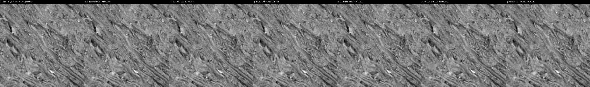
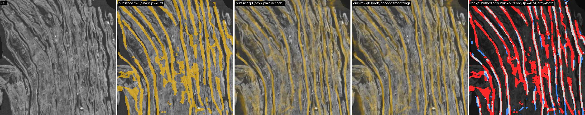
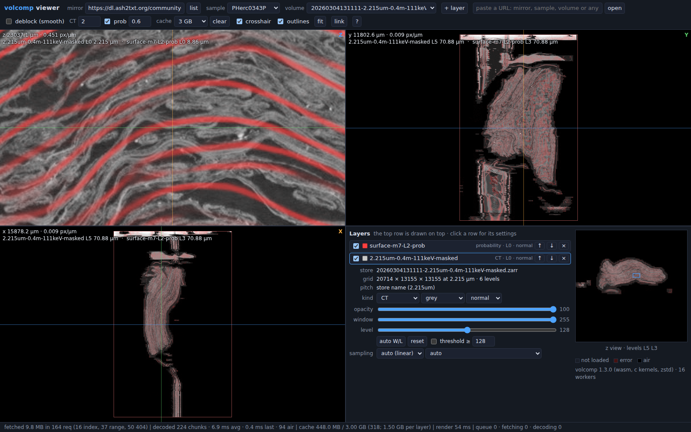

# volcomp: September submission (short version)

volcomp is a single-header C codec for `uint8` scroll CT and model predictions: 16³ 3-D DCT, dead-zone
quantiser, tANS, independently decodable 128³ chunks inside standard zarr v3 `sharding_indexed` 1024³
shards. One knob, `q`, plus exact modes for labels, masks and thresholded surface predictions. The
open-data bucket holds 761 TB of logical level-0 CT, 275 TB stored (docs/_bucket_size_2026-09-30.md).

Measured, single thread (docs/BENCHMARKS.md, docs/comparison/):

| data | q | ratio | PSNR |
|---|--:|--:|--:|
| PHercParis4 2.4 µm, 54 held-out chunks | 8 | 52.9x | 35.0 dB |
| 0.55 / 1.13 / 2.40 / 9.36 µm cubes | 8 | 146x / 132x / 52x / 31x | 41.6 / 42.7 / 36.6 / 33.4 dB |

Decode 1.4 GB/s and encode 0.8 GB/s per core at q 8. A recto teacher run on q 8 CT agrees with its raw-CT
prediction at dice 0.951; models not trained on compressed data do notice it.

**Released**

- C library, CLI and format spec; Python zarr v3 codec (`volcomp-zarr`).
- Mirror: <https://dl.ash2txt.org/community-uploads/forrest/volcomp/>, with the CT of all 39 samples,
  the published surface masks as exact mask stores, and 61 new whole-volume m7 surface-probability stores
  (TensorRT fp16, stride 128 for 59 of them, 96 for the first two).
- A single-file browser viewer (`web/dist/volcomp_viewer.html`) that streams the mirror by HTTP Range and
  stacks CT and prediction layers.
- VC3D integration: ScrollPrize/villa PR #1704 (open).

Our m7 stores hold 8-bit probabilities and are 1.63-2.34x smaller than the published binary m7 masks.
Agreement with those masks is only dice 0.64-0.66. Most of that gap is not compression. The two are
separate inference runs, and m7 moves with window placement: stride 128 against 96 gives dice 0.946. The
thresholds differ (0.2 against 0.5). The published masks also mark blocks of masked air. Against the same
run's float output, q 8 costs dice 0.978 and MAE 4 of 255.

**Caveats.** No error bound. Blocks become visible at high zoom (deblocking is opt-in and decode-side).
The released probability stores are q 8, which flips 0.2-0.7 % of voxels at the 0.5 threshold; the new
exact-threshold surface mode is not used in them. The viewer is tested in Chromium only. The benchmark
against JPEG XL, AV1, x265, ZFP and others is **[pending: docs/bench/]**, so this post makes no claim of
beating them.

Full writeup: [SUBMISSION_2026-09.md](SUBMISSION_2026-09.md).
