# Comparison gallery

Every thumbnail links to the full-resolution lossless PNG. Numbers are in the README and report.json next to each image: CT cubes [README.md](README.md), surfaces [surfaces/README.md](surfaces/README.md), masks [masks/README.md](masks/README.md). Strip thumbnails show only some panels (named per row); the full strip has them all. Made by `tools/gallery.py`.

## CT cubes (512³, q 1-32)

### PHerc0500P2 0.55 µm ([table](README.md#pherc0500p2_055um))

| thumbnail | shows |
|---|---|
| [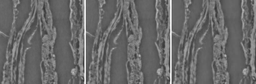](PHerc0500P2_0.55um/zmid_all.png) | [PHerc0500P2_0.55um/zmid_all.png](PHerc0500P2_0.55um/zmid_all.png): PHerc0500P2 0.55 µm, centre z plane: raw and q 1-32 (plain decode); q 8 146x at 41.6 dB, q 32 428x at 36.7 dB |
| [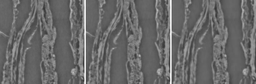](PHerc0500P2_0.55um/zmid_all_db.png) | [PHerc0500P2_0.55um/zmid_all_db.png](PHerc0500P2_0.55um/zmid_all_db.png): PHerc0500P2 0.55 µm, the same with the deblocking post-filter; q 32 37.5 dB |
| [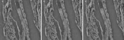](PHerc0500P2_0.55um/ymid_all.png) | [PHerc0500P2_0.55um/ymid_all.png](PHerc0500P2_0.55um/ymid_all.png): PHerc0500P2 0.55 µm, centre y plane (z vertical), raw and q 1-32 |
| [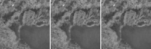](PHerc0500P2_0.55um/xmid_all.png) | [PHerc0500P2_0.55um/xmid_all.png](PHerc0500P2_0.55um/xmid_all.png): PHerc0500P2 0.55 µm, centre x plane (z vertical), raw and q 1-32 |
| [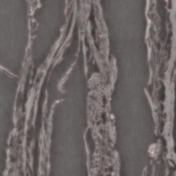](PHerc0500P2_0.55um/diff_zmid_q8.png) | [PHerc0500P2_0.55um/diff_zmid_q8.png](PHerc0500P2_0.55um/diff_zmid_q8.png): PHerc0500P2 0.55 µm, q 8 error overlay on the centre z plane (red opacity = 4 x abs(error) / 255; max error 34) |
| [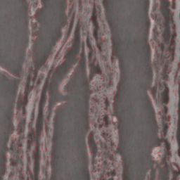](PHerc0500P2_0.55um/diff_zmid_q32.png) | [PHerc0500P2_0.55um/diff_zmid_q32.png](PHerc0500P2_0.55um/diff_zmid_q32.png): PHerc0500P2 0.55 µm, q 32 error overlay on the centre z plane (max error 66) |

### PHerc0139 1.13 µm ([table](README.md#pherc0139_113um))

| thumbnail | shows |
|---|---|
| [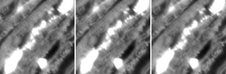](PHerc0139_1.13um/zmid_all.png) | [PHerc0139_1.13um/zmid_all.png](PHerc0139_1.13um/zmid_all.png): PHerc0139 1.13 µm, centre z plane: raw and q 1-32 (plain decode); q 8 177x at 44.1 dB, q 32 467x at 38.7 dB |
| [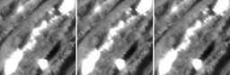](PHerc0139_1.13um/zmid_all_db.png) | [PHerc0139_1.13um/zmid_all_db.png](PHerc0139_1.13um/zmid_all_db.png): PHerc0139 1.13 µm, the same with the deblocking post-filter; q 32 39.8 dB |
| [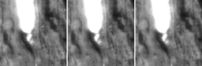](PHerc0139_1.13um/ymid_all.png) | [PHerc0139_1.13um/ymid_all.png](PHerc0139_1.13um/ymid_all.png): PHerc0139 1.13 µm, centre y plane (z vertical), raw and q 1-32 |
| [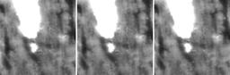](PHerc0139_1.13um/xmid_all.png) | [PHerc0139_1.13um/xmid_all.png](PHerc0139_1.13um/xmid_all.png): PHerc0139 1.13 µm, centre x plane (z vertical), raw and q 1-32 |
| [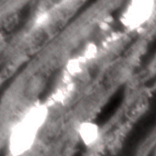](PHerc0139_1.13um/diff_zmid_q8.png) | [PHerc0139_1.13um/diff_zmid_q8.png](PHerc0139_1.13um/diff_zmid_q8.png): PHerc0139 1.13 µm, q 8 error overlay on the centre z plane (red opacity = 4 x abs(error) / 255; max error 44) |
| [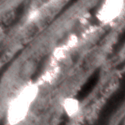](PHerc0139_1.13um/diff_zmid_q32.png) | [PHerc0139_1.13um/diff_zmid_q32.png](PHerc0139_1.13um/diff_zmid_q32.png): PHerc0139 1.13 µm, q 32 error overlay on the centre z plane (max error 61) |

### PHerc1667 1.13 µm ([table](README.md#pherc1667_113um))

| thumbnail | shows |
|---|---|
| [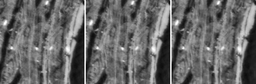](PHerc1667_1.13um/zmid_all.png) | [PHerc1667_1.13um/zmid_all.png](PHerc1667_1.13um/zmid_all.png): PHerc1667 1.13 µm, centre z plane: raw and q 1-32 (plain decode); q 8 132x at 42.7 dB, q 32 361x at 36.9 dB |
| [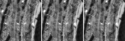](PHerc1667_1.13um/zmid_all_db.png) | [PHerc1667_1.13um/zmid_all_db.png](PHerc1667_1.13um/zmid_all_db.png): PHerc1667 1.13 µm, the same with the deblocking post-filter; q 32 37.9 dB |
| [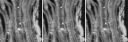](PHerc1667_1.13um/ymid_all.png) | [PHerc1667_1.13um/ymid_all.png](PHerc1667_1.13um/ymid_all.png): PHerc1667 1.13 µm, centre y plane (z vertical), raw and q 1-32 |
| [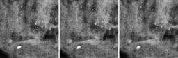](PHerc1667_1.13um/xmid_all.png) | [PHerc1667_1.13um/xmid_all.png](PHerc1667_1.13um/xmid_all.png): PHerc1667 1.13 µm, centre x plane (z vertical), raw and q 1-32 |
| [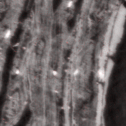](PHerc1667_1.13um/diff_zmid_q8.png) | [PHerc1667_1.13um/diff_zmid_q8.png](PHerc1667_1.13um/diff_zmid_q8.png): PHerc1667 1.13 µm, q 8 error overlay on the centre z plane (red opacity = 4 x abs(error) / 255; max error 29) |
| [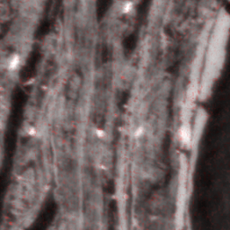](PHerc1667_1.13um/diff_zmid_q32.png) | [PHerc1667_1.13um/diff_zmid_q32.png](PHerc1667_1.13um/diff_zmid_q32.png): PHerc1667 1.13 µm, q 32 error overlay on the centre z plane (max error 67) |

### PHerc0343P 2.21 µm ([table](README.md#pherc0343p_221um))

| thumbnail | shows |
|---|---|
| [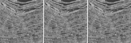](PHerc0343P_2.21um/zmid_all.png) | [PHerc0343P_2.21um/zmid_all.png](PHerc0343P_2.21um/zmid_all.png): PHerc0343P 2.21 µm, centre z plane: raw and q 1-32 (plain decode); q 8 76x at 37.8 dB, q 32 250x at 32.5 dB |
| [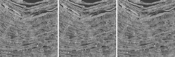](PHerc0343P_2.21um/zmid_all_db.png) | [PHerc0343P_2.21um/zmid_all_db.png](PHerc0343P_2.21um/zmid_all_db.png): PHerc0343P 2.21 µm, the same with the deblocking post-filter; q 32 33.1 dB |
| [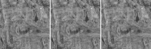](PHerc0343P_2.21um/ymid_all.png) | [PHerc0343P_2.21um/ymid_all.png](PHerc0343P_2.21um/ymid_all.png): PHerc0343P 2.21 µm, centre y plane (z vertical), raw and q 1-32 |
| [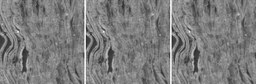](PHerc0343P_2.21um/xmid_all.png) | [PHerc0343P_2.21um/xmid_all.png](PHerc0343P_2.21um/xmid_all.png): PHerc0343P 2.21 µm, centre x plane (z vertical), raw and q 1-32 |
| [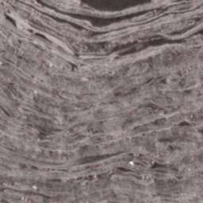](PHerc0343P_2.21um/diff_zmid_q8.png) | [PHerc0343P_2.21um/diff_zmid_q8.png](PHerc0343P_2.21um/diff_zmid_q8.png): PHerc0343P 2.21 µm, q 8 error overlay on the centre z plane (red opacity = 4 x abs(error) / 255; max error 36) |
| [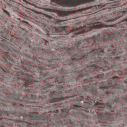](PHerc0343P_2.21um/diff_zmid_q32.png) | [PHerc0343P_2.21um/diff_zmid_q32.png](PHerc0343P_2.21um/diff_zmid_q32.png): PHerc0343P 2.21 µm, q 32 error overlay on the centre z plane (max error 71) |

### PHercParis4 2.40 µm ([table](README.md#phercparis4_240um))

| thumbnail | shows |
|---|---|
| [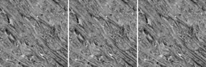](PHercParis4_2.40um/zmid_all.png) | [PHercParis4_2.40um/zmid_all.png](PHercParis4_2.40um/zmid_all.png): PHercParis4 2.40 µm, centre z plane: raw and q 1-32 (plain decode); q 8 52x at 36.6 dB, q 32 163x at 30.3 dB |
| [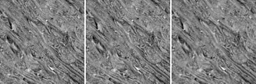](PHercParis4_2.40um/zmid_all_db.png) | [PHercParis4_2.40um/zmid_all_db.png](PHercParis4_2.40um/zmid_all_db.png): PHercParis4 2.40 µm, the same with the deblocking post-filter; q 32 31.0 dB |
| [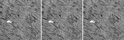](PHercParis4_2.40um/ymid_all.png) | [PHercParis4_2.40um/ymid_all.png](PHercParis4_2.40um/ymid_all.png): PHercParis4 2.40 µm, centre y plane (z vertical), raw and q 1-32 |
| [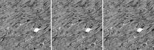](PHercParis4_2.40um/xmid_all.png) | [PHercParis4_2.40um/xmid_all.png](PHercParis4_2.40um/xmid_all.png): PHercParis4 2.40 µm, centre x plane (z vertical), raw and q 1-32 |
| [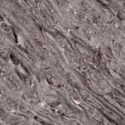](PHercParis4_2.40um/diff_zmid_q8.png) | [PHercParis4_2.40um/diff_zmid_q8.png](PHercParis4_2.40um/diff_zmid_q8.png): PHercParis4 2.40 µm, q 8 error overlay on the centre z plane (red opacity = 4 x abs(error) / 255; max error 41) |
| [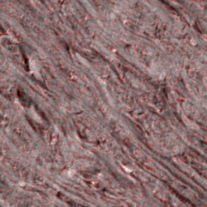](PHercParis4_2.40um/diff_zmid_q32.png) | [PHercParis4_2.40um/diff_zmid_q32.png](PHercParis4_2.40um/diff_zmid_q32.png): PHercParis4 2.40 µm, q 32 error overlay on the centre z plane (max error 92) |

### PHerc0500P2 4.32 µm ([table](README.md#pherc0500p2_432um))

| thumbnail | shows |
|---|---|
| [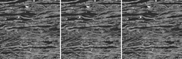](PHerc0500P2_4.32um/zmid_all.png) | [PHerc0500P2_4.32um/zmid_all.png](PHerc0500P2_4.32um/zmid_all.png): PHerc0500P2 4.32 µm, centre z plane: raw and q 1-32 (plain decode); q 8 79x at 38.6 dB, q 32 215x at 33.2 dB |
| [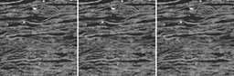](PHerc0500P2_4.32um/zmid_all_db.png) | [PHerc0500P2_4.32um/zmid_all_db.png](PHerc0500P2_4.32um/zmid_all_db.png): PHerc0500P2 4.32 µm, the same with the deblocking post-filter; q 32 34.1 dB |
| [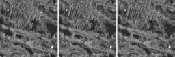](PHerc0500P2_4.32um/ymid_all.png) | [PHerc0500P2_4.32um/ymid_all.png](PHerc0500P2_4.32um/ymid_all.png): PHerc0500P2 4.32 µm, centre y plane (z vertical), raw and q 1-32 |
| [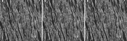](PHerc0500P2_4.32um/xmid_all.png) | [PHerc0500P2_4.32um/xmid_all.png](PHerc0500P2_4.32um/xmid_all.png): PHerc0500P2 4.32 µm, centre x plane (z vertical), raw and q 1-32 |
| [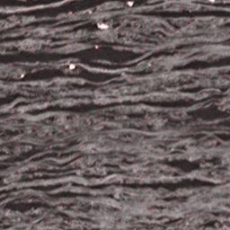](PHerc0500P2_4.32um/diff_zmid_q8.png) | [PHerc0500P2_4.32um/diff_zmid_q8.png](PHerc0500P2_4.32um/diff_zmid_q8.png): PHerc0500P2 4.32 µm, q 8 error overlay on the centre z plane (red opacity = 4 x abs(error) / 255; max error 38) |
| [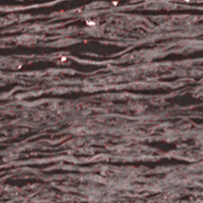](PHerc0500P2_4.32um/diff_zmid_q32.png) | [PHerc0500P2_4.32um/diff_zmid_q32.png](PHerc0500P2_4.32um/diff_zmid_q32.png): PHerc0500P2 4.32 µm, q 32 error overlay on the centre z plane (max error 84) |

### PHerc0800 8.64 µm ([table](README.md#pherc0800_864um))

| thumbnail | shows |
|---|---|
| [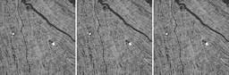](PHerc0800_8.64um/zmid_all.png) | [PHerc0800_8.64um/zmid_all.png](PHerc0800_8.64um/zmid_all.png): PHerc0800 8.64 µm, centre z plane: raw and q 1-32 (plain decode); q 8 40x at 34.1 dB, q 32 150x at 28.2 dB |
| [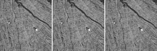](PHerc0800_8.64um/zmid_all_db.png) | [PHerc0800_8.64um/zmid_all_db.png](PHerc0800_8.64um/zmid_all_db.png): PHerc0800 8.64 µm, the same with the deblocking post-filter; q 32 28.6 dB |
| [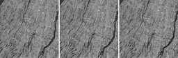](PHerc0800_8.64um/ymid_all.png) | [PHerc0800_8.64um/ymid_all.png](PHerc0800_8.64um/ymid_all.png): PHerc0800 8.64 µm, centre y plane (z vertical), raw and q 1-32 |
| [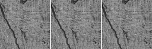](PHerc0800_8.64um/xmid_all.png) | [PHerc0800_8.64um/xmid_all.png](PHerc0800_8.64um/xmid_all.png): PHerc0800 8.64 µm, centre x plane (z vertical), raw and q 1-32 |
| [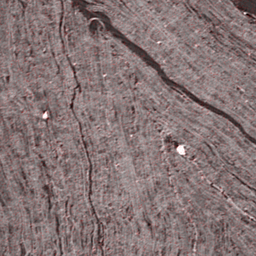](PHerc0800_8.64um/diff_zmid_q8.png) | [PHerc0800_8.64um/diff_zmid_q8.png](PHerc0800_8.64um/diff_zmid_q8.png): PHerc0800 8.64 µm, q 8 error overlay on the centre z plane (red opacity = 4 x abs(error) / 255; max error 73) |
| [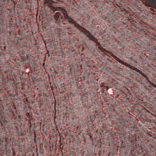](PHerc0800_8.64um/diff_zmid_q32.png) | [PHerc0800_8.64um/diff_zmid_q32.png](PHerc0800_8.64um/diff_zmid_q32.png): PHerc0800 8.64 µm, q 32 error overlay on the centre z plane (max error 116) |

### PHerc0191 9.36 µm ([table](README.md#pherc0191_936um))

| thumbnail | shows |
|---|---|
| [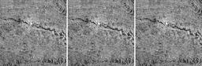](PHerc0191_9.36um/zmid_all.png) | [PHerc0191_9.36um/zmid_all.png](PHerc0191_9.36um/zmid_all.png): PHerc0191 9.36 µm, centre z plane: raw and q 1-32 (plain decode); q 8 31x at 33.4 dB, q 32 109x at 26.7 dB |
| [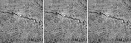](PHerc0191_9.36um/zmid_all_db.png) | [PHerc0191_9.36um/zmid_all_db.png](PHerc0191_9.36um/zmid_all_db.png): PHerc0191 9.36 µm, the same with the deblocking post-filter; q 32 27.1 dB |
| [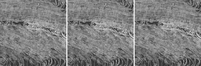](PHerc0191_9.36um/ymid_all.png) | [PHerc0191_9.36um/ymid_all.png](PHerc0191_9.36um/ymid_all.png): PHerc0191 9.36 µm, centre y plane (z vertical), raw and q 1-32 |
| [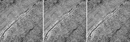](PHerc0191_9.36um/xmid_all.png) | [PHerc0191_9.36um/xmid_all.png](PHerc0191_9.36um/xmid_all.png): PHerc0191 9.36 µm, centre x plane (z vertical), raw and q 1-32 |
| [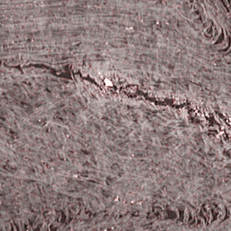](PHerc0191_9.36um/diff_zmid_q8.png) | [PHerc0191_9.36um/diff_zmid_q8.png](PHerc0191_9.36um/diff_zmid_q8.png): PHerc0191 9.36 µm, q 8 error overlay on the centre z plane (red opacity = 4 x abs(error) / 255; max error 69) |
| [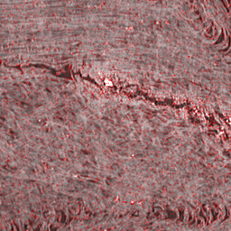](PHerc0191_9.36um/diff_zmid_q32.png) | [PHerc0191_9.36um/diff_zmid_q32.png](PHerc0191_9.36um/diff_zmid_q32.png): PHerc0191 9.36 µm, q 32 error overlay on the centre z plane (max error 142) |

## Surface predictions: ours (volcomp q8 probability) vs the published m7 mask

### PHerc0343P ([README](surfaces/PHerc0343P/README.md))

| thumbnail | shows |
|---|---|
| [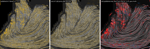](surfaces/PHerc0343P/z1493_all.png) | [surfaces/PHerc0343P/z1493_all.png](surfaces/PHerc0343P/z1493_all.png): PHerc0343P 8.86 µm, slice z1493: CT, published m7 mask, ours plain / smoothed, diff (thumb: published, ours, diff); slice dice 0.656 at p>=0.5 |
| [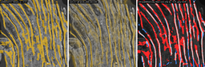](surfaces/PHerc0343P/z1493_zoom.png) | [surfaces/PHerc0343P/z1493_zoom.png](surfaces/PHerc0343P/z1493_zoom.png): PHerc0343P slice z1493, the 256² crop with the most surface at 2x: same five panels |
|  | [surfaces/PHerc0343P/z1834_all.png](surfaces/PHerc0343P/z1834_all.png): PHerc0343P 8.86 µm, slice z1834: CT, published m7 mask, ours plain / smoothed, diff (thumb: published, ours, diff); slice dice 0.586 at p>=0.5 |
|  | [surfaces/PHerc0343P/z1834_zoom.png](surfaces/PHerc0343P/z1834_zoom.png): PHerc0343P slice z1834, the 256² crop with the most surface at 2x: same five panels |
|  | [surfaces/PHerc0343P/z1493_diff.png](surfaces/PHerc0343P/z1493_diff.png): PHerc0343P slice z1493 full resolution disagreement: red published only, blue ours only (p>=0.5), grey both |

### PHerc0009B ([README](surfaces/PHerc0009B/README.md))

| thumbnail | shows |
|---|---|
|  | [surfaces/PHerc0009B/z2709_all.png](surfaces/PHerc0009B/z2709_all.png): PHerc0009B 9.604 µm, slice z2709: CT, published m7 mask, ours plain / smoothed, diff (thumb: published, ours, diff); slice dice 0.647 at p>=0.5 |
|  | [surfaces/PHerc0009B/z2709_zoom.png](surfaces/PHerc0009B/z2709_zoom.png): PHerc0009B slice z2709, the 256² crop with the most surface at 2x: same five panels |
|  | [surfaces/PHerc0009B/z3050_all.png](surfaces/PHerc0009B/z3050_all.png): PHerc0009B 9.604 µm, slice z3050: CT, published m7 mask, ours plain / smoothed, diff (thumb: published, ours, diff); slice dice 0.648 at p>=0.5 |
|  | [surfaces/PHerc0009B/z3050_zoom.png](surfaces/PHerc0009B/z3050_zoom.png): PHerc0009B slice z3050, the 256² crop with the most surface at 2x: same five panels |
|  | [surfaces/PHerc0009B/z2709_diff.png](surfaces/PHerc0009B/z2709_diff.png): PHerc0009B slice z2709 full resolution disagreement: red published only, blue ours only (p>=0.5), grey both |

### PHerc0800 (in progress)

| thumbnail | shows |
|---|---|
|  | [surfaces/PHerc0800/z6613_all.png](surfaces/PHerc0800/z6613_all.png): PHerc0800 level 0, slice z6613: CT, published m7 mask, ours plain / smoothed, diff (thumb: published, ours, diff); numbers pending: the whole-volume pass is still running (in progress) |
|  | [surfaces/PHerc0800/z6613_zoom.png](surfaces/PHerc0800/z6613_zoom.png): PHerc0800 slice z6613, the 256² crop with the most surface at 2x: same five panels |
|  | [surfaces/PHerc0800/z6954_all.png](surfaces/PHerc0800/z6954_all.png): PHerc0800 level 0, slice z6954: CT, published m7 mask, ours plain / smoothed, diff (thumb: published, ours, diff); numbers pending: the whole-volume pass is still running (in progress) |
|  | [surfaces/PHerc0800/z6954_zoom.png](surfaces/PHerc0800/z6954_zoom.png): PHerc0800 slice z6954, the 256² crop with the most surface at 2x: same five panels |
|  | [surfaces/PHerc0800/z6613_diff.png](surfaces/PHerc0800/z6613_diff.png): PHerc0800 slice z6613 full resolution disagreement: red published only, blue ours only (p>=0.5), grey both |

### PHerc1218 (in progress)

| thumbnail | shows |
|---|---|
|  | [surfaces/PHerc1218/z6421_all.png](surfaces/PHerc1218/z6421_all.png): PHerc1218 level 0, slice z6421: CT, published m7 mask, ours plain / smoothed, diff (thumb: published, ours, diff); numbers pending: the whole-volume pass is still running (in progress) |
|  | [surfaces/PHerc1218/z6421_zoom.png](surfaces/PHerc1218/z6421_zoom.png): PHerc1218 slice z6421, the 256² crop with the most surface at 2x: same five panels |
|  | [surfaces/PHerc1218/z6762_all.png](surfaces/PHerc1218/z6762_all.png): PHerc1218 level 0, slice z6762: CT, published m7 mask, ours plain / smoothed, diff (thumb: published, ours, diff); numbers pending: the whole-volume pass is still running (in progress) |
|  | [surfaces/PHerc1218/z6762_zoom.png](surfaces/PHerc1218/z6762_zoom.png): PHerc1218 slice z6762, the 256² crop with the most surface at 2x: same five panels |
|  | [surfaces/PHerc1218/z6421_diff.png](surfaces/PHerc1218/z6421_diff.png): PHerc1218 slice z6421 full resolution disagreement: red published only, blue ours only (p>=0.5), grey both |

### PHerc0175A (in progress)

| thumbnail | shows |
|---|---|
|  | [surfaces/PHerc0175A/z9877_all.png](surfaces/PHerc0175A/z9877_all.png): PHerc0175A level 0, slice z9877: CT, published m7 mask, ours plain / smoothed, diff (thumb: published, ours, diff); numbers pending: the whole-volume pass is still running (in progress) |
|  | [surfaces/PHerc0175A/z9877_zoom.png](surfaces/PHerc0175A/z9877_zoom.png): PHerc0175A slice z9877, the 256² crop with the most surface at 2x: same five panels |
|  | [surfaces/PHerc0175A/z10218_all.png](surfaces/PHerc0175A/z10218_all.png): PHerc0175A level 0, slice z10218: CT, published m7 mask, ours plain / smoothed, diff (thumb: published, ours, diff); numbers pending: the whole-volume pass is still running (in progress) |
|  | [surfaces/PHerc0175A/z10218_zoom.png](surfaces/PHerc0175A/z10218_zoom.png): PHerc0175A slice z10218, the 256² crop with the most surface at 2x: same five panels |
|  | [surfaces/PHerc0175A/z9877_diff.png](surfaces/PHerc0175A/z9877_diff.png): PHerc0175A slice z9877 full resolution disagreement: red published only, blue ours only (p>=0.5), grey both |

### PHerc0268 (in progress)

| thumbnail | shows |
|---|---|
|  | [surfaces/PHerc0268/z9109_all.png](surfaces/PHerc0268/z9109_all.png): PHerc0268 level 0, slice z9109: CT, published m7 mask, ours plain / smoothed, diff (thumb: published, ours, diff); numbers pending: the whole-volume pass is still running (in progress) |
|  | [surfaces/PHerc0268/z9109_zoom.png](surfaces/PHerc0268/z9109_zoom.png): PHerc0268 slice z9109, the 256² crop with the most surface at 2x: same five panels |
|  | [surfaces/PHerc0268/z9450_all.png](surfaces/PHerc0268/z9450_all.png): PHerc0268 level 0, slice z9450: CT, published m7 mask, ours plain / smoothed, diff (thumb: published, ours, diff); numbers pending: the whole-volume pass is still running (in progress) |
|  | [surfaces/PHerc0268/z9450_zoom.png](surfaces/PHerc0268/z9450_zoom.png): PHerc0268 slice z9450, the 256² crop with the most surface at 2x: same five panels |
|  | [surfaces/PHerc0268/z9109_diff.png](surfaces/PHerc0268/z9109_diff.png): PHerc0268 slice z9109 full resolution disagreement: red published only, blue ours only (p>=0.5), grey both |

### PHerc1447 (in progress)

| thumbnail | shows |
|---|---|
|  | [surfaces/PHerc1447/z17813_all.png](surfaces/PHerc1447/z17813_all.png): PHerc1447 level 0, slice z17813: CT, published m7 mask, ours plain / smoothed, diff (thumb: published, ours, diff); numbers pending: the whole-volume pass is still running (in progress) |
|  | [surfaces/PHerc1447/z17813_zoom.png](surfaces/PHerc1447/z17813_zoom.png): PHerc1447 slice z17813, the 256² crop with the most surface at 2x: same five panels |
|  | [surfaces/PHerc1447/z18154_all.png](surfaces/PHerc1447/z18154_all.png): PHerc1447 level 0, slice z18154: CT, published m7 mask, ours plain / smoothed, diff (thumb: published, ours, diff); numbers pending: the whole-volume pass is still running (in progress) |
|  | [surfaces/PHerc1447/z18154_zoom.png](surfaces/PHerc1447/z18154_zoom.png): PHerc1447 slice z18154, the 256² crop with the most surface at 2x: same five panels |
|  | [surfaces/PHerc1447/z17813_diff.png](surfaces/PHerc1447/z17813_diff.png): PHerc1447 slice z17813 full resolution disagreement: red published only, blue ours only (p>=0.5), grey both |

### PHerc0125 (in progress)

| thumbnail | shows |
|---|---|
|  | [surfaces/PHerc0125/z3285_all.png](surfaces/PHerc0125/z3285_all.png): PHerc0125 level 0, slice z3285: CT, published m7 mask, ours plain / smoothed, diff (thumb: published, ours, diff); numbers pending: the whole-volume pass is still running (in progress) |
|  | [surfaces/PHerc0125/z3285_zoom.png](surfaces/PHerc0125/z3285_zoom.png): PHerc0125 slice z3285, the 256² crop with the most surface at 2x: same five panels |
|  | [surfaces/PHerc0125/z3626_all.png](surfaces/PHerc0125/z3626_all.png): PHerc0125 level 0, slice z3626: CT, published m7 mask, ours plain / smoothed, diff (thumb: published, ours, diff); numbers pending: the whole-volume pass is still running (in progress) |
|  | [surfaces/PHerc0125/z3626_zoom.png](surfaces/PHerc0125/z3626_zoom.png): PHerc0125 slice z3626, the 256² crop with the most surface at 2x: same five panels |
|  | [surfaces/PHerc0125/z3285_diff.png](surfaces/PHerc0125/z3285_diff.png): PHerc0125 slice z3285 full resolution disagreement: red published only, blue ours only (p>=0.5), grey both |

## Published masks as volcomp mask stores

### PHerc0800 mask (in progress)

| thumbnail | shows |
|---|---|
|  | [masks/PHerc0800/mask_z6613_all.png](masks/PHerc0800/mask_z6613_all.png): PHerc0800 slice z6613: published mask, mode 4 decoded (ramp), mode 5 decoded (exact), mode 4 vs published (thumb: published, mode 4, diff); numbers pending: the whole-volume pass is still running (in progress) |
|  | [masks/PHerc0800/mask_z6613_zoom.png](masks/PHerc0800/mask_z6613_zoom.png): PHerc0800 slice z6613, 256² crop at 2x: the same four panels |

### PHerc1218 mask (in progress)

| thumbnail | shows |
|---|---|
|  | [masks/PHerc1218/mask_z6421_all.png](masks/PHerc1218/mask_z6421_all.png): PHerc1218 slice z6421: published mask, mode 4 decoded (ramp), mode 5 decoded (exact), mode 4 vs published (thumb: published, mode 4, diff); numbers pending: the whole-volume pass is still running (in progress) |
|  | [masks/PHerc1218/mask_z6421_zoom.png](masks/PHerc1218/mask_z6421_zoom.png): PHerc1218 slice z6421, 256² crop at 2x: the same four panels |

### PHerc0125 mask (in progress)

| thumbnail | shows |
|---|---|
|  | [masks/PHerc0125/mask_z3285_all.png](masks/PHerc0125/mask_z3285_all.png): PHerc0125 slice z3285: published mask, mode 4 decoded (ramp), mode 5 decoded (exact), mode 4 vs published (thumb: published, mode 4, diff); numbers pending: the whole-volume pass is still running (in progress) |
|  | [masks/PHerc0125/mask_z3285_zoom.png](masks/PHerc0125/mask_z3285_zoom.png): PHerc0125 slice z3285, 256² crop at 2x: the same four panels |
