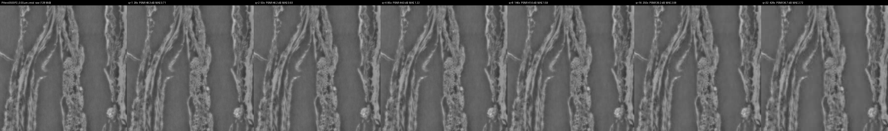
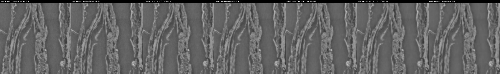
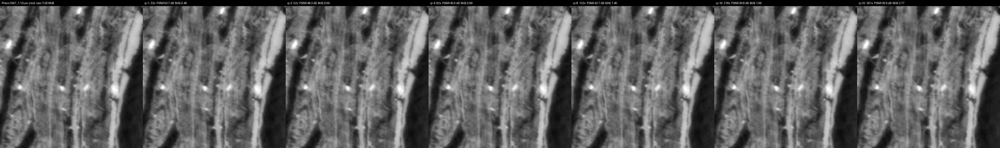
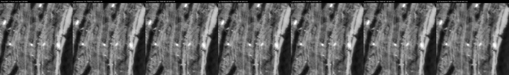
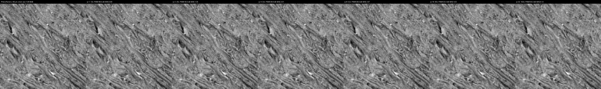
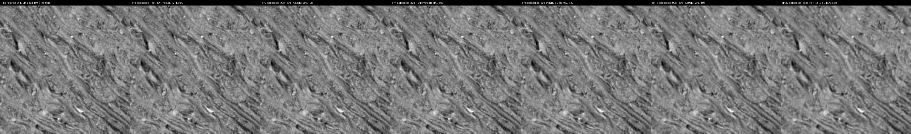
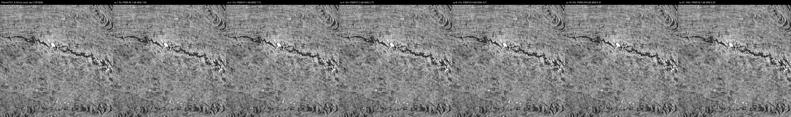
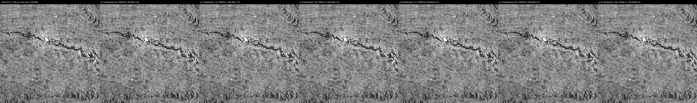
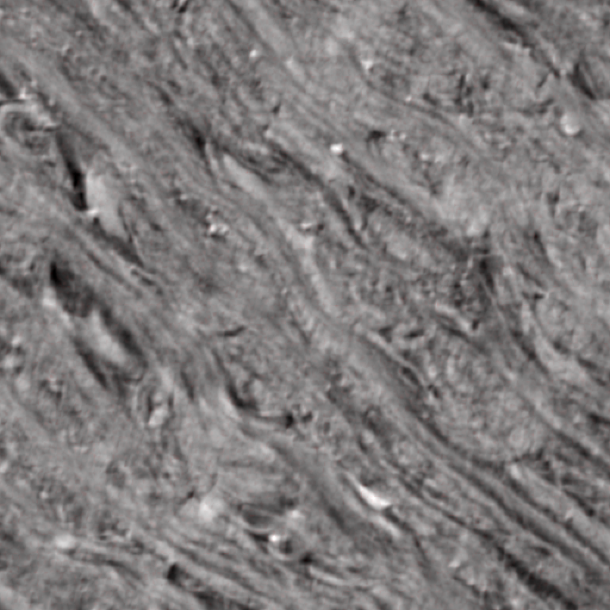

# volcomp quality comparison on raw scroll CT

512^3 cubes of ORIGINAL uint8 CT (the open-data bucket's uncompressed level-0 chunks) from four ESRF scans at four voxel sizes, encoded at q = 1 .. 32 (128^3 chunks) and decoded twice: plain (`q<N>`, what a zarr reader gets) and with the optional `volcomp_deblock()` post-filter (`q<N>_db`). Every version has nine 512^2 lossless PNG views: the six cube faces (`z0 z511 y0 y511 x0 x511`) and the three centre planes (`zmid ymid xmid`); `<view>_all.png` puts raw and the six q levels side by side without deblocking, `<view>_all_db.png` with it. Generated by `tools/compare_images.py`; numbers in `report.json`.

## PHerc0500P2_0.55um

`PHerc0500P2/volumes/20250821110041-0.550um-0.1m-65keV-masked.zarr`, volume shape [12320, 10813, 3891], cube origin zyx [5888, 7936, 1536], raw 128 MiB.

| q | size | ratio | PSNR dB | MAE | P99 | max | deblocked PSNR | MAE | P99 | max |
|---|---|---|---|---|---|---|---|---|---|---|
| 1 | 4.50 MiB | 28.4x | 48.3 | 0.71 | 2 | 10 | 48.3 | 0.71 | 2 | 10 |
| 2 | 2.58 MiB | 49.6x | 46.2 | 0.93 | 3 | 15 | 46.3 | 0.92 | 3 | 15 |
| 4 | 1.50 MiB | 85.2x | 44.0 | 1.22 | 4 | 26 | 44.2 | 1.18 | 4 | 26 |
| 8 | 0.88 MiB | 145.7x | 41.6 | 1.59 | 6 | 34 | 42.1 | 1.52 | 6 | 34 |
| 16 | 0.51 MiB | 250.3x | 39.2 | 2.08 | 8 | 41 | 39.8 | 1.95 | 8 | 32 |
| 32 | 0.30 MiB | 428.0x | 36.7 | 2.72 | 12 | 66 | 37.5 | 2.52 | 10 | 40 |

- z0: [z0_all.png](PHerc0500P2_0.55um/z0_all.png)  ·  deblocked [z0_all_db.png](PHerc0500P2_0.55um/z0_all_db.png)  ·  raw [PHerc0500P2_0.55um/z0_raw.png](PHerc0500P2_0.55um/z0_raw.png)
- z511: [z511_all.png](PHerc0500P2_0.55um/z511_all.png)  ·  deblocked [z511_all_db.png](PHerc0500P2_0.55um/z511_all_db.png)  ·  raw [PHerc0500P2_0.55um/z511_raw.png](PHerc0500P2_0.55um/z511_raw.png)
- y0: [y0_all.png](PHerc0500P2_0.55um/y0_all.png)  ·  deblocked [y0_all_db.png](PHerc0500P2_0.55um/y0_all_db.png)  ·  raw [PHerc0500P2_0.55um/y0_raw.png](PHerc0500P2_0.55um/y0_raw.png)
- y511: [y511_all.png](PHerc0500P2_0.55um/y511_all.png)  ·  deblocked [y511_all_db.png](PHerc0500P2_0.55um/y511_all_db.png)  ·  raw [PHerc0500P2_0.55um/y511_raw.png](PHerc0500P2_0.55um/y511_raw.png)
- x0: [x0_all.png](PHerc0500P2_0.55um/x0_all.png)  ·  deblocked [x0_all_db.png](PHerc0500P2_0.55um/x0_all_db.png)  ·  raw [PHerc0500P2_0.55um/x0_raw.png](PHerc0500P2_0.55um/x0_raw.png)
- x511: [x511_all.png](PHerc0500P2_0.55um/x511_all.png)  ·  deblocked [x511_all_db.png](PHerc0500P2_0.55um/x511_all_db.png)  ·  raw [PHerc0500P2_0.55um/x511_raw.png](PHerc0500P2_0.55um/x511_raw.png)
- zmid: [zmid_all.png](PHerc0500P2_0.55um/zmid_all.png)  ·  deblocked [zmid_all_db.png](PHerc0500P2_0.55um/zmid_all_db.png)  ·  raw [PHerc0500P2_0.55um/zmid_raw.png](PHerc0500P2_0.55um/zmid_raw.png)
- ymid: [ymid_all.png](PHerc0500P2_0.55um/ymid_all.png)  ·  deblocked [ymid_all_db.png](PHerc0500P2_0.55um/ymid_all_db.png)  ·  raw [PHerc0500P2_0.55um/ymid_raw.png](PHerc0500P2_0.55um/ymid_raw.png)
- xmid: [xmid_all.png](PHerc0500P2_0.55um/xmid_all.png)  ·  deblocked [xmid_all_db.png](PHerc0500P2_0.55um/xmid_all_db.png)  ·  raw [PHerc0500P2_0.55um/xmid_raw.png](PHerc0500P2_0.55um/xmid_raw.png)

## PHerc1667_1.13um

`PHerc1667/volumes/20260323082859-1.129um-0.2m-59keV-masked.zarr`, volume shape [42209, 22122, 20276], cube origin zyx [20864, 7168, 2944], raw 128 MiB.

| q | size | ratio | PSNR dB | MAE | P99 | max | deblocked PSNR | MAE | P99 | max |
|---|---|---|---|---|---|---|---|---|---|---|
| 1 | 3.87 MiB | 33.1x | 50.7 | 0.49 | 2 | 17 | 50.7 | 0.49 | 2 | 17 |
| 2 | 2.46 MiB | 52.0x | 48.3 | 0.69 | 3 | 21 | 48.5 | 0.68 | 2 | 21 |
| 4 | 1.57 MiB | 81.7x | 45.6 | 0.99 | 4 | 27 | 46.0 | 0.95 | 3 | 27 |
| 8 | 0.97 MiB | 131.7x | 42.7 | 1.40 | 5 | 29 | 43.4 | 1.31 | 5 | 29 |
| 16 | 0.59 MiB | 217.6x | 39.8 | 1.99 | 7 | 41 | 40.7 | 1.81 | 6 | 41 |
| 32 | 0.35 MiB | 361.5x | 36.9 | 2.77 | 11 | 67 | 37.9 | 2.50 | 9 | 33 |

- z0: [z0_all.png](PHerc1667_1.13um/z0_all.png)  ·  deblocked [z0_all_db.png](PHerc1667_1.13um/z0_all_db.png)  ·  raw [PHerc1667_1.13um/z0_raw.png](PHerc1667_1.13um/z0_raw.png)
- z511: [z511_all.png](PHerc1667_1.13um/z511_all.png)  ·  deblocked [z511_all_db.png](PHerc1667_1.13um/z511_all_db.png)  ·  raw [PHerc1667_1.13um/z511_raw.png](PHerc1667_1.13um/z511_raw.png)
- y0: [y0_all.png](PHerc1667_1.13um/y0_all.png)  ·  deblocked [y0_all_db.png](PHerc1667_1.13um/y0_all_db.png)  ·  raw [PHerc1667_1.13um/y0_raw.png](PHerc1667_1.13um/y0_raw.png)
- y511: [y511_all.png](PHerc1667_1.13um/y511_all.png)  ·  deblocked [y511_all_db.png](PHerc1667_1.13um/y511_all_db.png)  ·  raw [PHerc1667_1.13um/y511_raw.png](PHerc1667_1.13um/y511_raw.png)
- x0: [x0_all.png](PHerc1667_1.13um/x0_all.png)  ·  deblocked [x0_all_db.png](PHerc1667_1.13um/x0_all_db.png)  ·  raw [PHerc1667_1.13um/x0_raw.png](PHerc1667_1.13um/x0_raw.png)
- x511: [x511_all.png](PHerc1667_1.13um/x511_all.png)  ·  deblocked [x511_all_db.png](PHerc1667_1.13um/x511_all_db.png)  ·  raw [PHerc1667_1.13um/x511_raw.png](PHerc1667_1.13um/x511_raw.png)
- zmid: [zmid_all.png](PHerc1667_1.13um/zmid_all.png)  ·  deblocked [zmid_all_db.png](PHerc1667_1.13um/zmid_all_db.png)  ·  raw [PHerc1667_1.13um/zmid_raw.png](PHerc1667_1.13um/zmid_raw.png)
- ymid: [ymid_all.png](PHerc1667_1.13um/ymid_all.png)  ·  deblocked [ymid_all_db.png](PHerc1667_1.13um/ymid_all_db.png)  ·  raw [PHerc1667_1.13um/ymid_raw.png](PHerc1667_1.13um/ymid_raw.png)
- xmid: [xmid_all.png](PHerc1667_1.13um/xmid_all.png)  ·  deblocked [xmid_all_db.png](PHerc1667_1.13um/xmid_all_db.png)  ·  raw [PHerc1667_1.13um/xmid_raw.png](PHerc1667_1.13um/xmid_raw.png)

## PHercParis4_2.40um

`PHercParis4/volumes/20260411134726-2.400um-0.2m-78keV-masked.zarr`, volume shape [75784, 32693, 32693], cube origin zyx [37632, 22272, 22016], raw 128 MiB.

| q | size | ratio | PSNR dB | MAE | P99 | max | deblocked PSNR | MAE | P99 | max |
|---|---|---|---|---|---|---|---|---|---|---|
| 1 | 10.24 MiB | 12.5x | 46.5 | 0.90 | 3 | 16 | 46.5 | 0.90 | 3 | 16 |
| 2 | 6.50 MiB | 19.7x | 43.3 | 1.35 | 5 | 20 | 43.3 | 1.35 | 5 | 20 |
| 4 | 4.04 MiB | 31.7x | 39.9 | 2.01 | 7 | 26 | 40.0 | 1.99 | 7 | 26 |
| 8 | 2.45 MiB | 52.3x | 36.6 | 2.97 | 10 | 41 | 36.9 | 2.87 | 10 | 41 |
| 16 | 1.42 MiB | 90.1x | 33.3 | 4.32 | 15 | 60 | 33.9 | 4.05 | 14 | 60 |
| 32 | 0.78 MiB | 163.4x | 30.3 | 6.12 | 21 | 92 | 31.0 | 5.69 | 19 | 92 |

- z0: [z0_all.png](PHercParis4_2.40um/z0_all.png)  ·  deblocked [z0_all_db.png](PHercParis4_2.40um/z0_all_db.png)  ·  raw [PHercParis4_2.40um/z0_raw.png](PHercParis4_2.40um/z0_raw.png)
- z511: [z511_all.png](PHercParis4_2.40um/z511_all.png)  ·  deblocked [z511_all_db.png](PHercParis4_2.40um/z511_all_db.png)  ·  raw [PHercParis4_2.40um/z511_raw.png](PHercParis4_2.40um/z511_raw.png)
- y0: [y0_all.png](PHercParis4_2.40um/y0_all.png)  ·  deblocked [y0_all_db.png](PHercParis4_2.40um/y0_all_db.png)  ·  raw [PHercParis4_2.40um/y0_raw.png](PHercParis4_2.40um/y0_raw.png)
- y511: [y511_all.png](PHercParis4_2.40um/y511_all.png)  ·  deblocked [y511_all_db.png](PHercParis4_2.40um/y511_all_db.png)  ·  raw [PHercParis4_2.40um/y511_raw.png](PHercParis4_2.40um/y511_raw.png)
- x0: [x0_all.png](PHercParis4_2.40um/x0_all.png)  ·  deblocked [x0_all_db.png](PHercParis4_2.40um/x0_all_db.png)  ·  raw [PHercParis4_2.40um/x0_raw.png](PHercParis4_2.40um/x0_raw.png)
- x511: [x511_all.png](PHercParis4_2.40um/x511_all.png)  ·  deblocked [x511_all_db.png](PHercParis4_2.40um/x511_all_db.png)  ·  raw [PHercParis4_2.40um/x511_raw.png](PHercParis4_2.40um/x511_raw.png)
- zmid: [zmid_all.png](PHercParis4_2.40um/zmid_all.png)  ·  deblocked [zmid_all_db.png](PHercParis4_2.40um/zmid_all_db.png)  ·  raw [PHercParis4_2.40um/zmid_raw.png](PHercParis4_2.40um/zmid_raw.png)
- ymid: [ymid_all.png](PHercParis4_2.40um/ymid_all.png)  ·  deblocked [ymid_all_db.png](PHercParis4_2.40um/ymid_all_db.png)  ·  raw [PHercParis4_2.40um/ymid_raw.png](PHercParis4_2.40um/ymid_raw.png)
- xmid: [xmid_all.png](PHercParis4_2.40um/xmid_all.png)  ·  deblocked [xmid_all_db.png](PHercParis4_2.40um/xmid_all_db.png)  ·  raw [PHercParis4_2.40um/xmid_raw.png](PHercParis4_2.40um/xmid_raw.png)

## PHerc0191_9.36um

`PHerc0191/volumes/20250821151635-9.362um-1.2m-113keV-masked.zarr`, volume shape [18977, 8387, 8387], cube origin zyx [9216, 3584, 6016], raw 128 MiB.

| q | size | ratio | PSNR dB | MAE | P99 | max | deblocked PSNR | MAE | P99 | max |
|---|---|---|---|---|---|---|---|---|---|---|
| 1 | 16.29 MiB | 7.9x | 45.1 | 1.06 | 4 | 28 | 45.1 | 1.06 | 4 | 28 |
| 2 | 10.84 MiB | 11.8x | 41.1 | 1.73 | 6 | 41 | 41.1 | 1.73 | 6 | 41 |
| 4 | 6.89 MiB | 18.6x | 37.2 | 2.75 | 9 | 47 | 37.2 | 2.74 | 9 | 47 |
| 8 | 4.13 MiB | 31.0x | 33.4 | 4.27 | 15 | 69 | 33.5 | 4.22 | 15 | 69 |
| 16 | 2.30 MiB | 55.7x | 29.8 | 6.41 | 23 | 100 | 30.1 | 6.19 | 22 | 100 |
| 32 | 1.17 MiB | 109.3x | 26.7 | 9.20 | 33 | 142 | 27.1 | 8.76 | 31 | 142 |

- z0: [z0_all.png](PHerc0191_9.36um/z0_all.png)  ·  deblocked [z0_all_db.png](PHerc0191_9.36um/z0_all_db.png)  ·  raw [PHerc0191_9.36um/z0_raw.png](PHerc0191_9.36um/z0_raw.png)
- z511: [z511_all.png](PHerc0191_9.36um/z511_all.png)  ·  deblocked [z511_all_db.png](PHerc0191_9.36um/z511_all_db.png)  ·  raw [PHerc0191_9.36um/z511_raw.png](PHerc0191_9.36um/z511_raw.png)
- y0: [y0_all.png](PHerc0191_9.36um/y0_all.png)  ·  deblocked [y0_all_db.png](PHerc0191_9.36um/y0_all_db.png)  ·  raw [PHerc0191_9.36um/y0_raw.png](PHerc0191_9.36um/y0_raw.png)
- y511: [y511_all.png](PHerc0191_9.36um/y511_all.png)  ·  deblocked [y511_all_db.png](PHerc0191_9.36um/y511_all_db.png)  ·  raw [PHerc0191_9.36um/y511_raw.png](PHerc0191_9.36um/y511_raw.png)
- x0: [x0_all.png](PHerc0191_9.36um/x0_all.png)  ·  deblocked [x0_all_db.png](PHerc0191_9.36um/x0_all_db.png)  ·  raw [PHerc0191_9.36um/x0_raw.png](PHerc0191_9.36um/x0_raw.png)
- x511: [x511_all.png](PHerc0191_9.36um/x511_all.png)  ·  deblocked [x511_all_db.png](PHerc0191_9.36um/x511_all_db.png)  ·  raw [PHerc0191_9.36um/x511_raw.png](PHerc0191_9.36um/x511_raw.png)
- zmid: [zmid_all.png](PHerc0191_9.36um/zmid_all.png)  ·  deblocked [zmid_all_db.png](PHerc0191_9.36um/zmid_all_db.png)  ·  raw [PHerc0191_9.36um/zmid_raw.png](PHerc0191_9.36um/zmid_raw.png)
- ymid: [ymid_all.png](PHerc0191_9.36um/ymid_all.png)  ·  deblocked [ymid_all_db.png](PHerc0191_9.36um/ymid_all_db.png)  ·  raw [PHerc0191_9.36um/ymid_raw.png](PHerc0191_9.36um/ymid_raw.png)
- xmid: [xmid_all.png](PHerc0191_9.36um/xmid_all.png)  ·  deblocked [xmid_all_db.png](PHerc0191_9.36um/xmid_all_db.png)  ·  raw [PHerc0191_9.36um/xmid_raw.png](PHerc0191_9.36um/xmid_raw.png)

## Error overlays

For the three centre planes of every cube: the raw slice in grey with a red overlay whose opacity is the absolute error of the plain decode at that pixel, unstretched (|raw - decoded| / 255), magnified 2x by pixel replication to 1024^2. `tools/diff_images.py`.

- PHerc0500P2_0.55um: zmid [q1](PHerc0500P2_0.55um/diff_zmid_q1.png) [q2](PHerc0500P2_0.55um/diff_zmid_q2.png) [q4](PHerc0500P2_0.55um/diff_zmid_q4.png) [q8](PHerc0500P2_0.55um/diff_zmid_q8.png) [q16](PHerc0500P2_0.55um/diff_zmid_q16.png) [q32](PHerc0500P2_0.55um/diff_zmid_q32.png)  ·  ymid [q1](PHerc0500P2_0.55um/diff_ymid_q1.png) [q2](PHerc0500P2_0.55um/diff_ymid_q2.png) [q4](PHerc0500P2_0.55um/diff_ymid_q4.png) [q8](PHerc0500P2_0.55um/diff_ymid_q8.png) [q16](PHerc0500P2_0.55um/diff_ymid_q16.png) [q32](PHerc0500P2_0.55um/diff_ymid_q32.png)  ·  xmid [q1](PHerc0500P2_0.55um/diff_xmid_q1.png) [q2](PHerc0500P2_0.55um/diff_xmid_q2.png) [q4](PHerc0500P2_0.55um/diff_xmid_q4.png) [q8](PHerc0500P2_0.55um/diff_xmid_q8.png) [q16](PHerc0500P2_0.55um/diff_xmid_q16.png) [q32](PHerc0500P2_0.55um/diff_xmid_q32.png)
- PHerc1667_1.13um: zmid [q1](PHerc1667_1.13um/diff_zmid_q1.png) [q2](PHerc1667_1.13um/diff_zmid_q2.png) [q4](PHerc1667_1.13um/diff_zmid_q4.png) [q8](PHerc1667_1.13um/diff_zmid_q8.png) [q16](PHerc1667_1.13um/diff_zmid_q16.png) [q32](PHerc1667_1.13um/diff_zmid_q32.png)  ·  ymid [q1](PHerc1667_1.13um/diff_ymid_q1.png) [q2](PHerc1667_1.13um/diff_ymid_q2.png) [q4](PHerc1667_1.13um/diff_ymid_q4.png) [q8](PHerc1667_1.13um/diff_ymid_q8.png) [q16](PHerc1667_1.13um/diff_ymid_q16.png) [q32](PHerc1667_1.13um/diff_ymid_q32.png)  ·  xmid [q1](PHerc1667_1.13um/diff_xmid_q1.png) [q2](PHerc1667_1.13um/diff_xmid_q2.png) [q4](PHerc1667_1.13um/diff_xmid_q4.png) [q8](PHerc1667_1.13um/diff_xmid_q8.png) [q16](PHerc1667_1.13um/diff_xmid_q16.png) [q32](PHerc1667_1.13um/diff_xmid_q32.png)
- PHercParis4_2.40um: zmid [q1](PHercParis4_2.40um/diff_zmid_q1.png) [q2](PHercParis4_2.40um/diff_zmid_q2.png) [q4](PHercParis4_2.40um/diff_zmid_q4.png) [q8](PHercParis4_2.40um/diff_zmid_q8.png) [q16](PHercParis4_2.40um/diff_zmid_q16.png) [q32](PHercParis4_2.40um/diff_zmid_q32.png)  ·  ymid [q1](PHercParis4_2.40um/diff_ymid_q1.png) [q2](PHercParis4_2.40um/diff_ymid_q2.png) [q4](PHercParis4_2.40um/diff_ymid_q4.png) [q8](PHercParis4_2.40um/diff_ymid_q8.png) [q16](PHercParis4_2.40um/diff_ymid_q16.png) [q32](PHercParis4_2.40um/diff_ymid_q32.png)  ·  xmid [q1](PHercParis4_2.40um/diff_xmid_q1.png) [q2](PHercParis4_2.40um/diff_xmid_q2.png) [q4](PHercParis4_2.40um/diff_xmid_q4.png) [q8](PHercParis4_2.40um/diff_xmid_q8.png) [q16](PHercParis4_2.40um/diff_xmid_q16.png) [q32](PHercParis4_2.40um/diff_xmid_q32.png)
- PHerc0191_9.36um: zmid [q1](PHerc0191_9.36um/diff_zmid_q1.png) [q2](PHerc0191_9.36um/diff_zmid_q2.png) [q4](PHerc0191_9.36um/diff_zmid_q4.png) [q8](PHerc0191_9.36um/diff_zmid_q8.png) [q16](PHerc0191_9.36um/diff_zmid_q16.png) [q32](PHerc0191_9.36um/diff_zmid_q32.png)  ·  ymid [q1](PHerc0191_9.36um/diff_ymid_q1.png) [q2](PHerc0191_9.36um/diff_ymid_q2.png) [q4](PHerc0191_9.36um/diff_ymid_q4.png) [q8](PHerc0191_9.36um/diff_ymid_q8.png) [q16](PHerc0191_9.36um/diff_ymid_q16.png) [q32](PHerc0191_9.36um/diff_ymid_q32.png)  ·  xmid [q1](PHerc0191_9.36um/diff_xmid_q1.png) [q2](PHerc0191_9.36um/diff_xmid_q2.png) [q4](PHerc0191_9.36um/diff_xmid_q4.png) [q8](PHerc0191_9.36um/diff_xmid_q8.png) [q16](PHerc0191_9.36um/diff_xmid_q16.png) [q32](PHerc0191_9.36um/diff_xmid_q32.png)

