# volcomp quality comparison on raw scroll CT

512^3 cubes of ORIGINAL uint8 CT (the open-data bucket's uncompressed level-0 chunks) from 8 scans (ESRF 2025/2026) of seven scrolls at seven voxel sizes, encoded at q = 1 .. 32 (128^3 chunks) and decoded twice: plain (`q<N>`, what a zarr reader gets) and with the optional `volcomp_deblock()` post-filter (`q<N>_db`). Nine 512^2 lossless PNG views per cube: the six cube faces (`z0 z511 y0 y511 x0 x511`) and the three centre planes (`zmid ymid xmid`); `<view>_raw.png` is the original, `<view>_all.png` puts raw and the six q levels side by side without deblocking, `<view>_all_db.png` with it. The first four cubes also have every single q view (`<view>_q<N>[_db].png`); the later four omit them (the strips hold the same pixels). The cube is the densest 512^3 window of the middle 512 slices, chunk-aligned (not picked by hand). Generated by `tools/compare_images.py` (`--set first`, `--set more`); numbers in `report.json`. SSIM is the mean 3-D SSIM over the cube (Gaussian window sigma 1.5 voxels, K1 0.01, K2 0.03, range 255). A thumbnail index of every image is in [GALLERY.md](GALLERY.md).

## Summary at q = 8 (by voxel size)

| cube | voxel | ratio | PSNR dB | SSIM | deblocked PSNR | SSIM |
|---|---|---|---|---|---|---|
| [PHerc0500P2_0.55um](#pherc0500p2_055um) | 0.55 µm | 145.7x | 41.6 | 0.9662 | 42.1 | 0.9695 |
| [PHerc1667_1.13um](#pherc1667_113um) | 1.13 µm | 131.7x | 42.7 | 0.9769 | 43.4 | 0.9806 |
| [PHerc0139_1.13um](#pherc0139_113um) | 1.13 µm | 177.3x | 44.1 | 0.9797 | 44.7 | 0.9829 |
| [PHerc0343P_2.21um](#pherc0343p_221um) | 2.21 µm | 76.1x | 37.8 | 0.9433 | 38.1 | 0.9478 |
| [PHercParis4_2.40um](#phercparis4_240um) | 2.40 µm | 52.3x | 36.6 | 0.9560 | 36.9 | 0.9594 |
| [PHerc0500P2_4.32um](#pherc0500p2_432um) | 4.32 µm | 78.9x | 38.6 | 0.9672 | 38.9 | 0.9699 |
| [PHerc0800_8.64um](#pherc0800_864um) | 8.64 µm | 40.3x | 34.1 | 0.9359 | 34.2 | 0.9376 |
| [PHerc0191_9.36um](#pherc0191_936um) | 9.36 µm | 31.0x | 33.4 | 0.9510 | 33.5 | 0.9521 |

## PHerc0500P2_0.55um

`PHerc0500P2/volumes/20250821110041-0.550um-0.1m-65keV-masked.zarr`, volume shape [12320, 10813, 3891], cube origin zyx [5888, 7936, 1536], raw 128 MiB.

| q | size | ratio | PSNR dB | SSIM | MAE | P99 | max | deblocked PSNR | SSIM | MAE | P99 | max |
|---|---|---|---|---|---|---|---|---|---|---|---|---|
| 1 | 4.50 MiB | 28.4x | 48.3 | 0.9903 | 0.71 | 2 | 10 | 48.3 | 0.9903 | 0.71 | 2 | 10 |
| 2 | 2.58 MiB | 49.6x | 46.2 | 0.9853 | 0.93 | 3 | 15 | 46.3 | 0.9857 | 0.92 | 3 | 15 |
| 4 | 1.50 MiB | 85.2x | 44.0 | 0.9778 | 1.22 | 4 | 26 | 44.2 | 0.9791 | 1.18 | 4 | 26 |
| 8 | 0.88 MiB | 145.7x | 41.6 | 0.9662 | 1.59 | 6 | 34 | 42.1 | 0.9695 | 1.52 | 6 | 34 |
| 16 | 0.51 MiB | 250.3x | 39.2 | 0.9484 | 2.08 | 8 | 41 | 39.8 | 0.9554 | 1.95 | 8 | 32 |
| 32 | 0.30 MiB | 428.0x | 36.7 | 0.9224 | 2.72 | 12 | 66 | 37.5 | 0.9347 | 2.52 | 10 | 40 |

- z0: [z0_all.png](PHerc0500P2_0.55um/z0_all.png)  ·  deblocked [z0_all_db.png](PHerc0500P2_0.55um/z0_all_db.png)  ·  raw [PHerc0500P2_0.55um/z0_raw.png](PHerc0500P2_0.55um/z0_raw.png)
- z511: [z511_all.png](PHerc0500P2_0.55um/z511_all.png)  ·  deblocked [z511_all_db.png](PHerc0500P2_0.55um/z511_all_db.png)  ·  raw [PHerc0500P2_0.55um/z511_raw.png](PHerc0500P2_0.55um/z511_raw.png)
- y0: [y0_all.png](PHerc0500P2_0.55um/y0_all.png)  ·  deblocked [y0_all_db.png](PHerc0500P2_0.55um/y0_all_db.png)  ·  raw [PHerc0500P2_0.55um/y0_raw.png](PHerc0500P2_0.55um/y0_raw.png)
- y511: [y511_all.png](PHerc0500P2_0.55um/y511_all.png)  ·  deblocked [y511_all_db.png](PHerc0500P2_0.55um/y511_all_db.png)  ·  raw [PHerc0500P2_0.55um/y511_raw.png](PHerc0500P2_0.55um/y511_raw.png)
- x0: [x0_all.png](PHerc0500P2_0.55um/x0_all.png)  ·  deblocked [x0_all_db.png](PHerc0500P2_0.55um/x0_all_db.png)  ·  raw [PHerc0500P2_0.55um/x0_raw.png](PHerc0500P2_0.55um/x0_raw.png)
- x511: [x511_all.png](PHerc0500P2_0.55um/x511_all.png)  ·  deblocked [x511_all_db.png](PHerc0500P2_0.55um/x511_all_db.png)  ·  raw [PHerc0500P2_0.55um/x511_raw.png](PHerc0500P2_0.55um/x511_raw.png)
- zmid: [zmid_all.png](PHerc0500P2_0.55um/zmid_all.png)  ·  deblocked [zmid_all_db.png](PHerc0500P2_0.55um/zmid_all_db.png)  ·  raw [PHerc0500P2_0.55um/zmid_raw.png](PHerc0500P2_0.55um/zmid_raw.png)
- ymid: [ymid_all.png](PHerc0500P2_0.55um/ymid_all.png)  ·  deblocked [ymid_all_db.png](PHerc0500P2_0.55um/ymid_all_db.png)  ·  raw [PHerc0500P2_0.55um/ymid_raw.png](PHerc0500P2_0.55um/ymid_raw.png)
- xmid: [xmid_all.png](PHerc0500P2_0.55um/xmid_all.png)  ·  deblocked [xmid_all_db.png](PHerc0500P2_0.55um/xmid_all_db.png)  ·  raw [PHerc0500P2_0.55um/xmid_raw.png](PHerc0500P2_0.55um/xmid_raw.png)

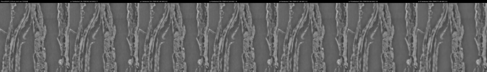

## PHerc1667_1.13um

`PHerc1667/volumes/20260323082859-1.129um-0.2m-59keV-masked.zarr`, volume shape [42209, 22122, 20276], cube origin zyx [20864, 7168, 2944], raw 128 MiB.

| q | size | ratio | PSNR dB | SSIM | MAE | P99 | max | deblocked PSNR | SSIM | MAE | P99 | max |
|---|---|---|---|---|---|---|---|---|---|---|---|---|
| 1 | 3.87 MiB | 33.1x | 50.7 | 0.9955 | 0.49 | 2 | 17 | 50.7 | 0.9955 | 0.49 | 2 | 17 |
| 2 | 2.46 MiB | 52.0x | 48.3 | 0.9925 | 0.69 | 3 | 21 | 48.5 | 0.9928 | 0.68 | 2 | 21 |
| 4 | 1.57 MiB | 81.7x | 45.6 | 0.9870 | 0.99 | 4 | 27 | 46.0 | 0.9882 | 0.95 | 3 | 27 |
| 8 | 0.97 MiB | 131.7x | 42.7 | 0.9769 | 1.40 | 5 | 29 | 43.4 | 0.9806 | 1.31 | 5 | 29 |
| 16 | 0.59 MiB | 217.6x | 39.8 | 0.9592 | 1.99 | 7 | 41 | 40.7 | 0.9678 | 1.81 | 6 | 41 |
| 32 | 0.35 MiB | 361.5x | 36.9 | 0.9309 | 2.77 | 11 | 67 | 37.9 | 0.9469 | 2.50 | 9 | 33 |

- z0: [z0_all.png](PHerc1667_1.13um/z0_all.png)  ·  deblocked [z0_all_db.png](PHerc1667_1.13um/z0_all_db.png)  ·  raw [PHerc1667_1.13um/z0_raw.png](PHerc1667_1.13um/z0_raw.png)
- z511: [z511_all.png](PHerc1667_1.13um/z511_all.png)  ·  deblocked [z511_all_db.png](PHerc1667_1.13um/z511_all_db.png)  ·  raw [PHerc1667_1.13um/z511_raw.png](PHerc1667_1.13um/z511_raw.png)
- y0: [y0_all.png](PHerc1667_1.13um/y0_all.png)  ·  deblocked [y0_all_db.png](PHerc1667_1.13um/y0_all_db.png)  ·  raw [PHerc1667_1.13um/y0_raw.png](PHerc1667_1.13um/y0_raw.png)
- y511: [y511_all.png](PHerc1667_1.13um/y511_all.png)  ·  deblocked [y511_all_db.png](PHerc1667_1.13um/y511_all_db.png)  ·  raw [PHerc1667_1.13um/y511_raw.png](PHerc1667_1.13um/y511_raw.png)
- x0: [x0_all.png](PHerc1667_1.13um/x0_all.png)  ·  deblocked [x0_all_db.png](PHerc1667_1.13um/x0_all_db.png)  ·  raw [PHerc1667_1.13um/x0_raw.png](PHerc1667_1.13um/x0_raw.png)
- x511: [x511_all.png](PHerc1667_1.13um/x511_all.png)  ·  deblocked [x511_all_db.png](PHerc1667_1.13um/x511_all_db.png)  ·  raw [PHerc1667_1.13um/x511_raw.png](PHerc1667_1.13um/x511_raw.png)
- zmid: [zmid_all.png](PHerc1667_1.13um/zmid_all.png)  ·  deblocked [zmid_all_db.png](PHerc1667_1.13um/zmid_all_db.png)  ·  raw [PHerc1667_1.13um/zmid_raw.png](PHerc1667_1.13um/zmid_raw.png)
- ymid: [ymid_all.png](PHerc1667_1.13um/ymid_all.png)  ·  deblocked [ymid_all_db.png](PHerc1667_1.13um/ymid_all_db.png)  ·  raw [PHerc1667_1.13um/ymid_raw.png](PHerc1667_1.13um/ymid_raw.png)
- xmid: [xmid_all.png](PHerc1667_1.13um/xmid_all.png)  ·  deblocked [xmid_all_db.png](PHerc1667_1.13um/xmid_all_db.png)  ·  raw [PHerc1667_1.13um/xmid_raw.png](PHerc1667_1.13um/xmid_raw.png)

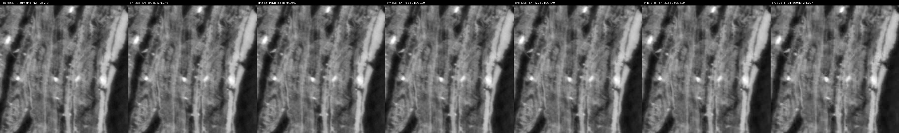

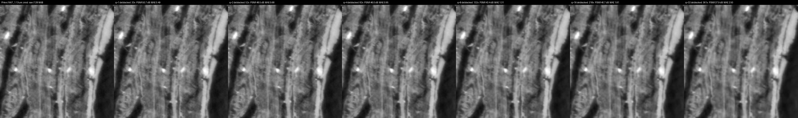

## PHercParis4_2.40um

`PHercParis4/volumes/20260411134726-2.400um-0.2m-78keV-masked.zarr`, volume shape [75784, 32693, 32693], cube origin zyx [37632, 22272, 22016], raw 128 MiB.

| q | size | ratio | PSNR dB | SSIM | MAE | P99 | max | deblocked PSNR | SSIM | MAE | P99 | max |
|---|---|---|---|---|---|---|---|---|---|---|---|---|
| 1 | 10.24 MiB | 12.5x | 46.5 | 0.9953 | 0.90 | 3 | 16 | 46.5 | 0.9953 | 0.90 | 3 | 16 |
| 2 | 6.50 MiB | 19.7x | 43.3 | 0.9902 | 1.35 | 5 | 20 | 43.3 | 0.9902 | 1.35 | 5 | 20 |
| 4 | 4.04 MiB | 31.7x | 39.9 | 0.9791 | 2.01 | 7 | 26 | 40.0 | 0.9795 | 1.99 | 7 | 26 |
| 8 | 2.45 MiB | 52.3x | 36.6 | 0.9560 | 2.97 | 10 | 41 | 36.9 | 0.9594 | 2.87 | 10 | 41 |
| 16 | 1.42 MiB | 90.1x | 33.3 | 0.9110 | 4.32 | 15 | 60 | 33.9 | 0.9215 | 4.05 | 14 | 60 |
| 32 | 0.78 MiB | 163.4x | 30.3 | 0.8330 | 6.12 | 21 | 92 | 31.0 | 0.8527 | 5.69 | 19 | 92 |

- z0: [z0_all.png](PHercParis4_2.40um/z0_all.png)  ·  deblocked [z0_all_db.png](PHercParis4_2.40um/z0_all_db.png)  ·  raw [PHercParis4_2.40um/z0_raw.png](PHercParis4_2.40um/z0_raw.png)
- z511: [z511_all.png](PHercParis4_2.40um/z511_all.png)  ·  deblocked [z511_all_db.png](PHercParis4_2.40um/z511_all_db.png)  ·  raw [PHercParis4_2.40um/z511_raw.png](PHercParis4_2.40um/z511_raw.png)
- y0: [y0_all.png](PHercParis4_2.40um/y0_all.png)  ·  deblocked [y0_all_db.png](PHercParis4_2.40um/y0_all_db.png)  ·  raw [PHercParis4_2.40um/y0_raw.png](PHercParis4_2.40um/y0_raw.png)
- y511: [y511_all.png](PHercParis4_2.40um/y511_all.png)  ·  deblocked [y511_all_db.png](PHercParis4_2.40um/y511_all_db.png)  ·  raw [PHercParis4_2.40um/y511_raw.png](PHercParis4_2.40um/y511_raw.png)
- x0: [x0_all.png](PHercParis4_2.40um/x0_all.png)  ·  deblocked [x0_all_db.png](PHercParis4_2.40um/x0_all_db.png)  ·  raw [PHercParis4_2.40um/x0_raw.png](PHercParis4_2.40um/x0_raw.png)
- x511: [x511_all.png](PHercParis4_2.40um/x511_all.png)  ·  deblocked [x511_all_db.png](PHercParis4_2.40um/x511_all_db.png)  ·  raw [PHercParis4_2.40um/x511_raw.png](PHercParis4_2.40um/x511_raw.png)
- zmid: [zmid_all.png](PHercParis4_2.40um/zmid_all.png)  ·  deblocked [zmid_all_db.png](PHercParis4_2.40um/zmid_all_db.png)  ·  raw [PHercParis4_2.40um/zmid_raw.png](PHercParis4_2.40um/zmid_raw.png)
- ymid: [ymid_all.png](PHercParis4_2.40um/ymid_all.png)  ·  deblocked [ymid_all_db.png](PHercParis4_2.40um/ymid_all_db.png)  ·  raw [PHercParis4_2.40um/ymid_raw.png](PHercParis4_2.40um/ymid_raw.png)
- xmid: [xmid_all.png](PHercParis4_2.40um/xmid_all.png)  ·  deblocked [xmid_all_db.png](PHercParis4_2.40um/xmid_all_db.png)  ·  raw [PHercParis4_2.40um/xmid_raw.png](PHercParis4_2.40um/xmid_raw.png)

## PHerc0191_9.36um

`PHerc0191/volumes/20250821151635-9.362um-1.2m-113keV-masked.zarr`, volume shape [18977, 8387, 8387], cube origin zyx [9216, 3584, 6016], raw 128 MiB.

| q | size | ratio | PSNR dB | SSIM | MAE | P99 | max | deblocked PSNR | SSIM | MAE | P99 | max |
|---|---|---|---|---|---|---|---|---|---|---|---|---|
| 1 | 16.29 MiB | 7.9x | 45.1 | 0.9966 | 1.06 | 4 | 28 | 45.1 | 0.9966 | 1.06 | 4 | 28 |
| 2 | 10.84 MiB | 11.8x | 41.1 | 0.9915 | 1.73 | 6 | 41 | 41.1 | 0.9915 | 1.73 | 6 | 41 |
| 4 | 6.89 MiB | 18.6x | 37.2 | 0.9792 | 2.75 | 9 | 47 | 37.2 | 0.9793 | 2.74 | 9 | 47 |
| 8 | 4.13 MiB | 31.0x | 33.4 | 0.9510 | 4.27 | 15 | 69 | 33.5 | 0.9521 | 4.22 | 15 | 69 |
| 16 | 2.30 MiB | 55.7x | 29.8 | 0.8914 | 6.41 | 23 | 100 | 30.1 | 0.8979 | 6.19 | 22 | 100 |
| 32 | 1.17 MiB | 109.3x | 26.7 | 0.7825 | 9.20 | 33 | 142 | 27.1 | 0.7963 | 8.76 | 31 | 142 |

- z0: [z0_all.png](PHerc0191_9.36um/z0_all.png)  ·  deblocked [z0_all_db.png](PHerc0191_9.36um/z0_all_db.png)  ·  raw [PHerc0191_9.36um/z0_raw.png](PHerc0191_9.36um/z0_raw.png)
- z511: [z511_all.png](PHerc0191_9.36um/z511_all.png)  ·  deblocked [z511_all_db.png](PHerc0191_9.36um/z511_all_db.png)  ·  raw [PHerc0191_9.36um/z511_raw.png](PHerc0191_9.36um/z511_raw.png)
- y0: [y0_all.png](PHerc0191_9.36um/y0_all.png)  ·  deblocked [y0_all_db.png](PHerc0191_9.36um/y0_all_db.png)  ·  raw [PHerc0191_9.36um/y0_raw.png](PHerc0191_9.36um/y0_raw.png)
- y511: [y511_all.png](PHerc0191_9.36um/y511_all.png)  ·  deblocked [y511_all_db.png](PHerc0191_9.36um/y511_all_db.png)  ·  raw [PHerc0191_9.36um/y511_raw.png](PHerc0191_9.36um/y511_raw.png)
- x0: [x0_all.png](PHerc0191_9.36um/x0_all.png)  ·  deblocked [x0_all_db.png](PHerc0191_9.36um/x0_all_db.png)  ·  raw [PHerc0191_9.36um/x0_raw.png](PHerc0191_9.36um/x0_raw.png)
- x511: [x511_all.png](PHerc0191_9.36um/x511_all.png)  ·  deblocked [x511_all_db.png](PHerc0191_9.36um/x511_all_db.png)  ·  raw [PHerc0191_9.36um/x511_raw.png](PHerc0191_9.36um/x511_raw.png)
- zmid: [zmid_all.png](PHerc0191_9.36um/zmid_all.png)  ·  deblocked [zmid_all_db.png](PHerc0191_9.36um/zmid_all_db.png)  ·  raw [PHerc0191_9.36um/zmid_raw.png](PHerc0191_9.36um/zmid_raw.png)
- ymid: [ymid_all.png](PHerc0191_9.36um/ymid_all.png)  ·  deblocked [ymid_all_db.png](PHerc0191_9.36um/ymid_all_db.png)  ·  raw [PHerc0191_9.36um/ymid_raw.png](PHerc0191_9.36um/ymid_raw.png)
- xmid: [xmid_all.png](PHerc0191_9.36um/xmid_all.png)  ·  deblocked [xmid_all_db.png](PHerc0191_9.36um/xmid_all_db.png)  ·  raw [PHerc0191_9.36um/xmid_raw.png](PHerc0191_9.36um/xmid_raw.png)

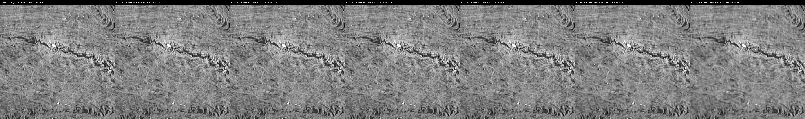

## PHerc0139_1.13um

`PHerc0139/volumes/20260413113053-1.129um-0.2m-59keV-masked.zarr`, volume shape [19297, 35971, 32318], cube origin zyx [9344, 25472, 26752], raw 128 MiB.

| q | size | ratio | PSNR dB | SSIM | MAE | P99 | max | deblocked PSNR | SSIM | MAE | P99 | max |
|---|---|---|---|---|---|---|---|---|---|---|---|---|
| 1 | 3.16 MiB | 40.5x | 50.8 | 0.9947 | 0.47 | 2 | 17 | 50.8 | 0.9947 | 0.47 | 2 | 17 |
| 2 | 1.91 MiB | 67.0x | 48.7 | 0.9918 | 0.64 | 2 | 23 | 48.8 | 0.9921 | 0.63 | 2 | 23 |
| 4 | 1.18 MiB | 108.6x | 46.5 | 0.9873 | 0.85 | 3 | 29 | 46.8 | 0.9882 | 0.83 | 3 | 29 |
| 8 | 0.72 MiB | 177.3x | 44.1 | 0.9797 | 1.15 | 5 | 44 | 44.7 | 0.9829 | 1.08 | 4 | 44 |
| 16 | 0.44 MiB | 289.5x | 41.4 | 0.9670 | 1.56 | 6 | 53 | 42.4 | 0.9744 | 1.42 | 5 | 53 |
| 32 | 0.27 MiB | 466.6x | 38.7 | 0.9474 | 2.13 | 9 | 61 | 39.8 | 0.9609 | 1.91 | 7 | 33 |

- z0: [z0_all.png](PHerc0139_1.13um/z0_all.png)  ·  deblocked [z0_all_db.png](PHerc0139_1.13um/z0_all_db.png)  ·  raw [PHerc0139_1.13um/z0_raw.png](PHerc0139_1.13um/z0_raw.png)
- z511: [z511_all.png](PHerc0139_1.13um/z511_all.png)  ·  deblocked [z511_all_db.png](PHerc0139_1.13um/z511_all_db.png)  ·  raw [PHerc0139_1.13um/z511_raw.png](PHerc0139_1.13um/z511_raw.png)
- y0: [y0_all.png](PHerc0139_1.13um/y0_all.png)  ·  deblocked [y0_all_db.png](PHerc0139_1.13um/y0_all_db.png)  ·  raw [PHerc0139_1.13um/y0_raw.png](PHerc0139_1.13um/y0_raw.png)
- y511: [y511_all.png](PHerc0139_1.13um/y511_all.png)  ·  deblocked [y511_all_db.png](PHerc0139_1.13um/y511_all_db.png)  ·  raw [PHerc0139_1.13um/y511_raw.png](PHerc0139_1.13um/y511_raw.png)
- x0: [x0_all.png](PHerc0139_1.13um/x0_all.png)  ·  deblocked [x0_all_db.png](PHerc0139_1.13um/x0_all_db.png)  ·  raw [PHerc0139_1.13um/x0_raw.png](PHerc0139_1.13um/x0_raw.png)
- x511: [x511_all.png](PHerc0139_1.13um/x511_all.png)  ·  deblocked [x511_all_db.png](PHerc0139_1.13um/x511_all_db.png)  ·  raw [PHerc0139_1.13um/x511_raw.png](PHerc0139_1.13um/x511_raw.png)
- zmid: [zmid_all.png](PHerc0139_1.13um/zmid_all.png)  ·  deblocked [zmid_all_db.png](PHerc0139_1.13um/zmid_all_db.png)  ·  raw [PHerc0139_1.13um/zmid_raw.png](PHerc0139_1.13um/zmid_raw.png)
- ymid: [ymid_all.png](PHerc0139_1.13um/ymid_all.png)  ·  deblocked [ymid_all_db.png](PHerc0139_1.13um/ymid_all_db.png)  ·  raw [PHerc0139_1.13um/ymid_raw.png](PHerc0139_1.13um/ymid_raw.png)
- xmid: [xmid_all.png](PHerc0139_1.13um/xmid_all.png)  ·  deblocked [xmid_all_db.png](PHerc0139_1.13um/xmid_all_db.png)  ·  raw [PHerc0139_1.13um/xmid_raw.png](PHerc0139_1.13um/xmid_raw.png)

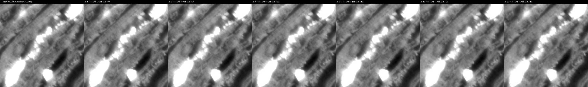

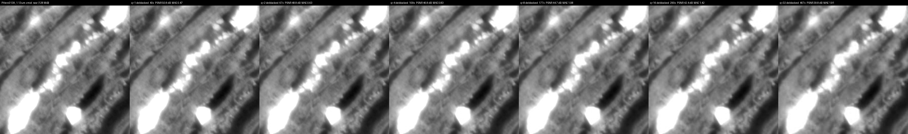

## PHerc0343P_2.21um

`PHerc0343P/volumes/20260304131111-2.215um-0.4m-111keV-masked.zarr`, volume shape [20714, 13155, 13155], cube origin zyx [10112, 4608, 4224], raw 128 MiB.

| q | size | ratio | PSNR dB | SSIM | MAE | P99 | max | deblocked PSNR | SSIM | MAE | P99 | max |
|---|---|---|---|---|---|---|---|---|---|---|---|---|
| 1 | 8.57 MiB | 14.9x | 46.4 | 0.9917 | 0.92 | 3 | 9 | 46.4 | 0.9917 | 0.92 | 3 | 9 |
| 2 | 5.00 MiB | 25.6x | 43.4 | 0.9835 | 1.34 | 4 | 14 | 43.4 | 0.9835 | 1.34 | 4 | 14 |
| 4 | 2.90 MiB | 44.1x | 40.5 | 0.9688 | 1.88 | 6 | 21 | 40.7 | 0.9698 | 1.85 | 6 | 21 |
| 8 | 1.68 MiB | 76.1x | 37.8 | 0.9433 | 2.59 | 9 | 36 | 38.1 | 0.9478 | 2.49 | 8 | 36 |
| 16 | 0.95 MiB | 134.9x | 35.1 | 0.9010 | 3.53 | 12 | 61 | 35.6 | 0.9118 | 3.33 | 11 | 61 |
| 32 | 0.51 MiB | 250.4x | 32.5 | 0.8375 | 4.74 | 17 | 71 | 33.1 | 0.8558 | 4.44 | 15 | 57 |

- z0: [z0_all.png](PHerc0343P_2.21um/z0_all.png)  ·  deblocked [z0_all_db.png](PHerc0343P_2.21um/z0_all_db.png)  ·  raw [PHerc0343P_2.21um/z0_raw.png](PHerc0343P_2.21um/z0_raw.png)
- z511: [z511_all.png](PHerc0343P_2.21um/z511_all.png)  ·  deblocked [z511_all_db.png](PHerc0343P_2.21um/z511_all_db.png)  ·  raw [PHerc0343P_2.21um/z511_raw.png](PHerc0343P_2.21um/z511_raw.png)
- y0: [y0_all.png](PHerc0343P_2.21um/y0_all.png)  ·  deblocked [y0_all_db.png](PHerc0343P_2.21um/y0_all_db.png)  ·  raw [PHerc0343P_2.21um/y0_raw.png](PHerc0343P_2.21um/y0_raw.png)
- y511: [y511_all.png](PHerc0343P_2.21um/y511_all.png)  ·  deblocked [y511_all_db.png](PHerc0343P_2.21um/y511_all_db.png)  ·  raw [PHerc0343P_2.21um/y511_raw.png](PHerc0343P_2.21um/y511_raw.png)
- x0: [x0_all.png](PHerc0343P_2.21um/x0_all.png)  ·  deblocked [x0_all_db.png](PHerc0343P_2.21um/x0_all_db.png)  ·  raw [PHerc0343P_2.21um/x0_raw.png](PHerc0343P_2.21um/x0_raw.png)
- x511: [x511_all.png](PHerc0343P_2.21um/x511_all.png)  ·  deblocked [x511_all_db.png](PHerc0343P_2.21um/x511_all_db.png)  ·  raw [PHerc0343P_2.21um/x511_raw.png](PHerc0343P_2.21um/x511_raw.png)
- zmid: [zmid_all.png](PHerc0343P_2.21um/zmid_all.png)  ·  deblocked [zmid_all_db.png](PHerc0343P_2.21um/zmid_all_db.png)  ·  raw [PHerc0343P_2.21um/zmid_raw.png](PHerc0343P_2.21um/zmid_raw.png)
- ymid: [ymid_all.png](PHerc0343P_2.21um/ymid_all.png)  ·  deblocked [ymid_all_db.png](PHerc0343P_2.21um/ymid_all_db.png)  ·  raw [PHerc0343P_2.21um/ymid_raw.png](PHerc0343P_2.21um/ymid_raw.png)
- xmid: [xmid_all.png](PHerc0343P_2.21um/xmid_all.png)  ·  deblocked [xmid_all_db.png](PHerc0343P_2.21um/xmid_all_db.png)  ·  raw [PHerc0343P_2.21um/xmid_raw.png](PHerc0343P_2.21um/xmid_raw.png)

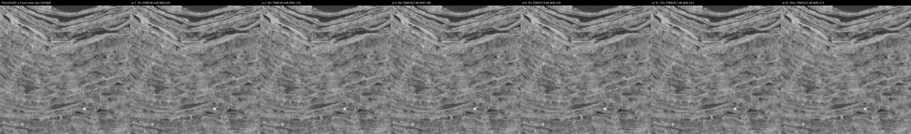

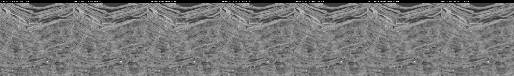

## PHerc0500P2_4.32um

`PHerc0500P2/volumes/20250528085330-4.317um-1.2m-111keV-masked.zarr`, volume shape [15838, 9423, 9423], cube origin zyx [7680, 4224, 3712], raw 128 MiB.

| q | size | ratio | PSNR dB | SSIM | MAE | P99 | max | deblocked PSNR | SSIM | MAE | P99 | max |
|---|---|---|---|---|---|---|---|---|---|---|---|---|
| 1 | 7.88 MiB | 16.3x | 46.0 | 0.9933 | 0.97 | 3 | 14 | 46.0 | 0.9933 | 0.97 | 3 | 14 |
| 2 | 4.47 MiB | 28.6x | 43.4 | 0.9880 | 1.33 | 4 | 20 | 43.4 | 0.9881 | 1.33 | 4 | 20 |
| 4 | 2.65 MiB | 48.4x | 41.0 | 0.9801 | 1.77 | 6 | 25 | 41.1 | 0.9807 | 1.75 | 6 | 25 |
| 8 | 1.62 MiB | 78.9x | 38.6 | 0.9672 | 2.34 | 8 | 38 | 38.9 | 0.9699 | 2.26 | 8 | 38 |
| 16 | 0.99 MiB | 128.8x | 36.0 | 0.9454 | 3.15 | 11 | 61 | 36.6 | 0.9530 | 2.95 | 10 | 61 |
| 32 | 0.60 MiB | 214.6x | 33.2 | 0.9077 | 4.32 | 16 | 84 | 34.1 | 0.9239 | 3.95 | 14 | 74 |

- z0: [z0_all.png](PHerc0500P2_4.32um/z0_all.png)  ·  deblocked [z0_all_db.png](PHerc0500P2_4.32um/z0_all_db.png)  ·  raw [PHerc0500P2_4.32um/z0_raw.png](PHerc0500P2_4.32um/z0_raw.png)
- z511: [z511_all.png](PHerc0500P2_4.32um/z511_all.png)  ·  deblocked [z511_all_db.png](PHerc0500P2_4.32um/z511_all_db.png)  ·  raw [PHerc0500P2_4.32um/z511_raw.png](PHerc0500P2_4.32um/z511_raw.png)
- y0: [y0_all.png](PHerc0500P2_4.32um/y0_all.png)  ·  deblocked [y0_all_db.png](PHerc0500P2_4.32um/y0_all_db.png)  ·  raw [PHerc0500P2_4.32um/y0_raw.png](PHerc0500P2_4.32um/y0_raw.png)
- y511: [y511_all.png](PHerc0500P2_4.32um/y511_all.png)  ·  deblocked [y511_all_db.png](PHerc0500P2_4.32um/y511_all_db.png)  ·  raw [PHerc0500P2_4.32um/y511_raw.png](PHerc0500P2_4.32um/y511_raw.png)
- x0: [x0_all.png](PHerc0500P2_4.32um/x0_all.png)  ·  deblocked [x0_all_db.png](PHerc0500P2_4.32um/x0_all_db.png)  ·  raw [PHerc0500P2_4.32um/x0_raw.png](PHerc0500P2_4.32um/x0_raw.png)
- x511: [x511_all.png](PHerc0500P2_4.32um/x511_all.png)  ·  deblocked [x511_all_db.png](PHerc0500P2_4.32um/x511_all_db.png)  ·  raw [PHerc0500P2_4.32um/x511_raw.png](PHerc0500P2_4.32um/x511_raw.png)
- zmid: [zmid_all.png](PHerc0500P2_4.32um/zmid_all.png)  ·  deblocked [zmid_all_db.png](PHerc0500P2_4.32um/zmid_all_db.png)  ·  raw [PHerc0500P2_4.32um/zmid_raw.png](PHerc0500P2_4.32um/zmid_raw.png)
- ymid: [ymid_all.png](PHerc0500P2_4.32um/ymid_all.png)  ·  deblocked [ymid_all_db.png](PHerc0500P2_4.32um/ymid_all_db.png)  ·  raw [PHerc0500P2_4.32um/ymid_raw.png](PHerc0500P2_4.32um/ymid_raw.png)
- xmid: [xmid_all.png](PHerc0500P2_4.32um/xmid_all.png)  ·  deblocked [xmid_all_db.png](PHerc0500P2_4.32um/xmid_all_db.png)  ·  raw [PHerc0500P2_4.32um/xmid_raw.png](PHerc0500P2_4.32um/xmid_raw.png)

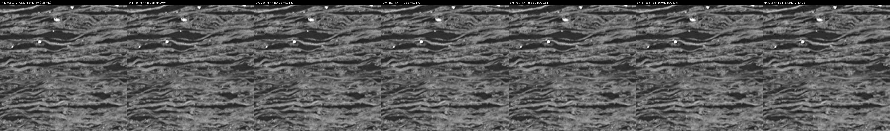

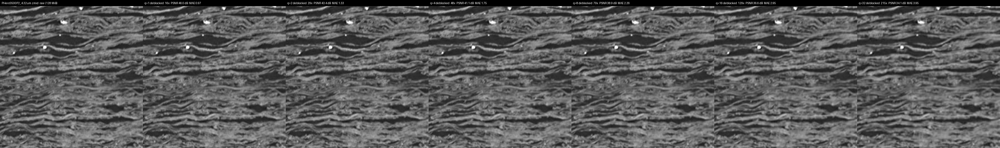

## PHerc0800_8.64um

`PHerc0800/volumes/20250521135224-8.640um-1.2m-116keV-masked.zarr`, volume shape [24298, 9867, 9867], cube origin zyx [11904, 1536, 3072], raw 128 MiB.

| q | size | ratio | PSNR dB | SSIM | MAE | P99 | max | deblocked PSNR | SSIM | MAE | P99 | max |
|---|---|---|---|---|---|---|---|---|---|---|---|---|
| 1 | 14.57 MiB | 8.8x | 44.5 | 0.9940 | 1.16 | 4 | 28 | 44.5 | 0.9940 | 1.16 | 4 | 28 |
| 2 | 9.24 MiB | 13.9x | 41.0 | 0.9866 | 1.77 | 6 | 42 | 41.0 | 0.9866 | 1.77 | 6 | 42 |
| 4 | 5.57 MiB | 23.0x | 37.5 | 0.9703 | 2.67 | 9 | 53 | 37.5 | 0.9704 | 2.67 | 9 | 53 |
| 8 | 3.18 MiB | 40.3x | 34.1 | 0.9359 | 3.95 | 14 | 73 | 34.2 | 0.9376 | 3.89 | 13 | 73 |
| 16 | 1.71 MiB | 75.1x | 30.9 | 0.8703 | 5.67 | 20 | 97 | 31.3 | 0.8781 | 5.45 | 19 | 97 |
| 32 | 0.85 MiB | 150.4x | 28.2 | 0.7621 | 7.79 | 27 | 116 | 28.6 | 0.7762 | 7.43 | 26 | 116 |

- z0: [z0_all.png](PHerc0800_8.64um/z0_all.png)  ·  deblocked [z0_all_db.png](PHerc0800_8.64um/z0_all_db.png)  ·  raw [PHerc0800_8.64um/z0_raw.png](PHerc0800_8.64um/z0_raw.png)
- z511: [z511_all.png](PHerc0800_8.64um/z511_all.png)  ·  deblocked [z511_all_db.png](PHerc0800_8.64um/z511_all_db.png)  ·  raw [PHerc0800_8.64um/z511_raw.png](PHerc0800_8.64um/z511_raw.png)
- y0: [y0_all.png](PHerc0800_8.64um/y0_all.png)  ·  deblocked [y0_all_db.png](PHerc0800_8.64um/y0_all_db.png)  ·  raw [PHerc0800_8.64um/y0_raw.png](PHerc0800_8.64um/y0_raw.png)
- y511: [y511_all.png](PHerc0800_8.64um/y511_all.png)  ·  deblocked [y511_all_db.png](PHerc0800_8.64um/y511_all_db.png)  ·  raw [PHerc0800_8.64um/y511_raw.png](PHerc0800_8.64um/y511_raw.png)
- x0: [x0_all.png](PHerc0800_8.64um/x0_all.png)  ·  deblocked [x0_all_db.png](PHerc0800_8.64um/x0_all_db.png)  ·  raw [PHerc0800_8.64um/x0_raw.png](PHerc0800_8.64um/x0_raw.png)
- x511: [x511_all.png](PHerc0800_8.64um/x511_all.png)  ·  deblocked [x511_all_db.png](PHerc0800_8.64um/x511_all_db.png)  ·  raw [PHerc0800_8.64um/x511_raw.png](PHerc0800_8.64um/x511_raw.png)
- zmid: [zmid_all.png](PHerc0800_8.64um/zmid_all.png)  ·  deblocked [zmid_all_db.png](PHerc0800_8.64um/zmid_all_db.png)  ·  raw [PHerc0800_8.64um/zmid_raw.png](PHerc0800_8.64um/zmid_raw.png)
- ymid: [ymid_all.png](PHerc0800_8.64um/ymid_all.png)  ·  deblocked [ymid_all_db.png](PHerc0800_8.64um/ymid_all_db.png)  ·  raw [PHerc0800_8.64um/ymid_raw.png](PHerc0800_8.64um/ymid_raw.png)
- xmid: [xmid_all.png](PHerc0800_8.64um/xmid_all.png)  ·  deblocked [xmid_all_db.png](PHerc0800_8.64um/xmid_all_db.png)  ·  raw [PHerc0800_8.64um/xmid_raw.png](PHerc0800_8.64um/xmid_raw.png)

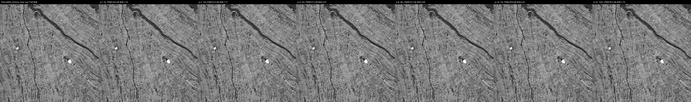

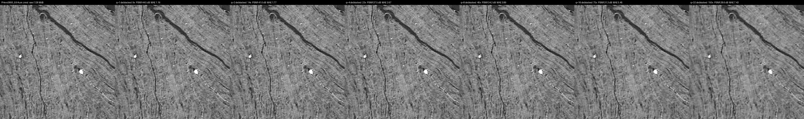

## Error overlays

For the three centre planes of every cube: the raw slice in grey with a red overlay whose opacity is the absolute error of the plain decode at that pixel with a fixed 4x gain (min(1, 4 |raw - decoded| / 255): an error of 32 shows as 50 % red, 64 or more as solid red), magnified 2x by pixel replication to 1024^2. `tools/diff_images.py`.

- PHerc0500P2_0.55um: zmid [q1](PHerc0500P2_0.55um/diff_zmid_q1.png) [q2](PHerc0500P2_0.55um/diff_zmid_q2.png) [q4](PHerc0500P2_0.55um/diff_zmid_q4.png) [q8](PHerc0500P2_0.55um/diff_zmid_q8.png) [q16](PHerc0500P2_0.55um/diff_zmid_q16.png) [q32](PHerc0500P2_0.55um/diff_zmid_q32.png)  ·  ymid [q1](PHerc0500P2_0.55um/diff_ymid_q1.png) [q2](PHerc0500P2_0.55um/diff_ymid_q2.png) [q4](PHerc0500P2_0.55um/diff_ymid_q4.png) [q8](PHerc0500P2_0.55um/diff_ymid_q8.png) [q16](PHerc0500P2_0.55um/diff_ymid_q16.png) [q32](PHerc0500P2_0.55um/diff_ymid_q32.png)  ·  xmid [q1](PHerc0500P2_0.55um/diff_xmid_q1.png) [q2](PHerc0500P2_0.55um/diff_xmid_q2.png) [q4](PHerc0500P2_0.55um/diff_xmid_q4.png) [q8](PHerc0500P2_0.55um/diff_xmid_q8.png) [q16](PHerc0500P2_0.55um/diff_xmid_q16.png) [q32](PHerc0500P2_0.55um/diff_xmid_q32.png)
- PHerc1667_1.13um: zmid [q1](PHerc1667_1.13um/diff_zmid_q1.png) [q2](PHerc1667_1.13um/diff_zmid_q2.png) [q4](PHerc1667_1.13um/diff_zmid_q4.png) [q8](PHerc1667_1.13um/diff_zmid_q8.png) [q16](PHerc1667_1.13um/diff_zmid_q16.png) [q32](PHerc1667_1.13um/diff_zmid_q32.png)  ·  ymid [q1](PHerc1667_1.13um/diff_ymid_q1.png) [q2](PHerc1667_1.13um/diff_ymid_q2.png) [q4](PHerc1667_1.13um/diff_ymid_q4.png) [q8](PHerc1667_1.13um/diff_ymid_q8.png) [q16](PHerc1667_1.13um/diff_ymid_q16.png) [q32](PHerc1667_1.13um/diff_ymid_q32.png)  ·  xmid [q1](PHerc1667_1.13um/diff_xmid_q1.png) [q2](PHerc1667_1.13um/diff_xmid_q2.png) [q4](PHerc1667_1.13um/diff_xmid_q4.png) [q8](PHerc1667_1.13um/diff_xmid_q8.png) [q16](PHerc1667_1.13um/diff_xmid_q16.png) [q32](PHerc1667_1.13um/diff_xmid_q32.png)
- PHercParis4_2.40um: zmid [q1](PHercParis4_2.40um/diff_zmid_q1.png) [q2](PHercParis4_2.40um/diff_zmid_q2.png) [q4](PHercParis4_2.40um/diff_zmid_q4.png) [q8](PHercParis4_2.40um/diff_zmid_q8.png) [q16](PHercParis4_2.40um/diff_zmid_q16.png) [q32](PHercParis4_2.40um/diff_zmid_q32.png)  ·  ymid [q1](PHercParis4_2.40um/diff_ymid_q1.png) [q2](PHercParis4_2.40um/diff_ymid_q2.png) [q4](PHercParis4_2.40um/diff_ymid_q4.png) [q8](PHercParis4_2.40um/diff_ymid_q8.png) [q16](PHercParis4_2.40um/diff_ymid_q16.png) [q32](PHercParis4_2.40um/diff_ymid_q32.png)  ·  xmid [q1](PHercParis4_2.40um/diff_xmid_q1.png) [q2](PHercParis4_2.40um/diff_xmid_q2.png) [q4](PHercParis4_2.40um/diff_xmid_q4.png) [q8](PHercParis4_2.40um/diff_xmid_q8.png) [q16](PHercParis4_2.40um/diff_xmid_q16.png) [q32](PHercParis4_2.40um/diff_xmid_q32.png)
- PHerc0191_9.36um: zmid [q1](PHerc0191_9.36um/diff_zmid_q1.png) [q2](PHerc0191_9.36um/diff_zmid_q2.png) [q4](PHerc0191_9.36um/diff_zmid_q4.png) [q8](PHerc0191_9.36um/diff_zmid_q8.png) [q16](PHerc0191_9.36um/diff_zmid_q16.png) [q32](PHerc0191_9.36um/diff_zmid_q32.png)  ·  ymid [q1](PHerc0191_9.36um/diff_ymid_q1.png) [q2](PHerc0191_9.36um/diff_ymid_q2.png) [q4](PHerc0191_9.36um/diff_ymid_q4.png) [q8](PHerc0191_9.36um/diff_ymid_q8.png) [q16](PHerc0191_9.36um/diff_ymid_q16.png) [q32](PHerc0191_9.36um/diff_ymid_q32.png)  ·  xmid [q1](PHerc0191_9.36um/diff_xmid_q1.png) [q2](PHerc0191_9.36um/diff_xmid_q2.png) [q4](PHerc0191_9.36um/diff_xmid_q4.png) [q8](PHerc0191_9.36um/diff_xmid_q8.png) [q16](PHerc0191_9.36um/diff_xmid_q16.png) [q32](PHerc0191_9.36um/diff_xmid_q32.png)
- PHerc0139_1.13um: zmid [q1](PHerc0139_1.13um/diff_zmid_q1.png) [q2](PHerc0139_1.13um/diff_zmid_q2.png) [q4](PHerc0139_1.13um/diff_zmid_q4.png) [q8](PHerc0139_1.13um/diff_zmid_q8.png) [q16](PHerc0139_1.13um/diff_zmid_q16.png) [q32](PHerc0139_1.13um/diff_zmid_q32.png)  ·  ymid [q1](PHerc0139_1.13um/diff_ymid_q1.png) [q2](PHerc0139_1.13um/diff_ymid_q2.png) [q4](PHerc0139_1.13um/diff_ymid_q4.png) [q8](PHerc0139_1.13um/diff_ymid_q8.png) [q16](PHerc0139_1.13um/diff_ymid_q16.png) [q32](PHerc0139_1.13um/diff_ymid_q32.png)  ·  xmid [q1](PHerc0139_1.13um/diff_xmid_q1.png) [q2](PHerc0139_1.13um/diff_xmid_q2.png) [q4](PHerc0139_1.13um/diff_xmid_q4.png) [q8](PHerc0139_1.13um/diff_xmid_q8.png) [q16](PHerc0139_1.13um/diff_xmid_q16.png) [q32](PHerc0139_1.13um/diff_xmid_q32.png)
- PHerc0343P_2.21um: zmid [q1](PHerc0343P_2.21um/diff_zmid_q1.png) [q2](PHerc0343P_2.21um/diff_zmid_q2.png) [q4](PHerc0343P_2.21um/diff_zmid_q4.png) [q8](PHerc0343P_2.21um/diff_zmid_q8.png) [q16](PHerc0343P_2.21um/diff_zmid_q16.png) [q32](PHerc0343P_2.21um/diff_zmid_q32.png)  ·  ymid [q1](PHerc0343P_2.21um/diff_ymid_q1.png) [q2](PHerc0343P_2.21um/diff_ymid_q2.png) [q4](PHerc0343P_2.21um/diff_ymid_q4.png) [q8](PHerc0343P_2.21um/diff_ymid_q8.png) [q16](PHerc0343P_2.21um/diff_ymid_q16.png) [q32](PHerc0343P_2.21um/diff_ymid_q32.png)  ·  xmid [q1](PHerc0343P_2.21um/diff_xmid_q1.png) [q2](PHerc0343P_2.21um/diff_xmid_q2.png) [q4](PHerc0343P_2.21um/diff_xmid_q4.png) [q8](PHerc0343P_2.21um/diff_xmid_q8.png) [q16](PHerc0343P_2.21um/diff_xmid_q16.png) [q32](PHerc0343P_2.21um/diff_xmid_q32.png)
- PHerc0500P2_4.32um: zmid [q1](PHerc0500P2_4.32um/diff_zmid_q1.png) [q2](PHerc0500P2_4.32um/diff_zmid_q2.png) [q4](PHerc0500P2_4.32um/diff_zmid_q4.png) [q8](PHerc0500P2_4.32um/diff_zmid_q8.png) [q16](PHerc0500P2_4.32um/diff_zmid_q16.png) [q32](PHerc0500P2_4.32um/diff_zmid_q32.png)  ·  ymid [q1](PHerc0500P2_4.32um/diff_ymid_q1.png) [q2](PHerc0500P2_4.32um/diff_ymid_q2.png) [q4](PHerc0500P2_4.32um/diff_ymid_q4.png) [q8](PHerc0500P2_4.32um/diff_ymid_q8.png) [q16](PHerc0500P2_4.32um/diff_ymid_q16.png) [q32](PHerc0500P2_4.32um/diff_ymid_q32.png)  ·  xmid [q1](PHerc0500P2_4.32um/diff_xmid_q1.png) [q2](PHerc0500P2_4.32um/diff_xmid_q2.png) [q4](PHerc0500P2_4.32um/diff_xmid_q4.png) [q8](PHerc0500P2_4.32um/diff_xmid_q8.png) [q16](PHerc0500P2_4.32um/diff_xmid_q16.png) [q32](PHerc0500P2_4.32um/diff_xmid_q32.png)
- PHerc0800_8.64um: zmid [q1](PHerc0800_8.64um/diff_zmid_q1.png) [q2](PHerc0800_8.64um/diff_zmid_q2.png) [q4](PHerc0800_8.64um/diff_zmid_q4.png) [q8](PHerc0800_8.64um/diff_zmid_q8.png) [q16](PHerc0800_8.64um/diff_zmid_q16.png) [q32](PHerc0800_8.64um/diff_zmid_q32.png)  ·  ymid [q1](PHerc0800_8.64um/diff_ymid_q1.png) [q2](PHerc0800_8.64um/diff_ymid_q2.png) [q4](PHerc0800_8.64um/diff_ymid_q4.png) [q8](PHerc0800_8.64um/diff_ymid_q8.png) [q16](PHerc0800_8.64um/diff_ymid_q16.png) [q32](PHerc0800_8.64um/diff_ymid_q32.png)  ·  xmid [q1](PHerc0800_8.64um/diff_xmid_q1.png) [q2](PHerc0800_8.64um/diff_xmid_q2.png) [q4](PHerc0800_8.64um/diff_xmid_q4.png) [q8](PHerc0800_8.64um/diff_xmid_q8.png) [q16](PHerc0800_8.64um/diff_xmid_q16.png) [q32](PHerc0800_8.64um/diff_xmid_q32.png)

## Surface predictions and masks

Our volcomp m7 surface-probability stores against the published upstream m7 masks of the same scans (eight scrolls): CT slices, overlays, disagreement panels, dice/precision/recall and store sizes. See [surfaces/README.md](surfaces/README.md); `tools/surface_compare.py`. The published masks re-exported as volcomp mask stores (mode 5 exact, mode 4 2x pooled): [masks/README.md](masks/README.md).
