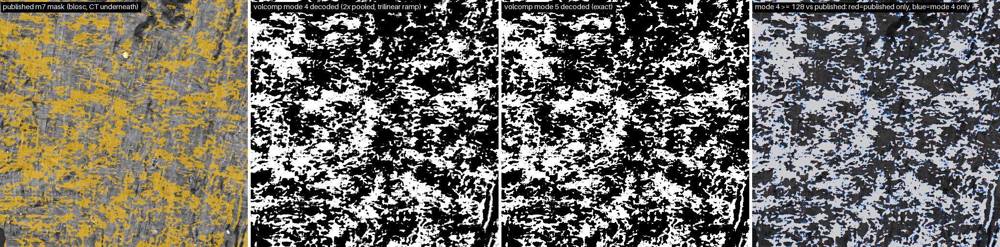
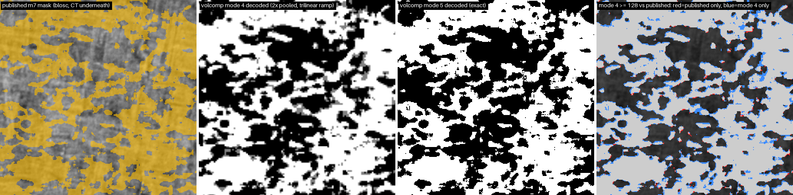
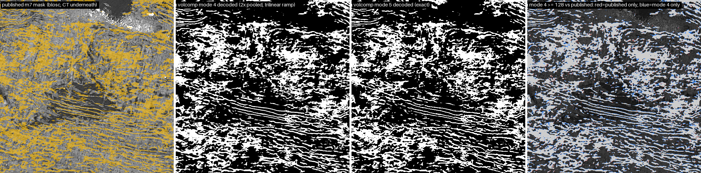
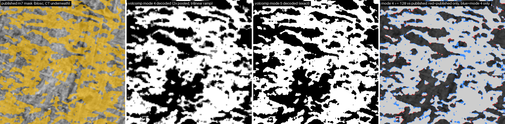
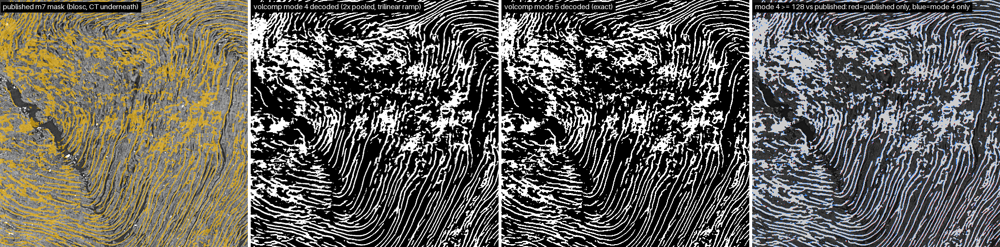
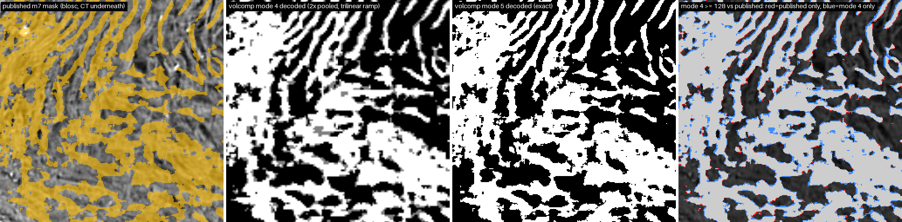

# Published m7 masks as volcomp mask stores

The mirror carries every published surface mask re-exported as a volcomp **mode 5** store (exact binary mask, 0/255, context-model range coder on the full 128³ chunk; same OME-zarr v3 layout, same grid). **Mode 4** stores the 2x2x2 majority pool of each chunk and decodes it as a trilinear 0..255 ramp; it is not on the mirror, so its level-0 size is measured here by encoding every non-empty 128³ chunk of the published level 0 (payload + a 16 B/slot index per non-empty 1024³ shard). Made by `tools/surface_compare.py --mask-out`; numbers in each scroll's report.json.

## Sizes (level 0)

| scroll | voxels | published (blosc-zstd, 192³ chunks) | mode 5 (exact) | published / mode 5 | mode 4 (2x pooled) | published / mode 4 | all levels: published / mode 5 |
|---|---|---|---|---|---|---|---|
| PHerc0800 | in progress: numbers pending | | | | | | |
| PHerc1218 | in progress: numbers pending | | | | | | |
| PHerc0125 | in progress: numbers pending | | | | | | |

## Fidelity in the comparison box

The same 1024³ box as the surface comparison (surfaces/<scroll>/README.md). Mode 5 is read back from the mirror store; mode 4 is encoded here on the store's 128³ grid and thresholded at 128 for the counts.

| scroll | mode 5 mismatching voxels | mode 4 dice (inside CT mask) | precision | recall | mode 4 mismatching voxels | mode 4 MAE vs 0/255 | box bytes mode 4 / mode 5 |
|---|---|---|---|---|---|---|---|

## Panels

Four panels per strip: the published mask (amber over the CT), mode 4 decoded (the 2x-pooled mask as a trilinear ramp, grey), mode 5 decoded (exact), and mode 4 >= 128 against the published mask (red = published only, blue = mode 4 only, grey = both). `_all` is the slice at half resolution, `_zoom` the 256² crop with the most surface at 2x.

### PHerc0800

### PHerc1218

### PHerc0125

