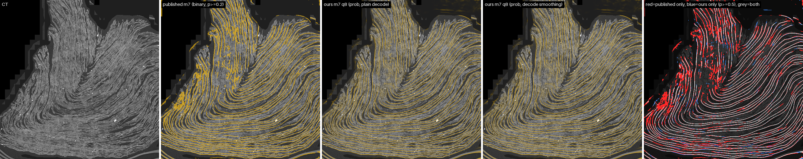

# PHerc0343P: our volcomp m7 surface prediction vs the published m7 prediction

Scan `20260304131111-2.215um-0.4m-111keV-masked.zarr`, CT level 2 (8.86 µm), prediction grid 5179 x 3289 x 3289 (z, y, x) = 56.0 Gvox. Made by `tools/surface_compare.py`; every number is in [report.json](report.json).

- **Published**: `s3://vesuvius-challenge-open-data/PHerc0343P/representations/predictions/surfaces/20260304131111-surface-20260413222639-surface-m7-L2-th0.2.zarr/` level 0, OME-zarr v2, blosc-zstd 192³ chunks. A **binary mask**: the m7 probability thresholded at **0.2**.
- **Ours**: `https://dl.ash2txt.org/community-uploads/forrest/volcomp/PHerc0343P/representations/predictions/surfaces/20260304131111-surface-20260925170000-surface-m7-L2-prob.zarr` level `8.86`, zarr v3 sharded, volcomp q8. An **8-bit probability** (uint8 = round(p · 255)), decoded plain (what any zarr reader gets) or with volcomp's decode-only smoothing: `gated2` is what `volcomp_zarr.set_read_smoothing(2)` gives (`decode_smooth(…, 2, GATED | ZERO_GUARD)`), `gauss0.6` is `decode_smooth(…, 0.6, ZERO_GUARD)`, the setting docs/deblocking.md recommends for probability maps. The images use plain and gated2.
- **CT** under the images: the original uncompressed level 2 (`s3://vesuvius-challenge-open-data/PHerc0343P/volumes/20260304131111-2.215um-0.4m-111keV-masked.zarr/2`).

**What differs besides compression.** Both are the same m7 checkpoint (surface_m7_nnunet) on the same scan at the same level, but they are separate inference runs. Ours: 192³ windows at **stride 128**, separable Gaussian blend, TensorRT fp16, no TTA, run on our volcomp q8 CT (volcomp_decode_smooth strength 2, gated, zero guard). Published: the upstream pipeline (nnU-Net predictor, TTA disabled per its metadata.json) on the original CT. m7's mask moves with window placement (stride 128 against 96 on the same input gave dice 0.946; no stride pair reaches 0.99), so a large part of the disagreement below is inference, not compression. The compression-only loss is measured separately at the end.

## Table

| | |
|---|---|
| voxels (level 0) | 56,023,941,259 (56.0 Gvox) |
| published store, level 0 | 370 MiB (387,987,633 B) |
| our store, level 0 | 158 MiB (166,049,715 B) |
| ratio published / ours, level 0 | 2.34x |
| published, all 6 levels / ours, all 8 levels | 468 MiB / 202 MiB (2.32x) |

Agreement with the published mask in the comparison box z 1152-2176, y 832-1856, x 1024-2048 (1.07 Gvox, the window with the most published surface inside the CT mask; 90 % of it is inside the CT mask), counted **inside the CT mask** (CT > 0). Precision = fraction of our voxels that the published mask also has; recall = fraction of the published voxels we also have. `p>=0.2` compares at the published threshold, `p>=0.5` at the usual one.

**The published mask also marks masked air.** In this box 4,504,264 published surface voxels lie where the published CT is 0 (outside the scroll mask), mostly in solid blocks; our store has 0 voxels >= 0.2 there (it is 0 wherever our volcomp copy of the CT is 0; the few left are at mask edges where the two copies differ). They are drawn dark red in the diff panels and left out of the scores below; counted in, the plain p>=0.5 dice would be 0.6286.

| ours decoded | threshold | dice | precision | recall | our voxels | published voxels |
|---|---|---|---|---|---|---|
| plain | p>=0.5 | 0.6373 | 0.8768 | 0.5006 | 117,807,595 | 206,345,893 |
| plain | p>=0.2 | 0.7355 | 0.6940 | 0.7823 | 232,616,785 | 206,345,893 |
| gated2 | p>=0.5 | 0.6370 | 0.8771 | 0.5000 | 117,634,549 | 206,345,893 |
| gated2 | p>=0.2 | 0.7357 | 0.6946 | 0.7820 | 232,318,130 | 206,345,893 |
| gauss0.6 | p>=0.5 | 0.6367 | 0.8783 | 0.4993 | 117,300,777 | 206,345,893 |
| gauss0.6 | p>=0.2 | 0.7341 | 0.6865 | 0.7887 | 237,059,467 | 206,345,893 |

Whole volume (every level-0 voxel inside the CT mask; the mask is CT level 4 > 0, nearest-upsampled 4x). Published surface voxels outside the mask: 6,111,993,165; ours >= 0.2 outside it: 0 (mask edges: the 4x-coarser mask is approximate there). The whole volume includes the sparse outer wraps and mask edges, so it can score below the dense box.

| ours decoded | threshold | dice | precision | recall | our voxels | published voxels |
|---|---|---|---|---|---|---|
| plain | p>=0.5 | 0.4587 | 0.7794 | 0.3249 | 610,732,849 | 1,464,844,101 |
| plain | p>=0.2 | 0.6029 | 0.5918 | 0.6144 | 1,520,810,940 | 1,464,844,101 |
| gated2 | p>=0.5 | 0.4584 | 0.7796 | 0.3247 | 609,998,999 | 1,464,844,101 |
| gated2 | p>=0.2 | 0.6030 | 0.5921 | 0.6142 | 1,519,534,883 | 1,464,844,101 |
| all_voxels_plain | p>=0.5 | 0.1163 | 0.7794 | 0.0628 | 610,732,849 | 7,576,837,266 |
| all_voxels_plain | p>=0.2 | 0.1979 | 0.5918 | 0.1188 | 1,520,810,940 | 7,576,837,266 |

### Compression only

No uncompressed float m7 prediction exists for this scan. The one kept float run is on **PHerc0343P 20250521134555-8.640um (level 0)**, a different scan of the same scroll, box z 1736-2120, y 1816-2584, x 1896-2664: the same engine, stride 96 and CT input as our production store there, blended in fp32 and kept uncompressed. It cannot be compared to the published mask (different scan, no registration), but against our q8 store of the same run it isolates what volcomp q8 costs:

| ours decoded | MAE (/255) | dice p>=0.5 | dice p>=0.2 | precision p>=0.5 | recall p>=0.5 |
|---|---|---|---|---|---|
| plain | 4.10 | 0.9784 | 0.9676 | 0.9838 | 0.9731 |
| gated2 | 3.70 | 0.9784 | 0.9685 | 0.9845 | 0.9724 |
| gauss0.6 | 4.67 | 0.9765 | 0.9554 | 0.9819 | 0.9710 |

## Images

Slices at 1/3 and 2/3 of the box along each axis (fixed positions, not picked), named by axis and level-0 index. Full resolution: 1 image pixel = 1 voxel, 1024² unless the volume is smaller.

- `<view>_ct.png`: the CT slice.
- `<view>_published.png`: the published **binary threshold-0.2 mask** in amber at 60 % opacity over the CT.
- `<view>_ours.png`: our **8-bit probability**, plain decode, in amber at opacity 0.6 · p over the CT (faint amber = low probability; the published mask has no such gradation).
- `<view>_ours_smooth.png`: the same with decode smoothing (`gated2`, what `volcomp_zarr.set_read_smoothing(2)` gives; on the kept float box it has the lowest error of the three decodes).
- `<view>_diff.png` (plain decode): darkened CT; **red** = published only, **blue** = ours only (plain decode, p ≥ 0.5), **grey** = both, **dark red** = published surface where the CT is 0 (masked air). Because the published threshold (0.2) is lower than ours (0.5), a thin red rim along surfaces is expected even from identical models.
- `<view>_all.png`: the five panels side by side at half resolution, labelled.
- `<view>_zoom.png`: the 256² crop of the slice with the most surface, five panels at 2x (nearest), labelled.

| view | slice dice (p>=0.5, plain) | precision | recall | images |
|---|---|---|---|---|
| z1493 | 0.6558 | 0.8756 | 0.5242 | [all](z1493_all.png) · [zoom](z1493_zoom.png) · [CT](z1493_ct.png) · [published](z1493_published.png) · [ours](z1493_ours.png) · [ours smooth](z1493_ours_smooth.png) · [diff](z1493_diff.png) |
| z1834 | 0.5864 | 0.8723 | 0.4417 | [all](z1834_all.png) · [zoom](z1834_zoom.png) · [CT](z1834_ct.png) · [published](z1834_published.png) · [ours](z1834_ours.png) · [ours smooth](z1834_ours_smooth.png) · [diff](z1834_diff.png) |
| y1173 | 0.6316 | 0.9057 | 0.4848 | [all](y1173_all.png) · [zoom](y1173_zoom.png) · [CT](y1173_ct.png) · [published](y1173_published.png) · [ours](y1173_ours.png) · [ours smooth](y1173_ours_smooth.png) · [diff](y1173_diff.png) |
| y1514 | 0.7034 | 0.9252 | 0.5674 | [all](y1514_all.png) · [zoom](y1514_zoom.png) · [CT](y1514_ct.png) · [published](y1514_published.png) · [ours](y1514_ours.png) · [ours smooth](y1514_ours_smooth.png) · [diff](y1514_diff.png) |
| x1365 | 0.6145 | 0.8597 | 0.4782 | [all](x1365_all.png) · [zoom](x1365_zoom.png) · [CT](x1365_ct.png) · [published](x1365_published.png) · [ours](x1365_ours.png) · [ours smooth](x1365_ours_smooth.png) · [diff](x1365_diff.png) |
| x1706 | 0.7228 | 0.8893 | 0.6088 | [all](x1706_all.png) · [zoom](x1706_zoom.png) · [CT](x1706_ct.png) · [published](x1706_published.png) · [ours](x1706_ours.png) · [ours smooth](x1706_ours_smooth.png) · [diff](x1706_diff.png) |

